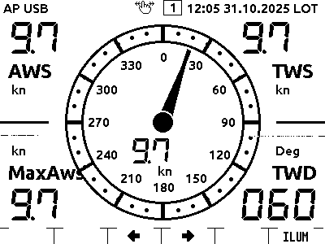
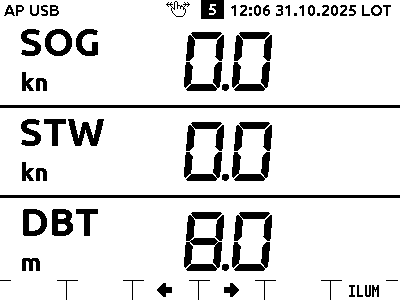

Schnellstart
============

Dies Kapitel beschäftigt sich  mit der ersten Inbetriebnahme des OBP60, vom Auspacken bis zum Anzeigen der ersten Daten auf dem Display. Ziel ist es, die erste Inbetriebnahme für Nutzer die sich mit dem Gerät noch nicht auskennen, möglichst einfach zu machen. 

Packungsinhalt
--------------

In der Packung ist bis auf Verbindungskabel alles, was man so braucht um das Gerät zu montieren und anzuschließen:

* Das Gerät selbst, das OBP60 Marine Display
* Eine Schutzkappe - wichtig wenn man das Gerät im Freien montiert
* Dichtung zur wasserdichten Montage an einer glatten Oberfläche
* Befestigungsschrauben
* Zwei Klemmblöcke, an die die diversen Kabel angeschlossen werden
* Zwei Jumper als Codierstecker, mit denen die NMEA2000 und NMEA183 Terminierung aktiviert werden können.

Erste Inbetriebnahme
--------------------

Detailliertere Zusatzinformationen finden Sie im Kapitel :ref:`inbetriebnahme001`. 
Hier eine kurze Übersicht der ersten Schritte:

Es empfiehlt sich, die allererste Inbetriebnahme des Gerätes am Arbeitstisch zu machen. Man benötigt dafür ein 12V Netzteil. Nützlich sind ein USB-C Kabel, ein Computer und eine NMEA Simulationssoftware.

So sieht das Gerät von hinten aus:

.. image:: ../pics/Bus_Systems.png
   :scale: 30 %

Die 12V-Versorgung sind die beiden obersten Pins am rechten Anschluss CN2, also .12V und GNDS.
USB-C wird am ovalen Stecker unterhalb des Anschlusses CN2 angeschlossen.

.. hint::
	Das Gerät braucht für den Betrieb die 12V Versorgung. Ein Testbetrieb am PC nur mit USB-C ist nicht möglich.

Nach dem Einschalten der Stromversorgung piept das Gerät und zeigt diesen Startbildschirm:

.. image:: ../pics/OBP60_OBP_Logo_tr.png
    :scale: 30 %
    
Kurz darauf wird ein QR-Code gezeigt, mit dem man sich per Handy direkt mit dem OBP60 verbinden kann. 

.. image:: ../pics/OBP60_QR_Code_tr.png
    :scale: 30 %

Das Gerät spannt ein eigenes WLAN auf. In der Netzwerkliste z.B. auf Android ist ganz unten ein QR-Symbol. Klickt man darauf, kann der QR Code gescannt werden und das Handy oder Tablett loggt sich dann direkt in das WLAN des OBP60 ein. 

.. note::
	Falls das nicht klappen sollte, bitte das Wifi-Netzwerk mit der ID "OBP60V2" auswählen und das Standard-Passwort "esp32nmea2k" eingeben. Später sollte man das Passwort sinnvollerweise ändern.

Sobald die Verbindung hergestellt ist, wird die Adresse des OBP60 eingegeben. Die lautet "OBP60V2.local", alternativ kann auch direkt die IP-Adresse "192.168.15.1" eingegeben werden.

.. hint::
	Falls die Verbindung nicht klappt, kann das daran liegen, dass auf dem Mobilgerät ein VPN aktiv ist. Das VPN muss man dann abschalten bzw. umkonfigurieren.

Es sollte sich dann direkt der Status-Bildschirm öffnen:

.. image:: ../pics/Status_1.png
 :scale: 40 %

Über die Reiter oben auf dem Bildschirm kann man auf weitere Seiten navigieren:

* Config: Systemeinstellungen und Auswahl der Bildschirme die das OBP60 anzeigen soll
* XDR: Hier können NMEA Telegramme (XDR Sätze) definiert werden, um Daten weiterzugeben für die es kein geeignetes NMEA 183 Telegramm gibt
* DATA: Zeigt alle Datensätze an, die für das Gerät definiert sind. Wenn es keine realen Daten gibt (z.B. weil NMEA2000 noch nicht angeschlossen ist), werden hier Striche angezeigt. 
* Update: Erlaubt das Update der Geräte-Firmware. Dazu wird zunächst eine neue Firmware für das OBP60 auf das Mobilgerät heruntergeladen. Danach auf diese "Update" Seite gehen, die Firmware-Datei auf dem Mobilgerät auswählen und durch "Upload" installiert.
*  Help: Zeigt eine Webseite mit Hilfeinformationen an, sobald das OBP60 den Internetzugang hat, z.B. als Client eines LTE Routers. Das muß allerdings zunächst konfiguriert werden.

Detaillierte Zusatzinformationen finden Sie im Kapitel :ref:`konfiguration001`. 

.. hint::
	Oberhalb der Reiter für die Seiten ist ein farbiger Punkt sichtbar. Wenn der grün ist, steht die Verbindung, wenn er rot ist ist sie abgerissen. 

.. hint::
	Abreißen der Verbindung ist oft darauf zurückzuführen, daß das Mobilgerät auf ein anderes WLAN umgestellt hat. Deshalb sollte das automatische Wiederherstellen der Wifi-Verbindung aktiviert sein. Wenn noch ein weiteres WLAN aktiv ist, sollte das automatische Wiederherstellen der Verbindung dazu deaktiviert sein. 

Anzeigeseiten
-------------

Das OBP60 kann Daten, die ihm bekannt sind, auf bis zu 10 Anzeigeseiten darstellen. Zwischen den Seiten schaltet man um, indem man entweder über die sechs Tasten unten wischt oder auf eine der beiden mittleren Tasten klickt. In jedem Fall geht es um eine Seite weiter.

.. note::
	Das OBP60 hat ein ePaper Display. Solche Displays haben eine besonders klare Darstellung und geringen Stromverbrauch. Sie haben aber auch die Eigenheit, daß regelmäßig ein sogenannter "Refresh" gemacht werden muß. Deshalb flackert das Display in regelmäßigen Abständen oder nach Seitenwechseln - das ist normal.

Jede der Seiten kann frei mit einem der vielen Layouts belegt werden. Derzeit gibt es zum Beispiel:

* Seiten mit einem, zwei, drei oder vier Zahlenwerten
* Windrose mit vier Zusatzdaten
* Windrose mit Schiffsdarstellung
* Uhr
* Windverlaufs-Grafik

Je nach Seite können dann unterschiedliche Daten gezeigt werden. Welche das sind, wird in der Weboberfläche eingestellt. 

Hier ein Beispiel:

In der obersten Zeile wird der Gerätestatus dargestellt. Hier sieht man, dass das Gerät im Access Point Mode ist (AP), Daten über USB empfängt (USB) und dass Wischgesten genutzt werden können (Hand-Symbol). In der Mitte wird die Nummer der aktuellen Seite dargestellt, und rechts die Uhrzeit und welche Zeit das ist - hier Local Time (LOT).

In der Mitte des Bildschirms sieht man die Nutzinformation des aktuellen Bildschirms.

In der untersten Zeile wird angezeigt, wie die Tasten belegt sind. Rechts kann immer die Bildschirmbeleuchtung eingeschaltet werden, die mittleren beiden Tasten sind für die Navigation da. Wischgesten sind auch möglich.

Detailliertere Zusatzinformationen zu den Seiten die angezeigt werden können finden Sie im Kapitel :ref:`konfiguration002`. 

Bedienung
-----------------

Das OBP60 hat unter dem Bildschirm sechs Bedientasten - genauer gesagt nicht physische Tasten, sondern berührungssenitive Knöpfe. Die Bedienung mit Wischgesten erfolgen, oder alternativ durch Drücken einzelner Knöpfe.

Für eine Wischgeste mit einem Finger von nach rechts oder umgekehrt über mehrere Knöpfe fahren.

Knopfdrücke erfolgen wie üblich - einfach den Finger kurz auf eine der Tasten legen. Das ist möglich für die Tasten, die oberhalb auf dem Bildschirm ein Symbol zeigen. Die Belegung der Tasten ändert sich abhängig von der angezeigten Seite.

Detailliertere Zusatzinformationen finden Sie im Kapitel :ref:`bedienelemente001`. 

Simulation
----------

Um sich mit dem OBP60 vertraut zu machen, ist es sinnvoll es zunächst via USB mit einem Computer zu verbinden, auf dem eine NMEA-Simulation läuft. Geeignet ist z.B. NMEASimulator_ . Den Simulator installieren, dann den USB-Port für NMEA183 im Simulator auswählen und den Computer via USB mit dem OBP60 verbinden. Dann die Simulation via "Run" starten. Gewünschte Werte können im Hauptbildschirm des Simulators eingegeben werden.

.. _NMEASimulator:  http://www.kave.fi/Apps/NMEA-Simulator/NMEA-Simulator.7z

Sobald die Verbindung zur Simulation steht, wird links oben im Display des OBP60 "USB" angezeigt. Die übertragenen Daten erscheinen auf dem Display:

Gleichzeitig sind sie im Web-Interface eines eingeloggten Mobilgeräts zu sehen

Elektrische Anschlüsse
-----------------------
Detailinformationen zu den elektrischen Anschlüssen finden Sie im Kapitel :ref:`stromversorgung001` 

Für den Normalbetrieb müssen mindestens die 12V Versorgung und ein Netzwerk, also NMEA2000 oder NMEA0183, angeschlossen werden. 

Das OBP60 hat keine Anschlussbuchsen für NMEA2000 oder Seatalk NG, sondern Klemmblöcke auf die die Leitungen direkt aufgelegt werden. Um hier den Kontakt herstellen zu können, muss ggf. ein vorhandenes Kabel aufgeschnitten werden. Die einzelnen Adern werden dann an den passenden Klemmblock angeschlossen.

* 12V: [+] und [-] an die beiden oberen Anschlüsse am Klemmblock CN2
* NMEA2000: Die Anschlüsse CAN H, CAN L und Shield. Die Farbcodierung kann je nach System unterschiedlich sein, bei Raymarine Seatalk NG (das ja auch NMEA2000 ist) ist CAN L weiß, CAN H blau. Shield ist die Abschirmung des Kabels 
* NMEA0183: Hier werden die Signalleitungen für A und B sowie Shield (Abschirmung) angeschlossen

.. image:: ../pics/Bus_Systems.png
 :scale: 30 %

Montage
-----------------------

Um das Gerät zu montieren, soll es fest auf einer geeigneten Fläche verschraubt werden. Die beiden mitgelieferten Sechskantschrauben werden von innen durchgesteckt und dann das Gehäuse wieder verschraubt. 

Die notwendigen Ausschnitte für die Kabel und die beiden Schrauben sind nach der Maßzeichnung_ zu erstellen.

.. _Maßzeichnung: ../_static/files/Drawing_OBP60_V2.pdf

Danach die Dichtung auf die Rückseite des Gehäuses aufsetzen, Schrauben durchstecken und festschrauben.

Weitere Informationen zur Montage des OBP60 finden Sie im Kapitel :ref:`einbau001` 