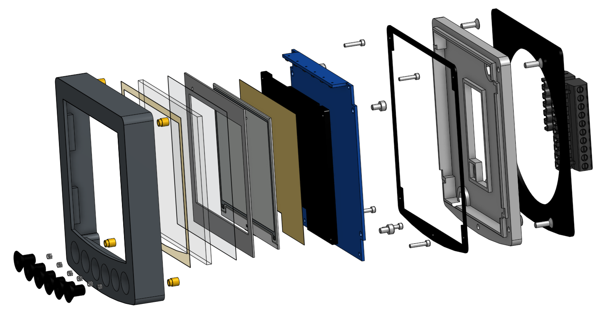

Technische Daten
================

.. raw:: html

   
   <! -- 
   *********************************************************************************************************
   ******** !!!Attantion!!! All pictures must be used in other pages otherwise is the link not valid *******
   *********************************************************************************************************
   -->
   

       <button class="sphinx-nav-btn" id="sph-backBtn">❮</button>
       
       

		   

               
               <h3 class="sphinx-caption">Start Page</h3>
           

           

               
               <h3 class="sphinx-caption">WiFi QR Code</h3>
           

		   

               
               <h3 class="sphinx-caption">One Value</h3>
           

           

               
               <h3 class="sphinx-caption">Two Value</h3>
           

           

               
               <h3 class="sphinx-caption">Two Value Diagram</h3>
           

		   

               
               <h3 class="sphinx-caption">Three Value</h3>
           

		   

               
               <h3 class="sphinx-caption">DST810</h3>
           

           

               
               <h3 class="sphinx-caption">Four Value</h3>
           

           

               
               <h3 class="sphinx-caption">Four Value 2</h3>
           

		   

               
               <h3 class="sphinx-caption">Six Value</h3>
           

           

               
               <h3 class="sphinx-caption">Windplot 1 Diagram</h3>
           

		   

               
               <h3 class="sphinx-caption">Windplot 2 Diagrams</h3>
           

           

               
               <h3 class="sphinx-caption">Windrose</h3>
           

           

               
               <h3 class="sphinx-caption">Windanzeige</h3>
           

           

               
               <h3 class="sphinx-caption">Windlupe</h3>
           

           

               
               <h3 class="sphinx-caption">Rudder</h3>
           

		   

               
               <h3 class="sphinx-caption">Roll & Pitch</h3>
           

           

               
               <h3 class="sphinx-caption">Keel</h3>
           

           

               
               <h3 class="sphinx-caption">Clock Analog</h3>
           

		   

               
               <h3 class="sphinx-caption">Clock Digital</h3>
           

           

               
               <h3 class="sphinx-caption">Regatta Timer</h3>
           

           

               
               <h3 class="sphinx-caption">Navigation</h3>
           

           

               
               <h3 class="sphinx-caption">Compass</h3>
           

		   

               
               <h3 class="sphinx-caption">XTE Track</h3>
           

           

               
               <h3 class="sphinx-caption">Sky View</h3>
           

           

               
               <h3 class="sphinx-caption">Digital Out</h3>
           

           

               
               <h3 class="sphinx-caption">Voltage</h3>
           

		   

               
               <h3 class="sphinx-caption">Voltage Analog</h3>
           

           

               
               <h3 class="sphinx-caption">Battery2</h3>
           

		   

               
               <h3 class="sphinx-caption">Solar</h3>
           

           

               
               <h3 class="sphinx-caption">Generator</h3>
           

           

               
               <h3 class="sphinx-caption">Fluid</h3>
           

       

       <button class="sphinx-nav-btn" id="sph-nextBtn">❯</button>
   

   
   
Abb.: OBP60 mit mehr als 32 verschiedenen Anzeigeseiten

Funktionen
----------

* E-Paper Display (tageslichttauglich)
* Numerische Anzeigeseiten für 1, 2, 3 und 4 Werte (Werte frei wählbar)
* Grafische Anzeigeseiten (feste Werte)
* Trendanzeige für Werte
* Grenzwertüberschreitung akustisch und optisch
* 6 Sensor-Tasten (geeignet für Wischgesten)
* Akustischer Signalgeber (Buzzer)
* Optischer Signalgeber (RGB-LED)
* LED-Displaybeleuchtung (RGB-LEDs)
* NMEA2000 (vollduplex, isoliert)
* NMEA0183 (RX oder TX, konfigurierbar, isoliert)
* NMEA2000/NMEA0183 Gateway (bidirektional)
* I2C (isoliert)
* 1Wire (nicht isoliert)
* Spannungsausgang 5V (max. 200mA) für externe Sensorik
* USB-C (OTG, Debug, NMEA0183)
* Batteriemonitor (12V-Spannungsmessung)
* Umgebungssensor BMP280 (Temperatur, Luftdruck)
* GPS-Empfäger (GPS, Glonass, Baidu, interne oder externe GPS-Antenne)
* WiFi 2.4GHz (HTTP, TCP, UDP)
* Bluetooth (aktuell ungenutzt)
* Batterie-Tiefentladeschutz < 9.0V
* Low Power Modus

Aufbau
------

Spezifikation
-------------

+----------------------+-----------------------------+
| Versorgungsspannung  | 10...28 V                   |
+----------------------+-----------------------------+
| Stromverbrauch       | 0.5...3.5 W, typisch 1 W    |
+----------------------+-----------------------------+
| Prozessor            | ESP32-S3, Dual Core         |
+----------------------+-----------------------------+
| Clock Speed          | 80, 160, 240 MHz            |
+----------------------+-----------------------------+
| RAM                  | 512 kB                      |
+----------------------+-----------------------------+
| Flash                | 16 MB                       |
+----------------------+-----------------------------+
| PSRAM                | 8 MB                        |
+----------------------+-----------------------------+
| Displaygröße         | 400 x 300 pix, 120 dpi      |
+----------------------+-----------------------------+
| Refreshrate          | 1 Hz                        |
+----------------------+-----------------------------+
| Sensortasten         | kapazitiv                   |
+----------------------+-----------------------------+
| NMEA0183-Bus         | RS485, max. 115.2 kBd, 30 m |
+----------------------+-----------------------------+
| NMEA2000-Bus         | CAN, 250 kBit/s, 30 m       |
+----------------------+-----------------------------+
| I2C-Bus              | 5V, 100 kBit/s, 10 m        |
+----------------------+-----------------------------+
| 1Wire-Bus            | 3.3V, 10 m                  |
+----------------------+-----------------------------+
| 5V-Ausgang           | 200 mA, isoliert            |
+----------------------+-----------------------------+
| ESD-Schutz           | 8 kV                        |
+----------------------+-----------------------------+
| Schutzgrad           | IP68, frontseitig           |
+----------------------+-----------------------------+
| Abmessungen          | 110 x 115 x 30 mm           |
+----------------------+-----------------------------+
| Gewicht              | 280 g                       |
+----------------------+-----------------------------+

Anschlussbelegung
-----------------
.. image:: ../pics/Bus_Systems.png
   :scale: 50%
   

   
Schaltplan
----------

* `Schaltplan V2.1 [PDF] <../_static/files/Schematic_OBP60_V2.1.pdf>`_

Maßbilder
---------

* `Maßbild [PDF] <../_static/files/Drawing_OBP60_V2.pdf>`_

   
Nutzbare und konvertierbare Telegramme
--------------------------------------

**NMEA0183**
    * AIVDM, AIVDO, DBK, DBS, DBT, DPT, GGA, GLL, GSA, GSV, HDG, HDM, HDT, MTW, MWD, MWV, RMB, RMC, ROT, RSA, VHW, VTG, VWR, XDR, XTE, ZDA
    
**NMEA2000**
    * 126992, 127245, 127250, 127251, 127257, 127258, 127488, 127489, 127505, 127508, 128259, 128267, 128275, 129025, 129026, 129029, 129033, 129038, 129039, 129283, 129284, 129539, 129540, 129794, 129809, 129810, 130306, 130310, 130311, 130312, 130313, 130314, 130316
	
Nutzbare I2C-Sensorik
---------------------

**Umgebungssensoren**
	* BMP085, BMP180, BMP280, BME280, SHT20, HTU21
	
**Spannungs- und Stromsensoren**
	* INA226, INA219 (in Vorbereitung)
	
**Winkelsensoren**
	* AS5600, MT6701 (in Vorbereitung)
	
**Port-Erweiterungen**
	* PCF8574 (in Vorbereitung)
	
**Echtzeit-Uhren**
	* DS1388
	
Nutzbare 1Wire-Sensorik
-----------------------

**Temperatursensoren**
	* DS18B20
