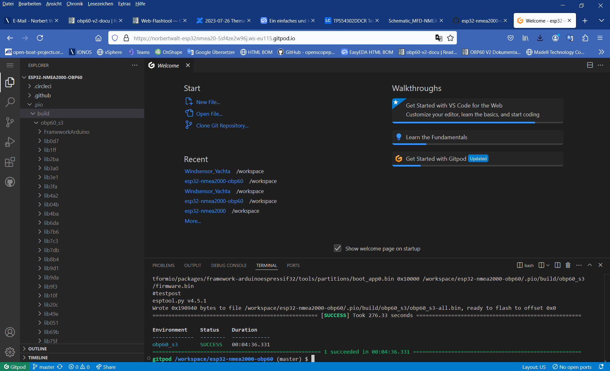

Kompilieren und Download
========================

Die Firmware zum OBP60 kann recht einfach selber an eigene Bedürfnisse angepasst werden. Der Source-Code befindet sich zentral auf Github im Internet. Alle Software-Revisionen sind dort verfügbar. Es können bei Bedarf aktuelle oder ältere Versionen benutzt werden. Als Betriebssysteme werden Linux, Windows und Mac iOS unterstützt. Zum Kompilieren der Firmware gibt es zwei Möglichkeiten.

	* Verwendung von **Gitpod** (webbasiert in Cloud)
	* **Visual Studio Code** mit **PlatformIO** Plugin (lokal auf dem PC)
	
Gitpod
------

Gitpod ist eine standardtisierte Entwicklungsumgebung, die webbasiert ist und in der Cloud läuft. So ist es möglich auf jedem Rechner, der über einen aktuellen Webbrowser verfügt eine Code-Entwicklung durchzuführen ohne spezielle Installation von irgendwelchen Softwarebestandteilen. Zur Benutzung des Dienstes ist eine Anmeldung bei Github notwendig. Die Code-Entwicklungsumgebung in Anlehnung an PlatformIO befindet sich jederzeit in einem aktuellen Zustand. Abhängigkeiten zu externen Bibliotheken werden selbständig aufgelöst und integriert. Das System ist sofort benutzbar und ist besonders für Anfänger geeignet oder für kleine Änderungen, die unterwegs mal schnell durchgeführt werden sollen. Die Benutzung von Gitpod ist in der Free-Variante kostenfrei, unterliegt jedoch einigen Einschränkungen bezüglich Nutzungszeit und bereitgestellter Rechnerhardware. Aktuell sind 50 Stunden Nutzungszeit pro Monat frei und vollkommen ausreichend für einfache Änderungen. Wer mehr Zeit benötigt oder schnellere Hardware einsetzen möchte, kann den kostenpflichtigen Service von Gitpod nutzen. Weitere Details findet man auf der `Webseite von Gitpod`_.

.. _Webseite von Gitpod: https://www.gitpod.io

**Der Workflow bei Gitpod sieht folgendermaßen aus:**

	**1.** OBP60-Github-Projekt in eigenes Github-Repository forken
	**2.** Gitpod-Link zum Projekt öffnen
	**3.** In Gitpod Entwicklungsumgebung und Hardware auswählen
	**4.** Start eines Containers mit der Entwicklungsumgebung und Download des Projektes aus dem eigenen Github-Repository
	**5.** Source-Code in der Entwicklungsumgebung ändern und kompilieren
	**6.** Download des Binary-Files
	**7.** Aktualisierung der Änderungen im eigenen Github-Repository

   
Github-Projekt forken
^^^^^^^^^^^^^^^^^^^^^

Als erstes wird das Original-Projekt zum OBP60 in das eigene private Repository geforkt. Ein Fork ist so zu sagen eine Aufgabelung bzw. eine Abtrennung des Source-Codes in einen neuen Zweig. Durch einen Fork entsteht eine Kopie des Original-Projektes in ihrem privaten Repository. So können Sie Änderungen am Code vornehmen und in ihrem Repository speichern. Der neu entstandene Code ist dann eine Erweiterung oder Modifikation des Original-Projektes.

.. note::
	Nur mit einem Fork ist es möglich, eigene Code-Änderungen zu sichern.

.. image:: ../pics/Github_Fork.png
   :scale: 40%
Abb.: Fork erstellen

Melden Sie sich als erstes bei Github an und gehen dann in das `Original-Projekt zum OBP60`_ und drücken oben rechts auf die Schaltfläche **Fork**. Sie werden danach gefragt, ob sie der Quelle vertrauen und können dann einen neuen Projektnamen vergeben oder den originalen Projektnamen benutzen. Kopieren Sie sich danach den Link zu ihrem Github-Projekt aus der Browser-Zeile. Sie sollten dann einen ähnlichen Link haben wie diesen:

.. _Original-Projekt zum OBP60: https://github.com/norbert-walter/esp32-nmea2000-obp60

``https://github.com/MyPrivatRepositoryName/esp32-nmea2000-obp60``

Den Part ``MyPrivatRepositoryName`` wird durch ihren eigenen Repositorynamen ersetzt.

Gitpod-Link öffnen
^^^^^^^^^^^^^^^^^^

Das Gitpad-Projekt wird über den Repositorynamen des Github-Projetes aufgerufen:

``https://gitpod.io/#https://github.com/MyPrivatRepositoryName/esp32-nmea2000-obp60``

Sie gelangen dann auf die Startseite von Gitpod und müssen sich dort anmelden. Loggen Sie sich dort mit dem bereits vorhandenen Github-Account ein.

.. image:: ../pics/Gitpod_Login.png
   :scale: 40%
Abb.: Login bei Gitpod mit Github-Account

Gitpod-Settings
^^^^^^^^^^^^^^^

Danach können Sie die Default-Einstellungen übernehmen. Sie sind schon korrekt auf das Projekt eingestellt.

.. image:: ../pics/Gitpod_New_Workplace.png
   :scale: 40%
Abb.: Einstellungen für Gitpod

Container-Start
^^^^^^^^^^^^^^^

Nach der Bestätigung der Einstellungen für Gitpod wird ein neuer Docker-Container gestartet und alle notwendigen Softwarebestandteile in den Container geladen. Der Vorgang kann etwas Zeit beanspruchen. Am Ende sollten Sie einen fertigen Workplace vorfinden. Der Workplace benutzt das Look & Feel von Visual Studio Code, ist jedoch nicht mit ihm verwand und in einigen Punkten verschieden. So gibt es z.B. keine IntelliSense und die Anzahl der Plugins ist deutlich geringer als beim Original. Zusätzlich fehlen die Buttons zum Kompilieren und zum Download auf die Zielhardware sowie der serielle Monitor, wie man das von Visual Studio Code gewohnt ist. Über den Workplace lässt sich der Code verändern, kompilieren und das Binary herunterladen. Der Download des Binarys auf die Zielhardware muss mit externen Tools durchgeführt werden.

.. image:: ../pics/Gitpod_Workplace.png
   :scale: 40%
Abb.: Fertiger Workplace

Codeänderung und Kompilieren
^^^^^^^^^^^^^^^^^^^^^^^^^^^^

Der Code zum OBP60 befindet sich im Ordner: */ESP32-NMEA2000_OBP60/lib/obp60task* . Über *platformio.ini* können einige Hardwareanpassungen zur Variante des ESP32-S3 und zum e-Paper Display vorgenommen werden. 

Um den Code kompilieren zu können, müssen Sie folgende Befehle nacheinander in das Terminal-Fenster unten rechts einfügen. Sie können dazu die Copy & Paste Funktion benutzen.

	* cd /workspace/esp32-nmea2000-obp60
	* bash /workspace/esp32-nmea2000-obp60/lib/obp60task/run

Nach dem letzten Befehl werden in den Workplace alle notwendigen Tool-Chains und Bibliotheken geladen. Dieser Vorgang kann einige Minuten dauern. Danach beginnt der eigentliche Kompiliervorgang, der ebenfalls einiges an Zeit benötigt.

.. image:: ../pics/Gitpod_Compile_Project.png
   :scale: 40%
Abb.: Source-Code kompilieren

Wenn der Kompiliervorgang erfolgreich abgeschlossen ist, sollten Sie folgende Meldung sehen. 

Abb.: Kompilierung beendet

Binary-Download
^^^^^^^^^^^^^^^

Der Binary-Code zur Firmware befindet sich nach dem Kompilieren im Verzeichnis: */ESP32-NMEA2000_OBP60/.pio/build/obp32_s3*

.. image:: ../pics/Gitpod_Download.png
   :scale: 40%
Abb.: Datei Download

Dabei haben die Files folgende Bedeutung:

	* bootloader.bin - ESP32-S3 Bootloader für Firmware
	* partitions.bin - Partitionstabelle für den Flash Speicher
	* firmware.bin - Binärfile als Update (nur Firmware)
	* firmware.elf - ELF-File für Fehlerverfolgung
	* obp60_s3-all.bin - Binärfile mit allen Bestandteilen (Bootloader, Patitionstabelle, Firmware, Default-Settings)
	* **obp60_s3-dev20240820-all.bin** - wie obp60_s3-all.bin
	* **obp60_s3-dev20240820-update.bin** - Binärfile als Update (nur Firmware)
	
Je nachdem ob man mit Default-Einstellungen starten möchte oder mit den alten Einstellungen weiter arbeiten möchte, kann man eine der beiden fett hervorgehobenen Files herunter laden. Das geht am einfachsten, wenn man einen rechtsklick auf die Datei im Dateibaum macht und über **Download** die Datei herunterläd. Diese Datei kann man später bei OBP60 auf der Update-Seite hochladen und damit die Firmware aktualisieren.

Source-Code Aktualisierung
^^^^^^^^^^^^^^^^^^^^^^^^^^

Wer die Source-Code-Änderungen in seinem Github-Repository speichern möchte, kann die Github-Funktionalität des Workplaces nutzen. Auf der linken Seite befindet sich ein Icon mit einer Pfadverzweigung und einer kleinen blauen Zahl daran. Dieses Icon teilt dem Benutzer mit, wie viele Änderungen an Dateien durch die Source-Code-Änderungen vorgenommen worden sind. Mit einem Klick auf das Icon kann man eine Beschreibung für die Änderungen hinzufügen. Wenn man dem Dialog rechts am blauen Commit-Button folgt, kann man **Commit und Push** anklicken. Dadurch werden die Code-Änderungen in das eigene Github-Repository hochgeladen und gesichert. Wer später dort weitermachen möchte wo er zuletzt aufgehört hat, kann der Vorgehensweise ab Punkt 2 folgen und den Gitpod-Link zu seinem Projekt öffnen.

Kompilieren und Download
========================

Die Firmware zum OBP60 kann recht einfach selber an eigene Bedürfnisse angepasst werden. Der Source-Code befindet sich zentral auf Github im Internet. Alle Software-Revisionen sind dort verfügbar. Es können bei Bedarf aktuelle oder ältere Versionen benutzt werden. Als Betriebssysteme werden Linux, Windows und Mac iOS unterstützt. Zum Kompilieren der Firmware gibt es zwei Möglichkeiten.

	* Verwendung von **Gitpod** (webbasiert in Cloud)
	* **Visual Studio Code** mit **PlatformIO** Plugin (lokal auf dem PC)
	
Gitpod
------

Gitpod ist eine standardtisierte Entwicklungsumgebung die webbasiert ist und in der Cloud läuft. So ist es möglich auf jedem Rechner, der über einen aktuellen Webbrowser verfügt eine Code-Entwicklung durchzuführen ohne spezielle Installation von irgendwelchen Softwarebestandteilen. Zur Benutzung des Dienstes ist eine Anmeldung bei Github notwendig. Die Code-Entwicklungsumgebung in Anlehnung an PlatformIO befindet sich jederzeit in einem aktuellen Zustand. Abhängigkeiten zu externen Bibliotheken werden selbständig aufgelöst und integriert. Das System ist sofort benutzbar und ist besonders für Anfänger geeignet oder für kleine Änderungen, die unterwegs mal schnell durchgeführt werden sollen. Die Benutzung von Gitpod ist in der Free-Variante kostenfrei, unterliegt jedoch einigen Einschränkungen bezüglich Nutzungszeit und bereitgestellter Rechnerhardware. Aktuell sind 50 Stunden Nutzungszeit pro Monat frei und vollkommen ausreichend für einfache Änderungen. Wer mehr Zeit benötigt oder schnellere Hardware einsetzen möchte, kann den kostenpflichtigen Service von Gitpod nutzen. Weitere Details findet man auf der `Webseite von Gitpod`_.

.. _Webseite von Gitpod: https://www.gitpod.io

**Der Workflow bei Gitpod sieht folgendermaßen aus:**

	1. OBP60-Github-Projekt in eigenes Github-Repository forken
	2. Gitpod-Link zum Projekt öffnen
	3. In Gitpod Entwicklungsumgebung und Hardware auswählen
	4. Start eines Containers mit der Entwicklungsumgebung und Download des Projektes aus dem eigenen Github-Repository
	5. Source-Code in der Entwicklungsumgebung ändern und kompilieren
	6. Download des Binary-Files
	7. Aktualisierung der Änderungen im eigenen Github-Repository

   
Github-Projekt forken
^^^^^^^^^^^^^^^^^^^^^

Als erstes wird das Original-Projekt zum OBP60 in das eigene private Repository geforkt. Ein Fork ist so zu sagen eine Aufgabelung bzw. eine Abtrennung des Source-Codes in einen neuen Zweig. Durch einen Fork entsteht eine Kopie des Original-Projektes in ihrem privaten Repository. So können Sie Änderungen am Code vornehmen und in ihrem Repository speichern. Der neu entstandene Code ist dann eine Erweiterung oder Modifikation des Original-Projektes.

.. note::
	Nur mit einem Fork ist es möglich, eigene Code-Änderungen zu sichern.

.. image:: ../pics/Github_Fork.png
   :scale: 40%
Abb.: Fork erstellen

Melden Sie sich als erstes bei Github an und gehen dann in das `Original-Projekt zum OBP60`_ und drücken oben rechts auf die Schaltfläche **Fork**. Sie werden danach gefragt, ob sie der Quelle vertrauen und können dann einen neuen Projketnamen vergeben oder den originalen Projektnamen benutzen. Kopieren Sie sich danach den Link zu ihren Github-Projekt aus der Browser-Zeile. Sie sollten dann einen ähnlichen Link haben wie diesen:

.. _Original-Projekt zum OBP60: https://github.com/norbert-walter/esp32-nmea2000-obp60

``https://github.com/MyPrivatRepositoryName/esp32-nmea2000-obp60``

Den Part ``MyPrivatRepositoryName`` wird durch ihren eigenen Repositorynamen ersetzt.

Gitpod-Link öffnen
^^^^^^^^^^^^^^^^^^

Das Gitpad-Projekt wird über den Repositorynamen des Github-Projetes aufgerufen:

``https://gitpod.io/#https://github.com/MyPrivatRepositoryName/esp32-nmea2000-obp60``

Sie gelangen dann auf die Startseite von Gitpod und müssen sich dort anmelden. Loggen Sie sich dort mit dem bereits vorhandenen Github-Account ein.

.. image:: ../pics/Gitpod_Login.png
   :scale: 40%
Abb.: Login bei Gitpod mit Github-Account

Gitpod-Settings
^^^^^^^^^^^^^^^

Danach können Sie die Default-Einstellungen übernehmen. Sie sind schon korrekt auf das Projekt eingestellt.

.. image:: ../pics/Gitpod_New_Workplace.png
   :scale: 40%
Abb.: Einstellungen für Gitpod

Container-Start
^^^^^^^^^^^^^^^

Nach der Bestätigung der Einstellungen für Gitpod wird ein neuer Docker-Container gestartet und allle notwendigen Softwarebestandteile in den Container geladen. Der Vorgang kann etwas Zeit beanspruchen. Am Ende sollten Sie einen fertigen Workplace vorfinden. Der Workplace benutzt das Look & Feel von Visual Studio Code, ist jedoch nicht mit ihm verwand und in einigen Punkten verschieden. So gibt es z.B. keine IntelliSense und die Anzahl der Plugins ist deutlich geringer als beim Original. Zusätzlich fehlen die Buttons zum Kompilieren und zum Download auf die Zielhardware sowie der serielle Monitor, wie man das von Visual Studio Code gewohnt ist. Über den Workplace lässt sich der Code verändern, kompilieren und das Binary herunterladen. Der Download des Binarys auf die Zielhardware muss mit externen Tools durchgeführt werden.

.. image:: ../pics/Gitpod_Workplace.png
   :scale: 40%
Abb.: Fertiger Workplace

Codeänderung und Kompilieren
^^^^^^^^^^^^^^^^^^^^^^^^^^^^

Der Code zum OBP60 befindet sich im Ordner: */ESP32-NMEA2000_OBP60/lib/obp60task* . Über *platformio.ini* können einige Hardwareanpassungen zur Variante des ESP32-S3 und zum e-Paper Display vorgenommen werden. 

Um den Code kompilieren zu können, müssen Sie folgende Befehle nacheinander in das Terminal-Fenster unten rechts einfügen. Sie könen dazu die Copy & Paste Funktion benutzen.

	* cd /workspace/esp32-nmea2000-obp60
	* bash /workspace/esp32-nmea2000-obp60/lib/obp60task/run

Nach dem letzen Befehl werden in den Workplace alle notwendigen Tool-Chains und Bibliotheken geladen. Dieser Vorgang kann einige Minuten dauern. Danach beginnt der eigentliche Kompiliervorgang, der ebenfalls einiges an Zeit benötigt.

.. image:: ../pics/Gitpod_Compile_Project.png
   :scale: 40%
Abb.: Source-Code kompilieren

Wenn der Kompiliervorgang erfolgreich abgeschlossen ist, sollten Sie folgende Meldung sehen. 

Abb.: Kompilierung beendet

Binary-Download
^^^^^^^^^^^^^^^

Der Binary-Code zur Firmware befindet sich nach dem Kompilieren im Verzeichnis: */ESP32-NMEA2000_OBP60/.pio/build/obp32_s3*

.. image:: ../pics/Gitpod_Download.png
   :scale: 40%
Abb.: Datei Download

Dabei haben die Files folgende Bedeutung:

	* bootloader.bin - ESP32-S3 Bootloader für Firmware
	* partitions.bin - Partitionstabelle für den Flash Speicher
	* firmware.bin - Binärfile als Update (nur Firmware)
	* firmware.elf - ELF-File für Fehlerverfolgung
	* obp60_s3-all.bin - Binärfile mit allen Bestandteilen (Bootloader, Patitionstabelle, Firmware, Default-Settings)
	* **obp60_s3-dev20240820-all.bin** - wie obp60_s3-all.bin
	* **obp60_s3-dev20240820-update.bin** - Binärfile als Update (nur Firmware)
	
Je nachdem ob man mit Default-Einstellungen starten möchte oder mit den alten Einstellungen weiter arbeiten möchte, kann man eine der beiden fett hervorgehobenen Files herunter laden. Das geht am einfachsten, wenn man einen rechtsklick auf die Datei im Dateibaum macht und über **Download** die Datei herunter läd. Diese Datei kann man später bei OBP60 auf der Update-Seite hochladen und damit die Firmware aktualisieren.

Source-Code Aktualisierung
^^^^^^^^^^^^^^^^^^^^^^^^^^

Wer die Source-Code-Änderungen in seinem Github-Repository speichern möchte, kann die Github-Funktionalität des Workplaces nutzen. Auf der linken Seite befindet sich ein Icon mit einer Pfadverzweigung und einer kleinen blauen Zahl daran. Dieses Icon teilt dem Benutzer mit, wie viele Änderungen an Dateien durch die Source-Code-Änderungen vorgenommen worden sind. Mit einenm Klick auf das Icon kann man eine Beschreibung für die Änderungen hinzufügen. Wenn man dem Dialog rechts am blauen Commit-Button folgt, kann man **Commit und Push** anklicken. Dadurch werden die Code-Änderungen in das eigene Github-Repository hochgeladen und gesichert. Wer später dort weitermachen möchte wo er zu letzt aufgehört hat, kann der Vorgehensweise ab Punkt 2 folgen und den Gitpod-Link zu seinem Projekt öffnen.

.. note::
	Wenn Sie keinen Beschreibungstext zur Codeänderung hinzufügen, können Sie die Änderungen nicht commiten und nach Github hochladen.

.. image:: ../pics/Gitpod_Commit_Push.png
   :scale: 40%
Abb.: Source Code auf Github sichern

