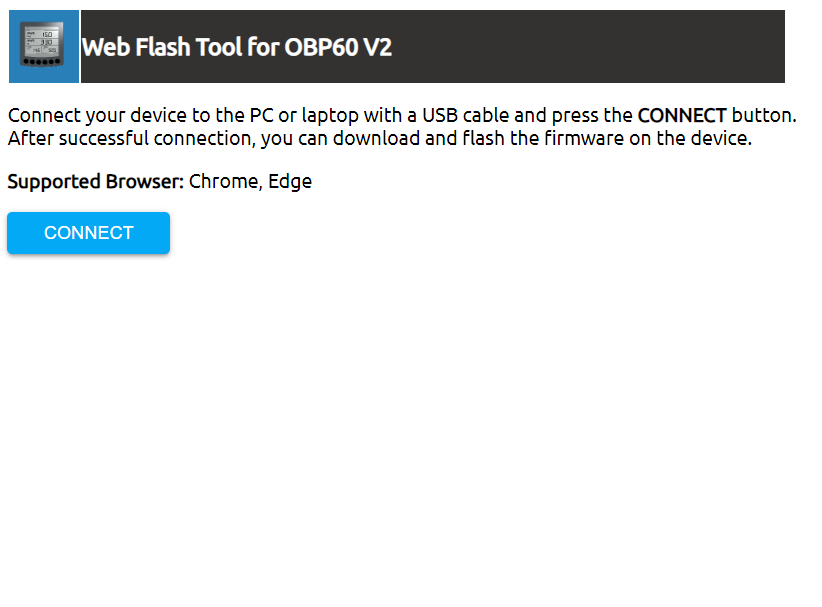
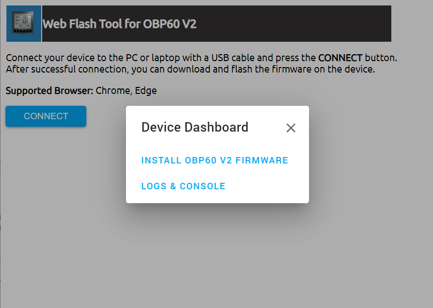

Web-Flashtool
=============

Mit dem Web-Flashtool kann die Firmware für das OBP60 mit einem Webbrowser über eine USB-Verbindung in das Gerät übertragen werden. Dazu wird das OBP60 über die USB-C-Buchse mit einem PC oder Laptop verbunden und der Chrome- oder Edge-Webbrowser gestartet. Im OBP60 ist ein USB-Seriell-Konverter integriert, über den die Datenübertragung durchgeführt wird.

.. note::
	Andere Webbrowser als Chrome oder Edge werden derzeit nicht unterstützt, da die Funktionalität für den Zugriff auf eine serielle Schnittstelle in anderen Webbrowsern nicht implementiert ist.
	
Rufen Sie als nächstes die Webseite des `Online-Flashtools`_ auf.

.. _Online-Flashtools: https://norbert-walter.github.io/obp60-v2-docu/flash_tool/esp_flash_tool.html

Abb.: Startseite Web-Flashtool

Drücken Sie dann auf **Connect** und wählen die entsprechende serielle Schnittstelle aus. Je nachdem, welches Betriebssystem Sie verwenden, sind die Schnittstellen verschieden bezeichnet.

* **Windows:** COMx
* **Linux:** /dev/ttyACM0

Abb.: Start Flashvorgang

.. note::
	Beachten Sie, dass durchaus noch andere serielle Schnittstellen im System benutzt werden. Wählen Sie die Schnittstelle aus, die nach dem Anstecken des OBP60 an den USB-Port im System neu auftaucht. Bereits bestehende Schnittstellen dürfen Sie nicht nutzen, sie werden bereits anderweitig verwendet.
	
