Bussysteme
==========

.. image:: ../pics/NMEA_Bus.png
             :scale: 35%

Das OBP60 unterstützt mehrere Bussysteme.

* **MNEA2000** über CAN-Bus (isoliert)
* **NMEA0183** über RS485/RS422-Bus (isoliert)
* **I2C-Bus** (isoliert)
* **1-Wire-Bus** (nicht isoliert)

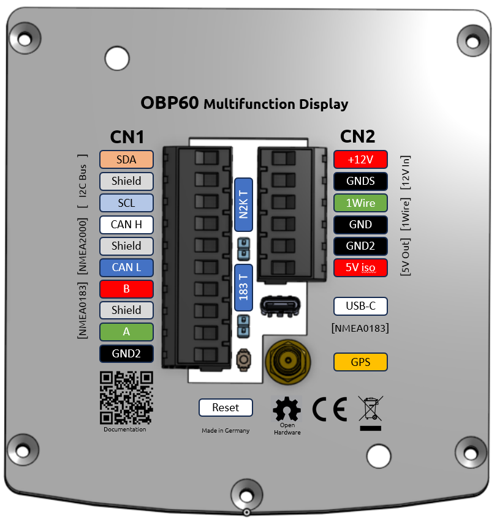
Abb.: Anschlussbelegung der Bussysteme

NMEA2000 und NMEA0183 sind Bussysteme, die im Marine-Bereich verwendet werden. Der I2C-Bus und der 1Wire-Bus kommen aus dem Elektronikbereich. Darüber lassen sich viele günstige Sensor-Module einbinden. Im Nachfolgenden werden die jeweiligen Bussysteme näher beschrieben.

NMEA2000
--------

NMEA2000 ist ein Bussystem und dient der Datenübertragung zwischen elektronischen Geräten in Booten. NMEA2000 verwendet **CAN** zur Datenübertragung. Die Übertragung erfolgt über ein zentrales Kabel, an das alle Geräte parallel angeschlossen sind. Jedes Gerät im NMEA2000-Netzwerk hat eine eindeutige Geräte-ID, um Datenquellen und Datenanzeigegeräte zu identifizieren und zu adressieren. Daten werden in Parameter Group Numbers (**PGN**) organisiert. PGN sind eindeutige Daten-IDs, um bestimmte Typen von Daten zu beschreiben, wie beispielsweise Geschwindigkeit, Kurs, Temperatur usw. Alle Geräte können PGN empfangen und senden, und es kann festgelegt werden, welche PGN von einem bestimmten Gerät gesendet oder empfangen werden sollen.

**Spezifikation NMEA2000**

* Differenzielles bidirektionales Datenprotokoll auf Binär-Basis
* halbduplex mit Kollisionserkennung und Vermeidung
* Busstruktur
* Beidseitige Bus-Terminierung
* Unterstützte Protokolle
	* CAN (Standard, mit speziellen Datenpaketen)
* Datenrate 250.000 Bd fix
* Stromversorgung von Sensoren und Anzeigegeräten über den Bus
* Buslänge bis zu 30 m (Stichleitungen <1.5 m)
* Kabelart 5-polig geschirmt mit 2x2 verdrillten Leitungen 0,25 mm²
* Steckerart M12 5-polig D-Codiert	

**Differenzielle Datenübertragung**

Die Datenübertragung auf dem CAN-Bus erfolgt diffenziell. Es werden jeweils zwei Signale mit entgegengesetzter Polarität vom Sender übertragen und im Empfänger durch Subtraktion aus den zwei Signalen ein Einzelsignal erzeugt. Störungen die sich in selber Weise auf beide Signalleitungen auswirken werden durch die Subtraktion im Empfänger eliminiert. Dadurch wird eine robuste und störunanfällige Signalübertragung ermöglicht.

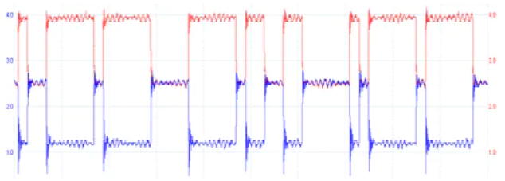

Abb.: Differenzielle Datenübertragung (rot CAN-H, blau CAN-L)

Die Datenrate von NMEA2000 beträgt **250 kbps**. Sie wurde gewählt, um eine ausreichend hohe Übertragungsgeschwindigkeit für eine Vielzahl von Anwendungen in Booten zu gewährleisten, während gleichzeitig eine möglichst effiziente Nutzung des Netzwerks sichergestellt wird. Mit einer Datenrate von 250 kbps können Sensordaten in Echtzeit übertragen werden, was für eine Vielzahl von Anwendungen wichtig ist, wie z.B. die Überwachung der Schiffsposition, der Navigations- und Kommunikationsgeräte sowie der Motor- und anderer Systeme an Bord.

.. note::
	SeaTalk NG, SIMnet, Raynet, C-Net 2000 und CANet haben einige Ähnlichkeiten zu NMEA2000. Sie unterscheiden sich jedoch durch ihre spezifische Auslegung der Hardware und der Datentelegramme. SeaTalk NG und SIMnet sind teilweise kompatibel mit NMEA2000. Das bedeutet, dass einige Geräte, die für SeaTalk NG und SimNet entwickelt wurden, auch mit NMEA2000-Geräten kommunizieren können.
	
**Terminierung des Bussystems**
	
Ein CAN-Bus verwendet an den beiden Enden des Bussystems Abschluss-Widerstände von 120 Ohm zwischen den Leitungen CAN-H und CAN-L. Die beiden Abschluss-Widerstände entsprechen dem Leitungswiderstand von 120 Ohm und verhindern Signalreflexionen an den Leitungsenden bei hohen Datenübertragungsraten. Der CAN-Bus besteht aus einem langen Busstrang mit kurzen Stichleitungen kleiner 1.5 m. Eine Sternstruktur des Bussystems ist nicht erlaubt. Die beiden Abschluss-Widerstände dürfen nur am Busende verbaut sein und dürfen sich nicht dazwischen befinden.

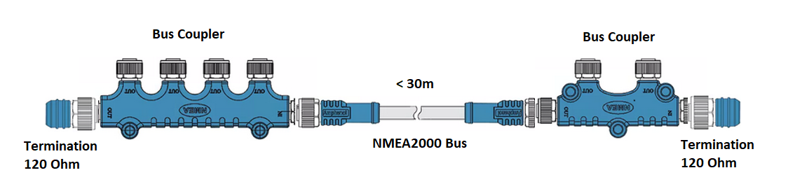
Abb.: CAN-Bus-Terminierung für NMEA2000

.. warning::
	Einige Geräte besitzen eingebaute Abschluss-Widerstände, die durch entsprechende Schalter zu- oder abgeschaltet werden können. Vergewissern sie sich vor dem Einbau neuer Geräte ob integrierte Abschluss-Widerstände benutzt werden und wie sie konfiguriert sind. Falsch terminierte Busse können Übertragungsprobleme verursachen, die schwer zu finden sind.
	
.. tip::
	Um herauszufinden, ob nur zwei Widerstände im NMEA-Bus aktiv sind, können Sie ein Digitalvoltmeter benutzen. Wenn Sie eine Widerstandsmessung bei **spannungslosen NMEA-Bus** zwischen den Leitungen **CAN-High** und **CAN-Low** vornehmen, so sollte ein Widerstand von ca. **60 Ohm** zu messen sein. Ist der Widerstand deutlich kleiner als 60 Ohm, so sind weitere Geräte im Bussystem vorhanden, dessen Abschlusswiderstände aktiv sind. Nehmen Sie dann nacheinander alle Geräte vom NMEA2000-Bus, bis sich der Widerstandswert deutlich erhöht. Beim zu letzt entnommenen Gerät ist der Abschlusswiderstand noch aktiv gewesen. Ist der Widerstandwert noch nicht bei 60 Ohm, so suchen Sie nach weiteren Geräten.  
	
**NMEA2000-Kabel**

.. image:: ../pics/NMEA_Bus.png
             :scale: 35%
	
Als Buskabel sollten nur hochwertige, wasserdichte und geschirmte Industrie-Kabel verwendet werden. Der Marine-Einzelhandel bietet dazu eine breite Auswahl an Produkten mit M12-Verbindungstechnik an, die sich sehr gut verwenden lassen.

.. tip::
	Im Industriebereich findet man gleichwertige Kabel mit M12-Verbindungstechnik, die deutlich günstiger sind und ebenfalls verwendet werden können. Achten Sie dabei auf Steckverbinder mit **D-Kodierung**. Die Indexkerbe befindet sich zwischen Pin 1 und 2.

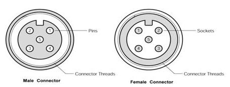
Abb.: Stecker und Buchse (Sicht auf Kontakte)

Die Belegung und Aderfarben sind in der nachfolgenden Tabelle zu sehen. Beachten Sie, dass die Farbbelegung bei Industriekabeln anders ausfallen kann. In dem Fall müssen Sie die Zuordnung der Aderfarben zu den Pins mit einem Ohmmeter ermitteln.

+----+-----------+--------+--------------------+
|Pin |Belegung   |Farbe   |Bedeutung           |
+====+===========+========+====================+
| 1  |Schrimung  |ohne    |Schirmgeflecht      |
+----+-----------+--------+--------------------+
| 2  |+12V       |rot     |Versorgungsspannung |
+----+-----------+--------+--------------------+
| 3  |GND        |schwarz |Bord-Masse          |
+----+-----------+--------+--------------------+
| 4  |CAN-H      |weiß    | CAN High-Signal    |
+----+-----------+--------+--------------------+
| 5  |CAN-L      |blau    | CAN Low-Signal     |
+----+-----------+--------+--------------------+
Tab.: NMEA2000 Steckerbelegung

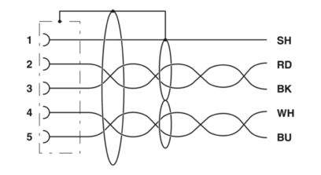
Abb. NMEA2000-Buskabel mit Schirmung

Wer eigene Buskabel herstellen möchte, sollte Kabel wie wie z.B. Lapp Busleitung UNITRONIC 2 x 2 x 0.34 mm² verwenden.

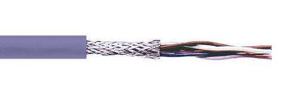
Abb. CAN-Buskabel

Dabei sind 2x zwei Einzeladern paarweise verdrillt und zusätzlich mit einem äußeren Schirmgeflecht umgeben. Ein verdrilltes Aderpaar wird für CAN-H und CAN-L verwendet und das andere Aderpaar für GND und 12V. Das Schirmgeflecht wird mit GND einseitig verbunden. Damit erzielt man die besten Ergebnisse und hat eine sichere und langlebige Installation. Dünnere Kabel als 0.34 mm² sollten nicht verwendet werden, wenn die Versorgung aus den Bus erfolgen soll. Die Länge des Buskabels sollte in Summe 30 m nicht übersteigen.

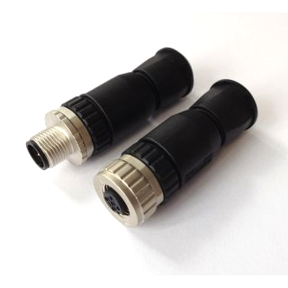
Abb.: NMEA2000 Stecker zur Selbstmontage

.. note::
	SeaTalk NG und Simnet benutzen eigene Steckverbinder die untereinander nicht zu NMEA2000 kompatibel sind. Mit entsprechenden Konverter-Kabeln kann aber ein Datenaustausch zwischen diesen Netzen vorgenommen werden. Grundsätzlich sollte eine Mischung verschiedener Bustechnologien vermieden werden.

**Stromversorgung aus dem NMEA2000-Bus**

NMEA2000 Geräte mit geringem Stromverbrauch wie z.B. Sensoren können auch aus dem Bussystem mit Strom versorgt werden. So sind keine zusätzlichen Versorgungskabel notwendig. Die Einspeisung der 12V-Versorgungsspannung in den NMEA2000 Bus erfolgt entweder über ein Einspeisekabel oder einen Plotter mit Buseinspeisung. Allerdings ist darauf zu achten, dass aus dem NMEA2000 Bus nur eine begrenzte Leistung von bis zu 35W entnommen werden darf. Die NMEA2000 Geräte sind dazu mit Load-Werten gekennzeichnet, die die Stromentnahme aus dem Bus angeben. Die Load wird als Vielfaches von 50 mA angegeben.  Ein Gerät mit Load 3 würde demnach 150 mA an 12V benötigen und 1,8 W an Leistung verbrauchen. Die Einspeisung der 12V-Versorgungsspannung in den Bus sollte idealer Weise in der Mitte erfolgen, da so Leitungsverluste durch Leitungswiderstände minimiert werden.

.. note::
	Das OBP60 hat einen Load-Wert von 5 und benötigt maximal 250 mA Strom. Sie können das OBP60 direkt mit Strom aus dem NMA2000-Bus versorgen. Im Normalbetrieb liegt der Stromverbrauch des OBP60 bei ca. 120 mA.

**Verkabelung für NMEA2000**

Für NMEA2000 wird eine Busstruktur verwendet. In dem Hauptstrang sind ein oder mehrere Buskoppler-Einheiten enthalten, über die die jeweiligen Geräte eingebunden werden. Die Buslänge darf 30 m nicht übersteigen und die Stichleitungen zu den Geräten sollte nicht länger als 1.5 m sein. An den Enden des Hautstranges befinden sich Abschlusswiderstände zur Bus-Terminierung. Die Einspeisung der Stromversorgung des NMEA2000-Busses erfolgt im unteren Bild über den Plotter.

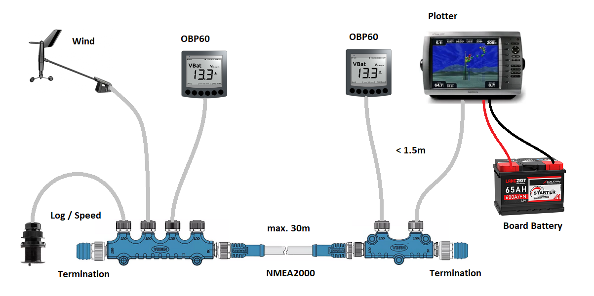
Abb.: NMEA2000-Bussystem mit Sensoren und Anzeigegeräten

Um das OBP an den NMEA2000-Bus anzuschließen, können Sie am einfachsten ein NMEA2000-Verlängerungskabel benutzen, indem Sie es in der Mitte trennen und die offenen Kabelenden an den Schraubklemmen auflegen. Es ist ratsam die Kabelenden mit Aderendhülsen zu versehen oder die Kupferkabel zu verzinnen.

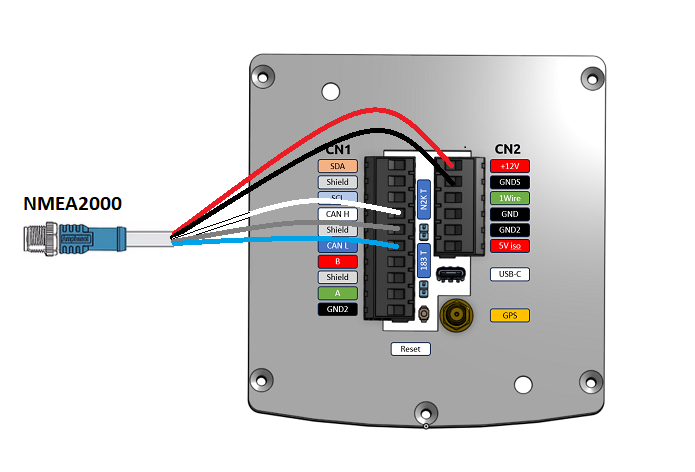
Abb.: NMEA2000-Verbindung mit Stromversorgung über den NMEA2000-Bus

Eine Minimal-Konfigutration könnte folgendermaßen aussehen. Dabei ist zu beachten, dass der NMEA2000-Bus auf der rechten Seite durch das OBP60 terminiert ist, indem die interne Busterminierung über den Jumper ``TN2K`` aktiviert wurde. Der Jumper ``TN2K`` befindet sich mittig zwischen den beiden Steckverbindern **CN1** und **CN2**. 

.. image:: ../pics/NMEA2000_Sample_Setup_Minimal_Configuration.png
             :scale: 60%	
Abb.: NMEA2000 Minimal-Konfiguration mit einem Sensor

Die Stromversorgung des NMEA2000-Bus kann auch über das OBP60 erfolgen. Die Einspeisung in den Bus sieht dann so aus:

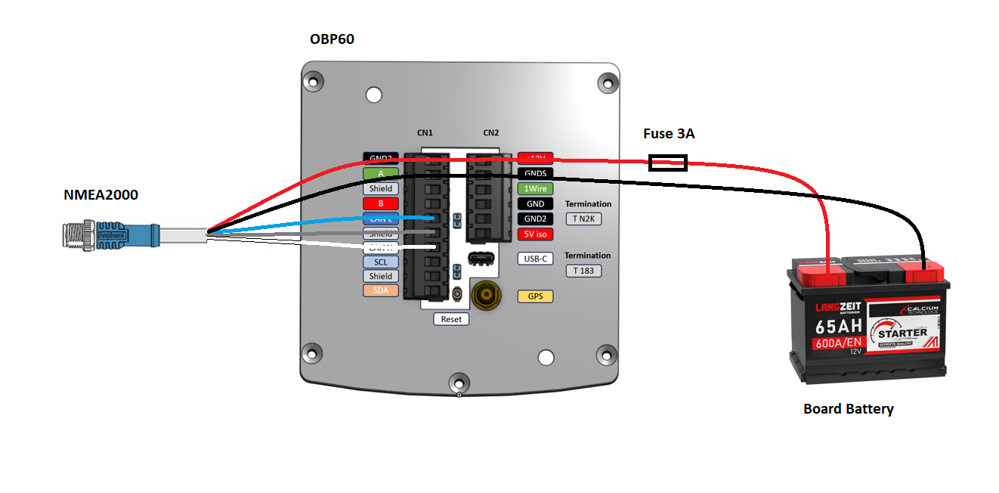
Abb.: NMEA2000-Verbindung mit Stromeinspeisung über OBP60

.. warning::
	Beachten Sie, dass der NMEA2000-Bus nur von einer Quelle gespeist sein darf. Anderenfalls kann es zu Störungen im Bussystem kommen. Achten Sie darauf, dass die Stromeinspeisung in den Bus über eine 3A Sicherrung verfügt.
	
Ein Anwendungsbeispiel könnte dann so aussehen wie im folgenden Bild. Die Bus-Terminierung ist dabei im OBP60 deaktiviert und wird am Busverteiler vorgenommen.

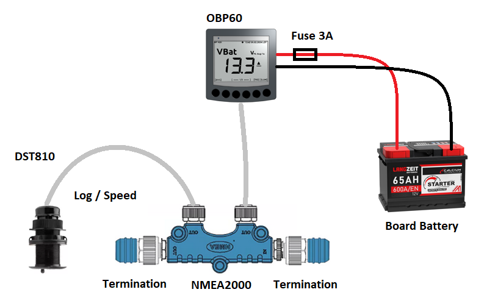
Abb.: NMEA2000 Minimal-Konfiguration mit Buseinspeisung

NMEA0183
--------

NMEA 0183 ist ein Standard für serielle Datenübertragung in der Schifffahrt. Es definiert ein Format für die Übertragung von Informationen zwischen Navigationsgeräten und anderen elektronischen Geräten auf Booten. NMEA0183 ist ein weit verbreiteter Standard, der von vielen alten Geräten unterstützt wird.

**Spezifikation NMEA0183**

* Serielles unidirektionales Datenprotokoll auf ASCII-Basis
* Punkt zu Punkt-Verbindung
* halbduplex ohne Kollisionserkennung und Vermeidung
* Bus-Terminierung am Empfänger
* Unterstützte Protokolle
	* RS422 (Standard)
	* RS485
	* RS232
	* RS232 3.3V TTL
	* RS232 5.0V TTL
* Datenrate 1.200...460.800 Bd variabel
* Stromversorgung von Sensoren und Anzeigegeräten über 12V-Bordnetz
* Buslänge bis zu 1000 m (abhängig von Datenrate und Kabelart)
* Kabelart nicht spezifiziert
* Steckerart nicht spezifiziert	

**Datenübertragung**

Die Datenübertragung erfolgt im OBP60 halbduplex auf serielle Weise über zwei einfache Kabel. Das bedeutet, dass man etweder senden oder empfangen kann. Beides gleichzeitig ist nicht möglich. Die Standard-Datenrate liegt bei 4800 Bd, was für heutige Verhältnisse recht langsam ist, aber Buslängen von bis zu 1000 m zulässt. Als Datenübertragungsrate lassen sich folgende Einstellungen verwenden:

* 1.200 Bd
* 2.400 Bd
* 4.800 Bd
* 9.600 Bd
* 14.400 Bd
* 19.200 Bd
* 28.800 Bd
* 38.400 Bd
* 56.600 Bd
* 57.600 Bd
* 115.200 Bd
* 230.400 Bd
* 460.800 Bd

Je nach Datenrate und Protokoll können die zulässigen Kabellängen unterschiedlich lang ausfallen. Im realen Betrieb sollten diese Werte beachtet werden.

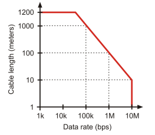
Abb.: Zulässige Kabellängen für RS422 und RS485

+-----------------+--------------------+
|Übertragungsrate | zul. Leitungslänge |
|[Bd]             | [m]                |
+=================+====================+
|4.800            | 300                |
+-----------------+--------------------+
|9.600            | 152                |
+-----------------+--------------------+
|19.200           | 15                 |
+-----------------+--------------------+
|57.600           | 5                  |
+-----------------+--------------------+
|115.200          | 2                  |
+-----------------+--------------------+
Tab.: Zulässige Leitungslängen für RS232

Die Datenübertragung erfolgt mit differenziellen Signalen ähnlich wie bei NMEA2000. Damit können Gleichtaktstörungen über lange Leitungslängen sicher unterdrückt werden.

Abb.: RS422 Übertragungsmodell Sender - Empfänger

**Bus-Terminierung**

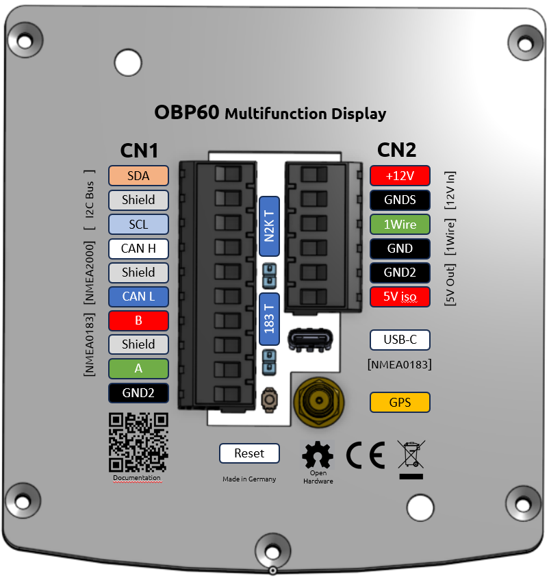
Abb.: Bus-Terminierung für NMEA0183

Auf der Empfängerseite ist der NMEA0183-Bus terminiert. Im OBP60 findet man zwischen den Steckverbindern **CN1** und **CN2** einen Jumper ``T183`` für die Bus-Terminierung. Der Jumper ist zu setzen, wenn das OBP60 als Empfänger von NMEA0183-Telegrammen als **Serial Direction Receive** konfiguriert wurde (siehe Kapitel `Config - Serial Port`_).

.. _Config - Serial Port: https://obp60-v2-docu.readthedocs.io/de/latest/usermanual/configuration.html#config-serial-port

**Multiplexer**

Insgesamt ist NMEA 0183 ein nützlicher Standard für die Übertragung von Navigationsdaten auf Booten, aber es hat seine Beschränkungen und kann nicht in allen Einsatzfällen mit moderneren Technologien wie NMEA2000 mithalten. Um Daten von mehreren Datenquellen wie z.B. Sensoren zu einem Datenstrom zusammenfassen zu können, sind Multiplexer notwendig.

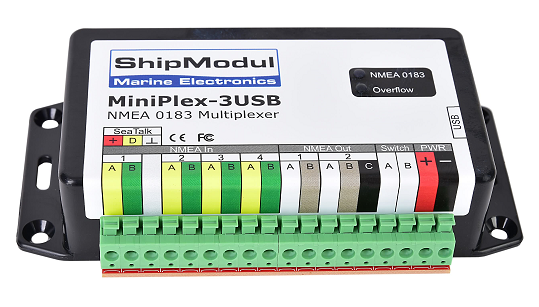
Abb.: NMEA0183 Multiplexer (Ship Modul)

Der Multiplexer empfängt verschiedene Datentelegramme an unterschiedlichen Ports und gibt den zusammengefassten Datenstrom mehrerer Sensoren an einem neuen Datenport aus. So lassen sich mehrere Sensorsignale über eine Leitung an ein Datenendgerät wie z.B. einen Plotter oder ein Multifunktionsdisplay übertragen. Viele Multiplexer bieten auch die Möglichkeit, bestimmte Datentelegramme im Datenstrom mit einer Filterfunktion zu unterdrücken. So können z.B. nur die wirklich notwendigen Daten an einen Autopiloten übertragen oder Mehrdeutigkeiten durch mehrere GPS-Empfänger vermieden werden.

**NMEA0183 Telegrammstruktur**

NMEA0183-Telegramme sind recht einfach aufgebaut und werden als ASCII-Datensätze übertragen. Ein NMEA0183-Telegramm besteht aus folgenden Informationen.

* Kennung
* Telegrammtyp
* Sensordaten
* Einheit
* Status
* CRC-Checksumme

Je nach Komplexität eines Telegramms, können auch mehrere Sensordaten oder Statusinformationen in einem Telegramm übertragen werden. Nachfolgend ist beispielhaft ein Telegramm vom Tiefenmesser dargestellt.

**DBT** - Depth below transducer

	$--DBT,a.a,b,c.c,d,e.e,f*hh<CR><LF>

	Feldnummer: 
		* a.a - Tiefe in Fuß
		* b - f = Fuß
		* c.c - Tiefe in Meter
		* d - M = Meter
		* e.e - Tiefe in Fathoms
		* f - F = Fathoms
		* hh - Checksumme
		
	Beispiel:	
	    * $IIDBT,12.8,f,39.0,M,21.3,F*20

Wer mehr Informationen zu NMEA0183-Telegrammen erfahren möchte, findet auf dieser `Webseite`_ ausführliche Informationen.

.. _Webseite: http://www.nmea.de/nmea0183datensaetze.html

**Verkabelung für NMEA0183**

Im nachfolgenden Bild ist eine Konfiguration zu sehen in der ein NMEA0183-Windsensor mit dem OBP60 verbunden ist. Der Windsensor sendet die Daten zum OBP60. Der OBP60 ist als NMEA0183-Empfänger konfiguriert. Die Bus-Terminierung ist über den Jumper ``T183`` aktiviert.

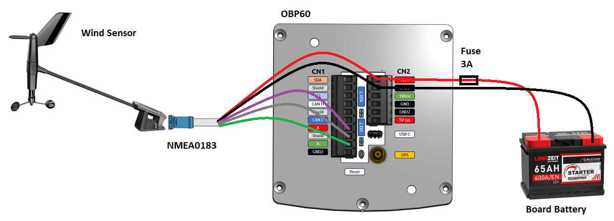
Abb.: NMEA0183 Minimalkonfiguration

.. hint::
    In ähnlicher Art und Weise können auch andere Sensoren an das OBP60 angebunden werden. Dabei ist aber zu berücksichtigen, dass immer nur ein Gerät oder Sensor mit dem OBP60 verbunden werden kann. Wenn mehere Geräte eingebunden werden sollen, dann benötigt man einen Multiplexer.

Die meisten Multiplexer haben mehrere NMEA0183-Eingänge und mindestens einen NMEA0183-Ausgang. Bei der verwendung eines Multiplexers werden alle Sensoren an die NMEA0183-Eingänge des Multiplexers angeschlossen und der NMEA0183-Ausgang mit dem OBP60 verbunden. Das OBP60 ist auf empfangen komfiguriert und die Terminierung des Bussystems ist deaktiviert.

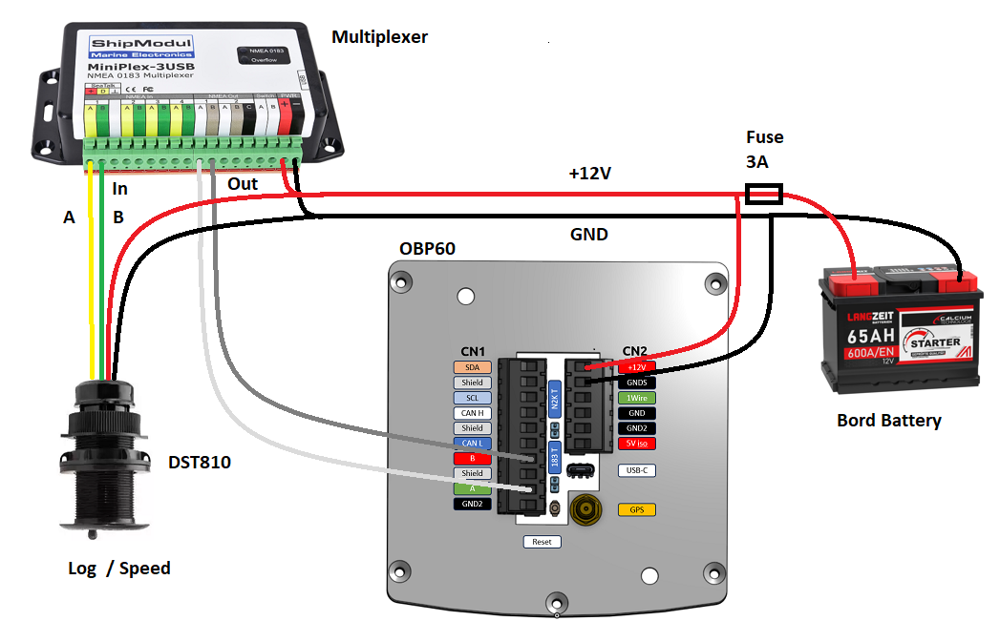
Abb.: NMEA0183-Verbindung zu einem Multiplexer

