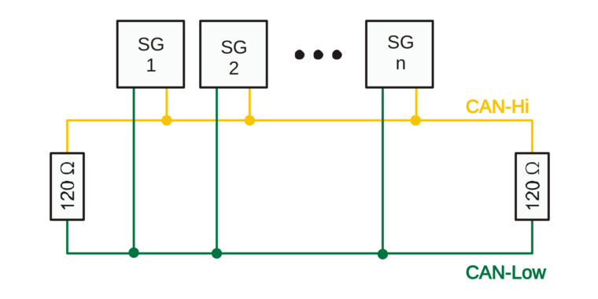

Bussysteme
==========

.. image:: ../pics/NMEA_Bus.png
             :scale: 35%

Das OBP60 unterstützt mehrere Bussysteme.

* **MNEA2000** über CAN-Bus (isoliert)
* **NMEA0183** über RS485/RS422-Bus (isoliert)
* **I2C-Bus** (isoliert)
* **1-Wire-Bus** (nicht isoliert)

Die NMEA2000 und NMEA0183 sind Bussysteme, die im Marine-Bereich verwendet werden. Der I2C-Bus und der 1Wire-Bus kommer aus dem Elektronikbereich udn es lassen sich darüber viele günstige Sensorik einbinden. Im Nachfolgenden werden die jeweiligen Bussysteme näher beschrieben.

NMEA2000
--------

NMEA2000 ist ein Bussystem und dient der Datenübertragung zwischen elektronischen Geräten in Booten. NMEA2000 verwendet **CAN** zur Datenübertragung. Die Übertragung erfolgt über ein zentrales Kabel, an das alle Geräte parallel angeschlossen sind. Jedes Gerät im NMEA2000-Netzwerk hat eine eindeutige Geräte-ID, um Datenquellen und Datenanzeigegeräte zu identifizieren und zu adressieren. Daten werden in Parameter Group Numbers (**PGN**) organisiert. PGN sind eindeutige Daten-IDs, um bestimmte Typen von Daten zu beschreiben, wie beispielsweise Geschwindigkeit, Kurs, Temperatur usw. Alle Geräte können PGN empfangen und senden, und es kann festgelegt werden, welche PGN von einem bestimmten Gerät gesendet oder empfangen werden sollen.

**Differenzielle Datenübertragung**

Die Datenübertragung auf dem CAN-Bus erfolgt diffenziell. Es werden jeweils zwei Signale mit entgegengesetzter Polarität vom Sender übertragen und im Empfänger durch Subtraktion aus den zwei Signalen ein Einzelsignal erzeugt. Störungen die sich in selber Weise auf beide Signalleitungen auswirken werden durch die Subtraktion im Empfänger eliminiert. Dadurch wird eine robuste und störunanfällige Signalübertragung ermöglicht.

.. image:: ../pics/CAN_Signal.png
             :scale: 60%

Abb.: Differenzielle Datenübertragung (rot CAN-H, blau CAN-L)

Die Datenrate von NMEA2000 beträgt **250 kbps** (Kilobits pro Sekunde). Sie wurde gewählt, um eine ausreichend hohe Übertragungsgeschwindigkeit für eine Vielzahl von Anwendungen in Booten zu gewährleisten, während gleichzeitig eine möglichst effiziente Nutzung des Netzwerks sichergestellt wird. Mit einer Datenrate von 250 kbps können Sensordaten in Echtzeit übertragen werden, was für eine Vielzahl von Anwendungen wichtig ist, wie z.B. die Überwachung der Schiffsposition, der Navigations- und Kommunikationsgeräte sowie der Motor- und anderer Systeme an Bord.

.. note::
	SeaTalk NG, SIMnet, Raynet, C-Net 2000 und CANet haben einige Ähnlichkeiten zu NMEA2000. Sie unterscheiden sich jedoch durch ihre spezifische Auslegung der Hardware und der Datentelegramme. SeaTalk NG und SIMnet sind teilweise kompatibel mit NMEA2000, was bedeutet, dass einige Geräte, die für SeaTalk NG und SimNet entwickelt wurden, auch mit NMEA2000-Geräten kommunizieren können.
	
**Terminierung des Bussystems**
	
Ein CAN-Bus verwendet an den beiden Enden des Bussystems Abschluss-Widerstände von 120 Ohm zwischen den Leitungen CAN-H und CAN-L. Die beiden Abschluss-Widerstände entsprechen dem Leitungswiderstand von 120 Ohm und verhindern Signalreflexionen an den Leitungsenden bei hohen Datenübertragungsraten. Der CAN-Bus besteht aus einem langen Busstrang mit kurzen Stichleitungen kleiner 1.5 m. Eine Sternstruktur des Bussystems ist nicht erlaubt. Die beiden Abschluss-Widerstände dürfen nur am Busende verbaut sein und dürfen sich nicht dazwischen befinden.

Abb.: CAN-Terminierung

.. warning::
	Einige Geräte besitzen eingebaute Abschluss-Widerstände, die durch entsprechende Schalter zu- oder abgeschaltet werden können. Vergewissern sie sich vor dem Einbau neuer Geräte ob integrierte Abschluss-Widerstände benutzt werden und wie sie konfiguriert sind. Falsch terminierte Busse können Übertragungsprobleme verursachen, die schwer zu finden sind.
	
**NMEA2000-Kabel**
	
Als Buskabel sollten nur hochwertige, wasserdichte und geschirmte Industrie-Kabel verwendet werden. Wer eigene Buskabel herstellen möchte, sollte Kabel wie wie z.B. Lapp Busleitung UNITRONIC 2 x 2 x 0.34 mm² verwenden.

.. image:: ../pics/CAN_Cable.png
             :scale: 60%			 
Abb. CAN-Buskabel

Dabei sind 2x zwei Einzeladern paarweise verdrillt und zusätzlich mit einem äußeren Schirmgeflecht umgeben. Ein verdrilltes Aderpaar wird für CAN-H und CAN-L verwendet und das andere Aderpaar für GND und 12V. Das Schirmgeflecht wird mit GND einseitig verbunden. Damit erzielt man die besten Ergebnisse und hat eine sichere und langlebige Installation. Dünnere Kabel als 0.34 mm² sollten nicht verwendet werden, wenn die Versorgung aus den Bus erfolgen soll. Die Länge des Buskabels sollte in Summe 40 m nicht übersteigen.

Abb.: Stecker und Buchse (Sicht auf Kontakte)

Abb.: NMEA2000 Stecker zur Selbstmontage

.. note::
	SeaTalk NG und Simnet sind ähnliche Bussysteme die auf CAN-Bus als physischen Layer aufsetzen. Jedoch weichen sie in einigen Spezifikationen von NMEA2000 ab und sind nicht 100% kompatibel. Zudem benutzt jeder Hersteller noch eigene Steckverbinder die untereinander nicht zu NMEA2000 kompatibel sind. Mit entsprechenden Konverter-Kabeln kann aber ein Datenaustausch zwischen diesen Netzen vorgenommen werden. Grundsätzlich sollte eine Mischung verschiedener Bustechnologien vermieden werden.

**Stromversorgung aus dem NMEA2000-Bus**

NMEA2000 Geräte mit geringem Stromverbrauch wie z.B. Sensoren können auch aus dem Bussystem mit Strom versorgt werden. So sind keine zusätzlichen Versorgungskabel notwendig. Die Einspeisung der 12V-Versorgungsspannung in den NMEA2000 Bus erfolgt entweder über ein Einspeisekabel oder einen Plotter mit Buseinspeisung. Allerdings ist darauf zu achten, dass aus dem NMEA2000 Bus nur eine begrenzte Leistung von bis zu 35W entnommen werden darf. Die NMEA2000 Geräte sind dazu mit Load-Werten gekennzeichnet, die die Stromentnahme aus dem Bus angeben. Die Load wird als Vielfaches von 50 mA angegeben.  Ein Gerät mit Load 3 würde demnach 150 mA an 12V benötigen und 1,8 W an Leistung verbrauchen. Die Einspeisung der 12V-Versorgungsspannung in den Bus sollte idealer Weise in der Mitte erfolgen, da so Leitungsverluste durch Leitungswiderstände minimiert werden.

.. note::
	Das OBP60 hat einen Load-Wert von 5 und benötigt maximal 250 mA an Strom. Sie können das OBP60 direkt mit Strom aus dem NMA2000-Bus versorgen.

**Verkabelung für NMEA2000**

