Konfiguration
=============

Um das OBP60 konfigurieren zu können, muss das Gerät in Betrieb sein. Schalten Sie dazu die Stromversorgung zu, die Firmware des OBP60 startet nun. Nach Abschluss der Initialisierungsphase ertönt ein Piepton. Im Display wird zuerst das Open Boat Projects-Logo angezeigt, gefolgt von einem QR-Code, der die Zugangsdaten zum Access Point des OBP60 anzeigt. Beide Bilder sind für einige Sekunden sichtbar. Sie können mit Ihrer Handy-Kamera den QR-Code scannen und sich mit diesen Daten in das WiFi-Netz des OBP60 einloggen.

             
Abb.: Startbildschirm mit OBP-Logo
             

             
Abb.: QR-Code für WiFi-Zugang

Ab Android 10 öffnen Sie dazu die Wifi-Einstellungen und lassen sich alle WiFi-Netzwerke der Umgebung anzeigen. Am Ende der Liste finden Sie unter **Netzwerk hinzufügen** rechts ein kleines, blaues QR-Symbol. Wenn Sie das Symbol anklicken, öffnet sich ein Fenster zum Scannen das QR-Codes. Nach einem erfolgreichen Scan bucht sich das Gerät selbständig in das WiFi-Netzwerk ein. Sie müssen keine Eingaben zur SSID oder zum Passwort vornehmen. Für ältere Android-Versionen gibt es Scanner-Apps, die eine ähnliche Funktionalität aufweisen. 

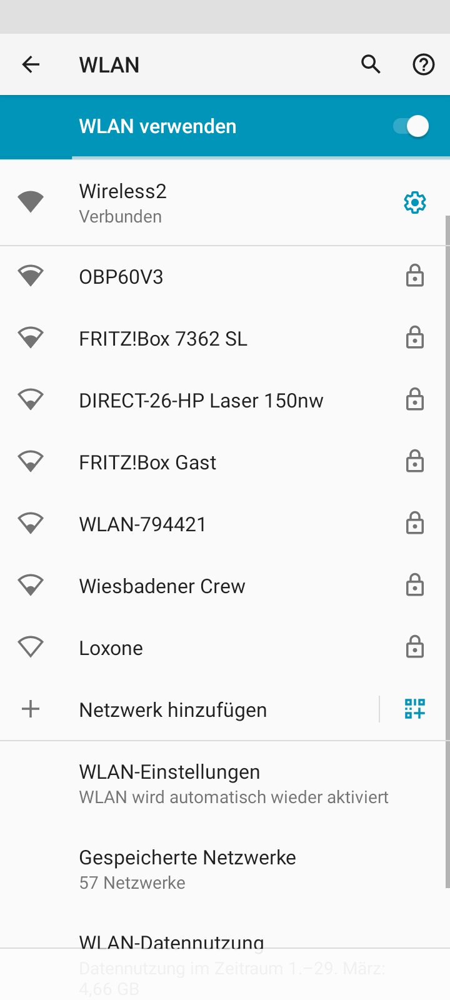
             
Abb.: WLAN Settings unter Android 11

.. note::
    Sollte das Einbuchen in das WiFi-Netzwerk des OBP60 per QR-Code nicht funktionieren, können Sie die Konfiguration auch manuell vornehmen. Verwenden Sie dazu die folgenden Zugangsdaten:

* **SSID:** OBP60V2
* **Passwort:** esp32nmea2k  

Nachdem Ihr Endgerät im WiFi-Netzwerk eigebucht sind, öffnen Sie in einem Web-Browser die Adresse **OBP60V2.local** oder die IP-Adresse **192.168.15.1**. Sie gelangen so auf die Benutzeroberfläche des OPB60 und können den aktuellen Status des Geräts überprüfen. Auf der Benutzeroberfläche befinden sich Tabs, mit denen verschiedene Bereiche der Konfiguration ausgewählt werden können:

* **Status** - Statusanzeige mit Übersicht der Bussysteme
* **Config** - Allgemeine Konfigurationsseite
* **XDR** - Konfigurationsseite für NMEA0183-XDR-Sentences
* **Data** - Dashboard zur Datenanzeige
* **Update** - Seite zum Firmware-Update
* **Help** - Aufruf der Github-Projektseite

.. note::
	Beachten Sie, dass beim erstmaligen Aufruf der Konfigurationsoberfläche kein Passwort beim Speichern der Konfiguration notwendig ist. Als **Default-Passwort** wird **esp32admin** verwendet. Sie können auch ein eigenes Passwort eintragen. Verwenden Sie dabei nur Zeichen des ASCII-Zeichensatzes. Die Passwortabfrage kann zudem deaktiviert werden.

Status
------

Auf der Statusseite sieht man im oberen Bereich den WiFi-Verbindungsstatus.

.. image:: ../pics/Status_1.png
             :scale: 60%

Die Informationen haben folgende Bedeutung:

**Version**
	Aktuelle Firmware-Version
**Access Point IP**
	IP-Adresse des Access Points
**WiFi Client connected**
	Zeigt an, ob das OBP60 mit einem anderen externen WiFi-Netzwerk als Client verbunden ist
**WiFi Client IP**
    IP-Adresse, die dem OBP60 zugewiesen wurde 
**NMEA2000 in**
	Anzahl der NMEA2000-Telegramme, die empfangen wurden
**NMEA2000 out**
	Anzahl der NMEA2000-Telegramme, die gesendet wurden
**TCP in**
	Anzahl der NMEA0183-Telegramme, die über TCP empfangen wurden
**TCP out**
	Anzahl der NMEA0183-Telegramme, die über TCP gesendet wurden
**USB in**
	Anzahl der NMEA0183-Telegramme, die über USB empfangen wurden
**USB out**
	Anzahl der NMEA0183-Telegramme, die über USB gesendet wurden
**Serial in**
	Anzahl der NMEA0183-Telegramme, die über RS485 empfangen wurden
**Serial out**
	Anzahl der NMEA0183-Telegramme, die über RS485 gesendet wurden

Wenn Sie auf das Fragezeichen hinter **Version** klicken, werden alle Telegramme angezeigt, die das OBP60 verarbeiten kann. Detailliertere Informationen zu den empfangenen Telegrammen sehen Sie, wenn Sie die Zeile des jeweiligen Bussystems aufklappen. Im Anhang finden Sie eine Tabelle mit allen NMEA0183- und NMEA2000-Telegrammen, die verarbeitet werden können.

.. note::
	Zum besseren Verständnis ist zu beachten, dass das OBP60 ein eigenes, unabhängiges WiFi-Netzwerk aufbaut, diese Funktion wird auch als Access Point bezeichnet. Die Anzahl der TCP-Clients in der Statuszeile bezieht sich dabei immer nur auf die Clients, die sich beim OBP60 im Access Point-Modus anmelden.
	Das OBP60 kann darüber hinaus in ein anderes, externes WiFi-Netzwerk eingebucht werden, indem es sich dort als Client anmeldet. In dem Fall wird das eigene WiFi-Netz des OBP60 mit dem externen WiFi-Netz gebrückt. Alle Daten des OPB60 sind dann in beiden Netzwerken verfügbar. 
	
Config
------

Die Konfigurationsseite unterteilt sich in zwei Bereiche. Die Firmware basiert auf dem NMEA2000-Gateway-Projekt und nutzt die gesamte Grundstruktur dieses Software-Projektes. Die Funktionalität des OBP60 ist als eigenständiger Task in der NMEA2000-Gateway-Firmware implementiert. Der erste Bereich enthält die Konfiguration für das NMEA2000-Gateway. Im zweiten Bereich ist die Konfiguration zur OBP60-Hardware und -Software zu finden. Den zweiten Bereich erkennt man an dem Prefix OBP.

**Konfiguration zum NMEA2000-Gateway**

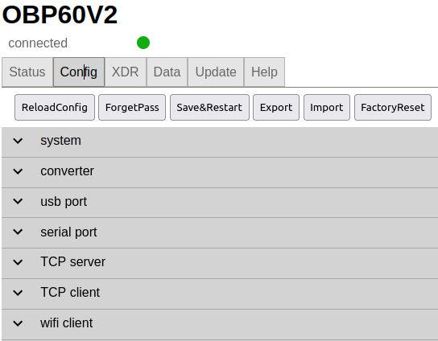
             
Abb.: Konfiguration zum NMEA2000-Gateway

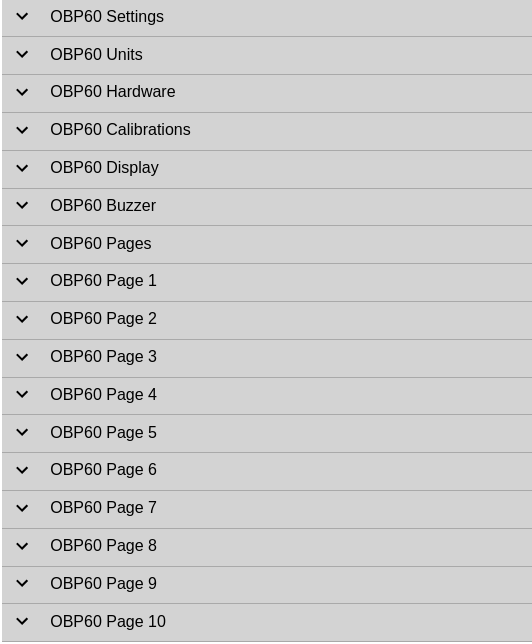
             
Abb.: Konfiguration zur OBP60-Hardware

Auf der Konfigurationsseite sind im oberen Bereich verschiedene Tasten zu sehen. Die Bedeutung der Tasten ist nachfolgend aufgeführt:

* **Reload Config** - Erneutes Laden der Konfiguration
* **Forget Pass** - Entfernen des Login-Passwortes aus dem Cache-Speiches des Browsers
* **Save & Restart** - Speichern der Konfiguration mit anschließendem Neustart der Firmware
* **Export** - Export einer Konfiguration als JSON-File
* **Import** - Import einer Konfiguration über ein JSON-File
* **Factory Reset** - Rücksetzen aller Einstellungen auf Werkszustand

Config - System
---------------

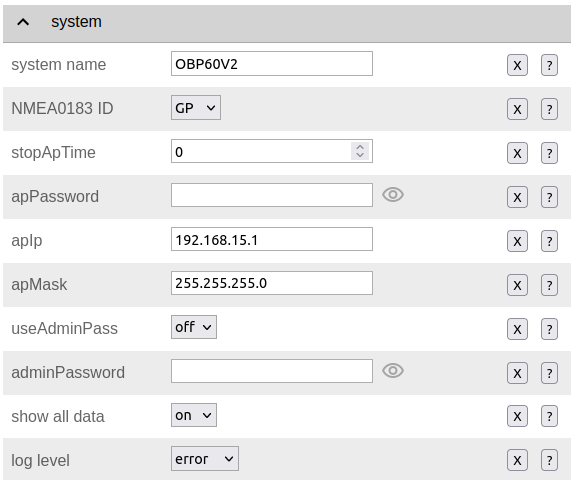

Unter **System** werden grundlegende Einstellungen vorgenommen wie:

**System Name**
	* Gerätename des OBP60. Hier kann ein Name verwendet werden, der aus bis zu 10 ASCII-Zeichen besteht. Dabei dürfen nur Buchstaben und Zahlen verwendet werden. Zusätzlich sind das Minus-Zeichen und der Unterstrich erlaubt. Sonderzeichen sind nicht erlaubt, da der Gerätename gleichzeitig auch als SSID im WiFi-Netzwerk verwendet wird.
	
**NMEA0183 ID**
	* Hier kann festgelegt werden, welches Präfix als Geräte-ID im NMEA0183-Telegrammen verwendet wird. Es lassen sich verschiedene Geräte-IDs einstellen. Details dazu sind unter folgendem `Link`_ zu finden.

.. _Link: https://de.wikipedia.org/wiki/NMEA_0183#Ger%C3%A4te-IDs

**Stop AP Time**
	* Hierüber kann angegeben werden, nach welcher Zeit der WiFi Access Point abgeschaltet werden soll. Die Angabe der Zeit erfolgt in Sekunden. Der Wert <0s> sorgt für einen dauerhaften Betrieb des WiFi Access Points.
	
**AP Password**
	* An dieser Stelle wird das Passwort für den WiFi Access Point angegeben. Es dürfen nur Zeichen des ASCII-Zeichensatzes verwendet werden.
	
**AP Ip**
	* Hier kann die IP-Adresse des WiFi Access Points eingestellt werden. Per Default steht die IP-Adresse auf **192.168.15.1**. In Ausnahmefällen kann die IP auf eine andere Adresse eingestellt werden. Beachten Sie dabei, dass das OPB60 bei veränderter IP-Adresse im Ihrem WLAN unter Umständen nicht mehr erreichbar sein könnte.
	
**AP Mask**
	* An diese Stelle wird die Subnetz-Maske für den WiFi Access Point angegeben. Per Default steht die Subnetz-Maske auf **255.255.255.0**. Es wird dringend empfohlen, diesen Wert nicht zu verändern, es sei denn, Sie wissen genau, welche Auswirkungen eine Änderung hat.
	
.. warning::	
	Achten Sie darauf, dass der Adressbereich des WiFi Access Points  sich zu dem Adressbereich des Netzes unterscheiden muss, in das sich das OBP60 als WiFi-Client einwählt. Der Adressbereich eines Netzwerks ist über die ersten 3 Zifferngruppen gekennzeichnet (111.222.333.xxx). Nur die letzte Gruppe (xxx) wird für die Gerätekennzeichnung im gleichen Netz benutzt. Verändern Sie die ersten 3 Zifferngruppen des Adressbereichs, werden Sie die Konfigurationsseiten des OPB60 nicht mehr ohne weiteres öffnen können. In den meisten Fällen wird eine Änderung der IP-Adresse oder der Subnetz-Maske nicht notwendig sein. Ändern Sie die IP-Adresse und die Subnetz-Maske daher nur, wenn Sie über genügend Netzwerkerfahrung verfügen und sich über die Auswirkungen Ihrer Änderungen im Klaren sind.

**Use Admin Pass**
	* Hiermit kann festgelegt werden, ob für Änderungen der Konfiguration ein Passwort notwendig ist.
	
**Admin Password**
	* Hier wird das Admin-Passwort eingegeben. Es dürfen nur Zeichen des ASCII-Zeichensatzes verwendet werden.
	
**Show All Data**
	* Zeigt das Menü ``on``, werden im Data-Bereich alle Sensordaten angezeigt. Das Umstellen auf ``off`` deaktiviert alle Sensordaten im Data-Bereich.
	
**Log Level**

	* Über **Log Level** lässt sich der Detailgrad der Benachrichtigungen über die USB-C-Schnittstelle einstellen. Folgende Einstellungen stehen zur Verfügung:
		* ``off`` - Keine Logging-Ausgaben
		* ``error`` - Es werden nur Fehlermeldungen ausgegeben
		* ``log`` - Es werden Fehlermeldungen und Statusinformationen ausgegeben
		* ``debug`` - Es werden alle vorgesehenen Meldungen inklusive Debug-Meldungen ausgegeben 
		
.. hint::
	Wenn Sie beabsichtigen, einen NMEA0183-Datenaustausch über die USB-C-Schnittstelle  durchzuführen, sollten Sie den **Log Level** auf ``off`` stellen. Beachten Sie das nicht, kann die Auswertung von Logging-Ausgaben sehr unübersichtlich werden, da Logging-Daten und NMEA0183-Telegramme dann gemischt ausgegeben werden. Wenn Sie nur Logging-Ausgaben sehen wollen, stellen Sie **NMEA to USB** und **NMEA from USB** auf ``off``.

Config - Converter
------------------

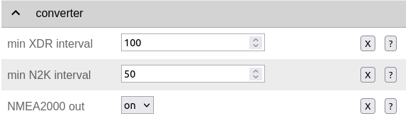

Mit den nachfolgenden Einstellungen können Sie die Funktion des NMEA2000-Gateways verändern.

**Min XDR Interval**
	* Hier wird die Intervallzeit der XDR-Signalverarbeitung eingestellt. XDR-Telegramme sind frei definierbare Sensor-Telegramme. Die Intervallzeit kann ab 10 ms eingestellt werden. Der Default-Wert steht auf 100 ms. Mit der kürzesten Intervallzeit von 10 ms wird eine Datenverarbeitungsrate von 100 Hz erreicht.
	
**Min N2K Interval**
	* Hier wird die Intervallzeit der NMEA2000-Signalverarbeitung eingestellt. Die Intervallzeit kann ab 5 ms eingestellt werden. Der Defaultwert steht auf 50 ms.
	
.. note::
	Bedenken Sie, dass kurze Intervallzeiten eine große Prozessorlast bewirken. Stellen Sie den Wert möglichst so ein, so dass ihre Daten noch zeitlich korrekt verarbeitet werden können. Mit dem Standardwert von 100 ms für das XDR-Interval und 50 ms für das N2K-Intervall können die meisten Anwendungen sinnvoll betrieben werden.
	
**NMEA2000 out**
	* Hier kann eingestellt werden, ob NMEA2000-Telegramme in das NMEA-Netzwerk übertragen werden
		* ``on`` - Ausgabe der NMEA2000-Daten
		* ``off`` - Keine Ausgabe der NMEA2000-Daten
		
Config - USB Port
-----------------

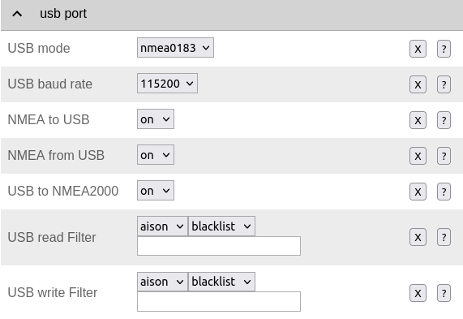

Über die Seite **USB** Port können die Funktionen des USB-Ports detailliert eingestellt werden.

**USB Mode**
	* legt das Format fest, wie Daten am USB-Port verarbeitet werden. Mit dem Actisense-Format können NMEA2000-Telegramme von externer Software empfangen und verarbeitet werden. Actisense-Daten werden innerhalb des Geräts in NMEA2000-Daten und in NMEA0183-Daten  übersetzt. So kann z.B. die `Simulations- und Diagnosefirmware`_ der Fa. Actisense zur Analyse der Busdaten verwendet werden.
	
.. _Simulations- und Diagnosefirmware: https://actisense.com/de/software/
	
		* ``nmea0183`` - Verarbeitung im NMEA0183-Format
		* ``actisense`` - Verarbeitung im Actisense-Format
		
**USB Baud Rate**
	* Hier kann die Schnittstellengeschwindigkeit der seriellen USB-Schnittstelle eingestellt werden. Es lassen sich Geschwindigkeiten zwischen 1.200 Bd und 460.800 Bd einstellen.
	
.. hint::
	Stellen Sie die Schnittstellengeschwindigkeit so ein, dass sie ausreichend hoch ist, um alle Datentelegramme im Sendeintervall verarbeiten zu können. Mit dem Default-Wert von 115.200 Bd können die meisten Anwendungen sinnvoll betrieben werden.

Mit den nachfolgenden drei Einstellungen lässt sich die Datenrichtung an der USB-C-Schnittstelle einstellen. Dabei wird zwischen NMEA0183 und NMEA2000 unterschieden.
	
**NMEA to USB**
	* ``on`` - NMEA0183-Daten werden an die USB-Schnittstelle ausgegeben
	* ``off`` - NMEA0183-Daten werden nicht an die USB-Schnittstelle ausgeben
	
**NMEA from USB**
	* ``on`` - NMEA0183-Daten werden von der USB-Schnittstelle empfangen
	* ``off`` - NMEA0183-Daten werden nicht von der USB-Schnittstelle empfangen
	
**USB to NMEA2000**
	* ``on`` - Daten werden von der USB-Schnittstelle an den NMEA2000-Bus weitergeleitet
	* ``off`` - Daten werden nicht von der USB-Schnittstelle an den NMEA2000-Bus weitergeleiten
	
In den nächsten beiden Einstellungen werden die Filterfunktionen **USB read Filter** und **USB write Filter** für das Lesen und Schreiben an der USB-Schnittstelle gesetzt. Es lassen sich nur NMEA0183-Daten filtern. Dabei lässt sich gesondert einstellen, ob AIS-Positionssignale verarbeitet werden. Als Filterformen stehen <Whitelist> und <Blacklist> zur Verfügung, also einmal die Angabe von Filterkriterien, die die betroffenen Daten einschliessen sollen (Whitelist), dann solche, die zum Ausschluss von Daten führen (Blacklist).

**USB Filter**
	* ``aison`` - AIS-Daten an der USB-Schnittstelle werden verarbeitet
	* ``aisoff`` - AIS-Daten an der USB-Schnittstelle werden nicht verarbeitet
	* ``blacklist`` - Der Filter arbeitet mit einer Blacklist. Die gekennzeichneten Telegramme werden nicht verarbeitet.
	* ``whitelist`` - Der Filter arbeitet mit einer Whitelist. Nur die aufgelisteten Telegramme werden verarbeitet.
	
Im Eingabefeld werden die Kurzbezeichner der NMEA0183-Telegramme eingetragen, Mehrere Einträge werden durch Komma ``,`` getrennt. Folgende Kurzbezeichner können verwendet werden:

	* DBK, DBS, DBT, DPT, GGA, GLL, GSA, GSV, HDG, HDM, HDT, MTW, MWD, MWV, RMB, RMC, ROT, RSA, VHW, VTG, VWR, XDR, XTE, ZDA
	
Die genaue Bedeutung der Kurzbezeichner ist `hier`_ erklärt.

.. _hier: https://de.wikipedia.org/wiki/NMEA_0183

.. hint::
	Filterfunktionen sind ein mächtiges Werkzeug, um Datenflüsse zu steuern. Überlegen Sie sich vor der Konfiguration, wie Ihre Datenflüsse im Boot aussehen sollen, und erstellen sich dazu eine Skizze. Setzen Sie die Filter so ein, dass sie nur die Daten senden und empfangen, die sie auch wirklich benötigen. Unterscheiden Sie dabei, was gesendet und was empfangen werden soll, vermeiden Sie dabei auf alle Fälle Datenschleifen.
	
.. warning::
	Datenschleifen führen zu Fehlfunktionen des Gerätes. Bei Datenschleifen laufen die selben Daten über mehrere Geräte im Kreis. Dadurch entstehen hohe Senderaten, weil fortlaufend die gleichen Daten gesendet und empfangen werden. Die Prozessorlast erhöht sich dabei auf ein Maximum. Unter Umständen kann das Gerät ausfallen, nicht mehr zeitnah die Daten verarbeiten oder nicht mehr bedienbar sein. Beachten Sie, dass der Zustand auch erst dann eintreten kann, wenn weitere Geräte am Bussystem später zugeschaltet werden.
	
Config - Serial Port
--------------------

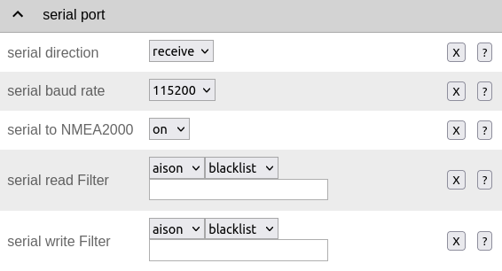

Über **serial port** können Einstellungen zur seriellen NMEA0183-Schnittstelle vorgenommen werden. Diese Einstellungen beziehen sich auf die RS485-Schnittstelle am Steckverbinder **CN1** mit den Signalen ``A``, ``B`` und ``Shield``.

**Serial Direction**
	* ``off`` - Die NMEA0183-Schnittstelle ist ausgeschaltet
	* ``send`` - Die NMEA0183-Schnittstelle sendet
	* ``receive`` - Die NMEA0183-Schnittstelle empfängt
	
.. note::
	Die serielle Schnittstelle ist konform zu RS485 und RS422 und arbeitet im Halbduplex-Betrieb. Es kann entweder gesendet oder empfangen werden. Beides gleichzeitig ist nicht möglich. Wenn Sie eine Vollduplex-Übertragung für NMEA0183-Daten benötigen, dann können Sie die USB-C-Schnittstelle benutzen. Diese Schnittstelle ist aber nicht zu RS485 oder RS422 konform. Sie kann sinnvoll verwendet werden, wenn Sie Daten z.B. in OpenCPN auf einem PC oder Laptop verarbeiten wollen.
	
**Serial Baud Rate**
	* Einstellung der Baudrate zwischen 1.200 und 460.800 Bd.

**Serial To NMEA2000**
	* ``on`` - Daten an der Schnittstelle werden nach NMEA2000 übertragen (Gateway-Funktion)
	* ``off`` - Daten an der Schnittstelle werden nicht nach NMEA2000 übertragen
	
In den nächsten beiden Einstellungen werden die Filterfunktionen **Serial read Filter** und **Serial write Filter** für das Lesen und Schreiben an der seriellen Schnittstelle vorgenommen. Es lassen sich nur NMEA0183-Daten filtern. Dabei lässt sich gesondert einstellen, ob auch AIS-Positionssignale verarbeitet werden. Als Filterformen stehen Whitelist und Blacklist zur Verfügung.

**Serial Filter**
	* ``aison`` - AIS-Daten an der USB-Schnittstelle werden verarbeitet
	* ``aisoff`` - AIS-Daten an der USB-Schnittstelle werden nicht verarbeitet
	* ``blacklist`` - Der Filter arbeitet mit einer Blacklist. Die gekennzeichneten Telegramme werden nicht verarbeitet.
	* ``whitelist`` - Der Filter arbeitet mit einer Whitelist. Nur die aufgelisteten Telegramme werden verarbeitet.
	
Im Eingabefeld werden die Kurzbezeichner der NMEA0183-Telegramme eingetragen, mehrere Einträge werden durch Komma ``,`` getrennt. Folgende Kurzbezeichner können verwendet werden:

	* DBK, DBS, DBT, DPT, GGA, GLL, GSA, GSV, HDG, HDM, HDT, MTW, MWD, MWV, RMB, RMC, ROT, RSA, VHW, VTG, VWR, XDR, XTE, ZDA
	
Die genaue Bedeutung der Kurzbezeichner ist `hier`_ erklärt.

Config - TCP Server
-------------------

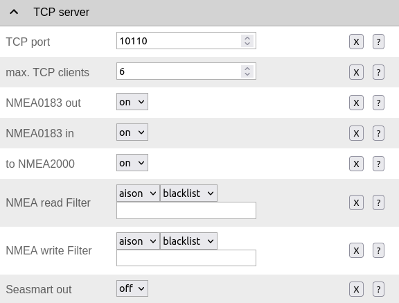
             
Hier werden die Einstellungen zum Betrieb des OPB60 als TCP-Server vorgenommen. Der TCP-Server ist ein Server-Dienst, über den Daten schreibend und lesend ausgetauscht werden können. Dabei meldet sich ein Netzwerk-Gerät als Client aktiv über einen TCP-Port am Server an und kann dann Daten mit dem TCP-Server austauschen.

.. note::
    Der Anmeldevorgang muss immer vom Client initiiert werden. Bei Verbindungsabbrüchen muss der Client die Verbindung wieder selbständig aufbauen. Achten Sie darauf, dass der Client über eine Auto-Connect-Funktion verfügt. Anderenfalls verlieren Sie die Datenverbindung bei Verbindungsabbrüchen dauerhaft.

**TCP Port**
	* Angabe des TCP-Port, auf dem der Server auf eingehende Verbindungsanfragen wartet. Der Default-Wert ist 10110. Verwenden Sie nur Ports größer 1024, da Ports unterhalb von 1024 für feste Anwendungen reserviert sind. Der Maximalwert liegt bei 65535.
	
**Max TCP Clients**
	* Angabe, wieviele Clients sich maximal mit dem TCP-Server verbinden dürfen. Der Default-Wert ist 6.
	
.. note::	
	Beachten Sie, dass eine hohe Zahl an Clients eine große Rechenlast der CPU verursachen kann. Sorgen Sie daher dafür, dass sich nie mehr als 6 Clients mit dem Server verbinden können. Anderenfalls kann es zur Beeinträchtigung der Datenverarbeitung kommen oder das Gerät reagiert nicht mehr korrekt.

**NMEA0183 Out**
    * ``on`` - Am TCP-Port werden NMEA0183-Daten ausgegeben
    * ``off`` - Am TCP-Port werden keine NMEA0183-Daten ausgegeben
	
**NMEA0183 In**
    * ``on`` - Am TCP-Port werden NMEA0183-Daten empfangen
    * ``off`` - Am TCP-Port werden keine NMEA0183-Daten empfangen
	
**To NMEA2000**
	* ``on`` - Daten am TCP-Port werden nach NMEA2000 übertragen (Gateway-Funktion)
	* ``off`` - Daten am TCP-Port werden nicht nach NMEA2000 übertragen
	
In den nächsten beiden Einstellungen werden die Filterfunktionen **NMEA Read Filter** und **NMEA Write Filter** für das Lesen und Schreiben am TCP-Port vorgenommen. Es lassen sich nur NMEA0183-Daten filtern. Dabei lässt sich gesondert einstellen, ob AIS-Positionssignale verarbeitet werden. Als Filterformen stehen "Whitelist" und "Blacklist" zur Verfügung.

**NMEA Read Filter**
	* ``aison`` - Einkommende AIS-Daten an der USB-Schnittstelle werden verarbeitet
	* ``aisoff`` - Einkommende AIS-Daten an der USB-Schnittstelle werden nicht verarbeitet
	* ``blacklist`` - Der Filter arbeitet mit einer Blacklist. Die gekennzeichneten Telegramme werden nicht verarbeitet.
	* ``whitelist`` - Der Filter arbeitet mit einer Whitelist. Nur die aufgelisteten Telegramme werden verarbeitet.

**NMEA Write Filter**
	* ``aison`` - Zu sendende AIS-Daten an der USB-Schnittstelle werden verarbeitet
	* ``aisoff`` - Zu sendende AIS-Daten an der USB-Schnittstelle werden nicht verarbeitet
	* ``blacklist`` - Der Filter arbeitet mit einer Blacklist. Die gekennzeichneten Telegramme werden nicht verarbeitet.
	* ``whitelist`` - Der Filter arbeitet mit einer Whitelist. Nur die aufgelisteten Telegramme werden verarbeitet.
	
Im Eingabefeld werden die Kurzbezeichner der NMEA0183-Telegramme eingetragen, mehrere Einträge werden durch Komma ``,`` getrennt. Folgende Kurzbezeichner können verwendet werden:

	* DBK, DBS, DBT, DPT, GGA, GLL, GSA, GSV, HDG, HDM, HDT, MTW, MWD, MWV, RMB, RMC, ROT, RSA, VHW, VTG, VWR, XDR, XTE, ZDA
	
Die genaue Bedeutung der Kurzbezeichner ist `hier`_ erklärt.

**Seasmart Out**
    * Über Seasmart lassen sich NMEA2000-Daten in NMEA0183-Telegrammen übersetzen. Wenn Sie **Seasmart** aktivieren, werden alle NMEA2000-Daten über NMEA0183-Telegramme ausgegeben und getunnelt. Die Daten werden dabei in Binärform in einem NMEA0183-Telegramm übertragen. Auf diese Weise können Sie von einem OBP60 (TCP-Server) zu einem weiteren OBP60 (TCP-Client) NMEA2000-Daten über Wifi übertragen. Achten Sie darauf, dass auf der Gegenseite ebenfalls **Seasmart** aktiviert ist.
    * ``on`` - Der TCP-Server kann Seasmart-Daten senden und empfangen
    * ``off`` - Seasmart wird vom TCP-Server nicht unterstützt
	
Config - TCP Client
-------------------

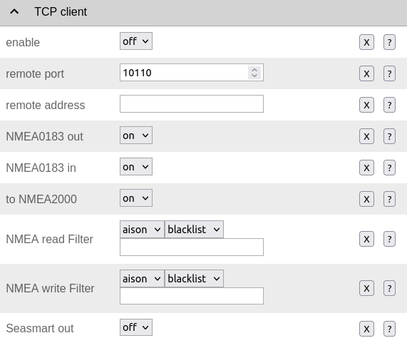
             
Hier werden die Einstellungen für den Betrieb des OPB60 als TCP-Client vorgenommen. Das OBP60 kann als TCP-Client Daten mit einem TCP-Server lesend und schreibend austauschen. Dabei meldet sich das OBP60 als Client aktiv über einen TCP-Port am TCP-Server an und kann dann Daten mit dem Server austauschen. Der TCP-Client-Modus enthält ein Auto-Connect, um bei Verbindungsabbrüchen automatisch die Verbindung wieder aufnehmen zu können.

**Enable**
    * ``on`` - Der TCP-Client-Modus ist im OBP60 aktiviert
    * ``off`` - Der TCP-Client-Modus ist deaktiviert
	
**Remote Port**
	* Angabe des TCP-Ports, über den Daten mit einem TCP-Server ausgetauscht werden sollen. Der Default-Wert ist 10110. Damit der Datenaustausch zwischen einem TCP-Server und einem TCP-Client stattfinden kann, muss der selbe Port vom TCP-Client verwendet werden, den der TCP-Server für die Kommunikation verwendet. Benutzen Sie nur Ports größer 1024, da Ports unterhalb von 1024 für festgelegte Anwendungen reserviert sind. Der Maximalwert liegt bei 65535.
	
**Remote Address**
    Die <Remote Address> ist die Adresse des TCP-Servers im WiFi-Netzwerk, mit dem Sie Daten austauschen wollen. Sie können eine IP-Adresse wie z.B. **192.168.15.1** oder einen MDNS-Hostnamen wie z.B. **OBP60V2.local** verwenden.

.. warning::
    Wenn Sie Daten zwischen zwei OBP60 via WiFi austauschen wollen, müssen sich beide Geräte im selben Funknetz befinden, auch müssen sie unterschiedliche System-Namen haben. Ihre Access Points müssen im gleichen IP-Adressbereich liegen, aber unterschiedliche Geräteadressen haben. Eine Gerät muss als TCP-Server und das andere Gerät als TCP-Client konfiguriert sein. Die Einstellungen dazu werden unter **Config - System** vorgenommen. Wenn Sie das nicht beachten, kann es zu Störungen im WiFi-Datenverkehr kommen und Sie können unter Umständen die Web-Konfigurationsoberflächen der Geräte nicht mehr erreichen.
    
**NMEA0183 Out**
    * ``on`` - Am TCP-Port werden NMEA0183-Daten ausgegeben
    * ``off`` - Am TCP-Port werden keine NMEA0183-Daten ausgegeben
	
**NMEA0183 In**
    * ``on`` - Am TCP-Port werden NMEA0183-Daten empfangen
    * ``off`` - Am TCP-Port werden keine NMEA0183-Daten empfangen
	
**To NMEA2000**
	* ``on`` - Daten am TCP-Port werden nach NMEA2000 übertragen (Gateway-Funktion)
	* ``off`` - Daten am TCP-Port werden nicht nach NMEA2000 übertragen
	
In den nächsten beiden Einstellungen werden die Filterfunktionen **NMEA Read Filter** und **NMEA Write Filter** für das Lesen und Schreiben am TCP-Port vorgenommen. Es lassen sich nur NMEA0183-Daten filtern. Dabei lässt sich gesondert einstellen, ob AIS-Positionssignale verarbeitet werden. Als Filterformen stehen Whitelist und Blacklist zur Verfügung.

**NMEA Read Filter**
	* ``aison`` - Einkommende AIS-Daten an der USB-Schnittstelle werden verarbeitet
	* ``aisoff`` - Einkommende AIS-Daten an der USB-Schnittstelle werden nicht verarbeitet
	* ``blacklist`` - Der Filter arbeitet mit einer Blacklist. Die gekennzeichneten Telegramme werden nicht verarbeitet.
	* ``whitelist`` - Der Filter arbeitet mit einer Whitelist. Nur die aufgelisteten Telegramme werden verarbeitet.

**NMEA Write Filter**
	* ``aison`` - Zu sendende AIS-Daten an der USB-Schnittstelle werden verarbeitet
	* ``aisoff`` - Zu sendende AIS-Daten an der USB-Schnittstelle werden nicht verarbeitet
	* ``blacklist`` - Der Filter arbeitet mit einer Blacklist. Die gekennzeichneten Telegramme werden nicht verarbeitet.
	* ``whitelist`` - Der Filter arbeitet mit einer Whitelist. Nur die aufgelisteten Telegramme werden verarbeitet.
	
Im Eingabefeld werden die Kurzbezeichner der NMEA0183-Telegramme eingetragen, mehrere Einträge werden durch Komma ``,`` getrennt. Folgende Kurzbezeichner können verwendet werden:

	* DBK, DBS, DBT, DPT, GGA, GLL, GSA, GSV, HDG, HDM, HDT, MTW, MWD, MWV, RMB, RMC, ROT, RSA, VHW, VTG, VWR, XDR, XTE, ZDA
	
Die genaue Bedeutung der Kurzbezeichner ist `hier`_ erklärt.

**SeaSmart Out**
    * Über SeaSmart lassen sich NMEA2000-Daten in NMEA0183-Telegrammen übersetzen. Wenn Sie **SeaSmart** aktivieren, werden alle NMEA2000-Daten über NMEA0183-Telegramme ausgegeben und getunnelt. Die Daten werden dabei in Binärform in einem NMEA0183-Telegramm übertragen. Auf diese Weise können Sie von einem OBP60 (TCP-Server) zu einem weiteren OBP60 (TCP-Client) NMEA2000-Daten über Wifi übertragen. Achten Sie darauf, dass auf der Gegenseite ebenfalls **SeaSmart** aktiviert ist.
    * ``on`` - Der TCP-Server kann SeaSmart-Daten senden und empfangen
    * ``off`` - SeaSmart wird vom TCP-Server nicht unterstützt
	
Config - WiFi Client
--------------------

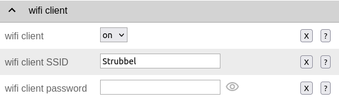

Das OBP60 kann neben dem WiFi Access Point auch als WiFi-Client betrieben werden. In diesem Modus kann das OBP60 einem anderen WiFi-Netz beitreten und dort Daten austauschen. Auf diese Weise lässt sich das OPB60 in Ihr bestehendes Bord-WLAN integrieren. Der WiFi-Client-Modus enthält ein Auto-Connect, um bei Verbindungsabbrüchen automatisch die Verbindung wieder aufnehmen zu können.

**WiFi Client**
    * ``on`` - Der WiFi-Client-Modus ist aktiviert
    * ``off`` - Der WiFi-Client-Modus wird nicht unterstützt
	
**WiFi Client SSID**
    * Tragen Sie hier einen WiFi-Netzwerknamen ein, zum Beispiel den Ihres Bord-WLANs. Als Namen können alle Zeichen des ASCII-Zeichensatzes verwendet werden.
    
**WiFi Client Pasword**
    * Tragen Sie hier das zur o.g. SSID gehörende WiFi-Passwort ein. Als Passwort können alle Zeichen des ASCII-Zeichensatzes verwendet werden. Bei der Eingabe wird das Passwort verdeckt mit Sternchen ``*****`` angezeigt. Über das Augen-Symbol kann das Passwort im Klartext angezeigt werden.
    
.. hint::
    Wenn Sie Probleme mit der Verbindung zu weiteren WiFi-Netzwerken haben, dann überprüfen Sie, ob der Netzwerkname oder das Passwort Sonderzeichen enthält. In einigen Situationen können Sonderzeichen oder zu lange Passwörter Verbindungsprobleme verursachen. Ändern Sie dann versuchsweise den Netzwerknamen oder das Passwort. Mitunter hilft auch ein Neustart Ihres Bord-Routers, in dessen WLAN Sie das OPB60 einbuchen möchten.
    
Config - OBP Settings
---------------------

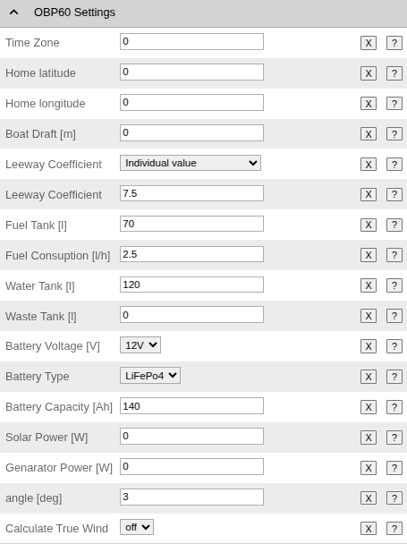
             
Auf der Seite **OBP60 Settings** können Sie Einstellungen vornehmen, die sich auf Ihr Boot beziehen, in dem das OBP60 eingebaut ist.  Die eingetragenen Werte werden dazu benutzt, um zum Beispiel eine ungefähre Reichweitenbestimmung für Wasser, Kraftstoff und Batterie vornehmen zu können. Geben Sie bitte die Werte für Ihr Boot möglichst genau ein und beachten Sie die entsprechenden Einheiten. Die Einstellungen dienen dazu, verschiedene Betriebszustände auf dem OPB60 in Grafiken darzustellen.

.. warning::
    Bedenken Sie, dass die Reichweitenbestimmung mit dem internen Spannungssensor nur als Richtwert verstanden werden sollte. Insbesondere bei den Batterietypen AGM und LiFePo4 müssen Sie mit größeren Ungenauigkeiten rechnen. Beobachten und überprüfen Sie die Ergebnisse unter realen Bedingungen, bevor Sie den Anzeigewerten vertrauen. 

**Time Zone**
    * Über **Time Zone** kann die Zeitzone im Bereich von -12 und +14 Stunden eingestellt werden.

Die meisten Einstellungen sollten selbsterklärend sein. Sofern Sie keine Solarpaneele benutzen, belassen Sie den Wert von **Solar Power**  auf 0. **Generator Power** bezieht sich auf einen Elektrogenerator, der im Boot arbeitet. Das kann eine Lichtmaschine, ein Windgenerator, ein Schleppgenerator oder ein weiterer Zusatz-Generator sein. Die Leistungsangaben für **Solar Power** und **Generator Power** werden zur Visualisierung der Energieflüsse benötigt.

Config - OBP Units
------------------

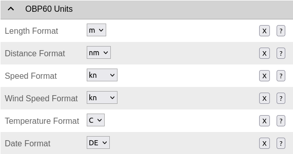
             
Die Einstellung der Einheiten wird unter **OBP Units** vorgenommen. Für die jeweiligen physikalischen Größen lassen sich verschiedene Einheiten verwenden. 

**Date Format**
    * Mit **Date Format** kann das Ausgabeformat des Datums angepasst werden.
    * ``DE`` - Deutsches Datumsformat ``31.12.2024``
    * ``GB`` - Britisches Datumsformat ``31/12/2024``
    * ``US`` - US-Datumsformat ``12/31/2024``

Config - OBP Hardware
---------------------

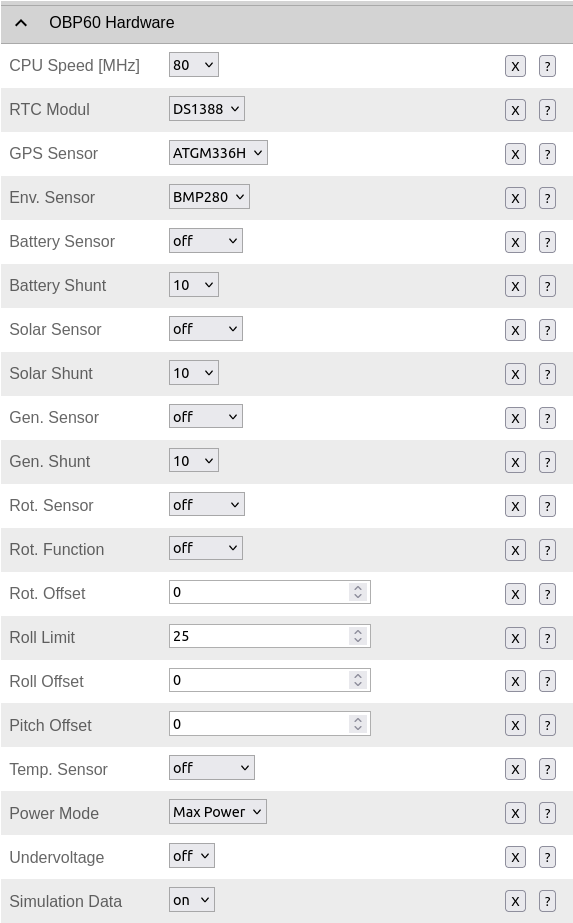

Unter **Hardware** werden alle Einstellungen bezüglich verbauter Hardware oder externer Zusatz-Hardware des OPB60 vorgenommen. Die Default-Einstellungen entsprechen den Minimal-Einstellungen für ein OBP60-Gerät. Je nach verbauter Hardware können unterschiedliche Sensoren und Funktionen zum Einsatz kommen.

**RTC Modul**
     * Typ der Echtzeituhr
     * ``off`` - Es wird keine Echtzeituhr benutzt
     * ``DS1388`` - Echtzeituhr DS1388 (Default)

**GPS Sensor**
     * Typ des GPS-Sensors
     * ``off`` - Es wird kein GPS-Sensor benutzt
     * ``NEO-6M`` - GPS-Sensor NEO-6M
     * ``NEO-M8N`` - Höherwertiger GPS-Sensor NEO-M8N
     * ``ATGM336H`` - GPS-Sensor ATGM336H (Default)
     
**Env. Sensor**
    * Angaben zum verwendeten Umgebungssensor. Dabei können verschiedene Sensoren ausgewählt werden. Die Sensoren sind am I2C-Bus angeschlossen. Es können interne Gerätesensoren des OBP60 oder externe Sensoren ausgewählt werden.   
    * ``off`` - Es wird kein Umgebungssensor benutzt
    * ``BME280`` - Sensor für Temperatur, Luftfeuchtigkeit und Luftdruck
    * ``BMP280`` - Sensor für Temperatur und Luftdruck (Default)
    * ``BMP180`` - Sensor für Temperatur und Luftdruck
    * ``BME085`` - Sensor für Temperatur und Luftdruck
    * ``HTU21`` - Sensor für Temperatur und Luftfeuchtigkeit
    * ``SHT21`` - Sensor für Temperatur und Luftfeuchtigkeit
    
**Battery Sensor**
    * Hier können Sensoren ausgewählt werden, die am externen I2C-Bus angeschlossen sind und Batterie-Werte auslesen.
    * ``off`` - Es wird kein Sensor benutzt
    * ``INA219`` - Sensor für Spannung 0...36V, Strom 0...500A und Leistung, I2C-Addresse 0x40
    * ``INA226`` - Sensor für Spannung 0...36V, Strom 0...500A und Leistung, I2C-Addresse 0x41
    
**Battery Shunt**
    * Hier kann der Shunt ausgewählt werden, der zur Messung des Batterie-Stroms dient. Es können nur Shunts verwendet werden, die 75 mV als Spannungsabfall bei Maximalstrom verwenden. Diese Angabe ist am Shunt zu finden.
    * ``10`` - Shunt für 10A
    * ``50`` - Shunt für 50A
    * ``100`` - Shunt für 100A
    * ``200`` - Shunt für 200A
    * ``300`` - Shunt für 300A
    * ``400`` - Shunt für 400A
    * ``500`` - Shunt für 500A
    
**Solar Sensor**
    * Hier können Sensoren ausgewählt werden, die am externen I2C-Bus angeschlossen sind und Solar-Werte auslesen.
    * ``off`` - Es wird kein Sensor benutzt
    * ``INA219`` - Sensor für Spannung 0...36V, Strom 0...500A und Leistung, I2C-Addresse 0x41
    * ``INA226`` - Sensor für Spannung 0...36V, Strom 0...500A und Leistung, I2C-Addresse 0x44
    
**Solar Shunt**
    * Hier kann der Shunt ausgewählt werden, der zur Messung des Solar-Stroms dient. Es können nur Shunts verwendet werden, die 75 mV als Spannungsabfall bei Maximalstrom verwenden. Diese Angabe ist am Shunt zu finden.
    * ``10`` - Shunt für 10A
    * ``50`` - Shunt für 50A
    * ``100`` - Shunt für 100A
    * ``200`` - Shunt für 200A
    * ``300`` - Shunt für 300A
    * ``400`` - Shunt für 400A
    * ``500`` - Shunt für 500A
    
**Generator Sensor**
    * Hier können Sensoren ausgewählt werden, die am externen I2C-Bus angeschlossen sind und Generator-Werte auslesen.
    * ``off`` - Es wird kein Sensor benutzt
    * ``INA219`` - Sensor für Spannung 0...36V, Strom 0...500A und Leistung, I2C-Addresse 0x45
    * ``INA226`` - Sensor für Spannung 0...36V, Strom 0...500A und Leistung, I2C-Addresse 0x45
    
**Solar Shunt**
    * Hier kann der Shunt ausgewählt werden, der zur Messung des Solarstroms dient. Es können nur Shunts verwendet werden, die 75 mV als Spannungsabfall bei Maximalstrom verwenden. Diese Angabe ist am Shunt zu finden.
    * ``10`` - Shunt für 10A
    * ``50`` - Shunt für 50A
    * ``100`` - Shunt für 100A
    * ``200`` - Shunt für 200A
    * ``300`` - Shunt für 300A
    * ``400`` - Shunt für 400A
    * ``500`` - Shunt für 500A
    
**Rot. Sensor**
    * Über **Rot.Sensor** kann der Sensor zur Winkelmessung ausgewählt werden, der sich am externen I2C-Bus befindet.
    * ``off`` - Es wird kein Sensor benutzt
    * ``AS5600`` - Magnetischer Sensor zur Winkelmessung von 0° bis 360° ohne Endanschlag, I2C-Adresse 0x36
    
**Rot. Function**
    * Funktion des Winkelsensors
    * ``Rudder`` - Winkelsensor für Ruderstellung
    * ``Wind`` - Winkelsensor für Windrichtung
    * ``Mast`` - Winkelsensor für Mastausrichtung bei drehbaren Masten
    * ``Keel`` - Winkelsensor für Kielneigung
    * ``Trim`` - Winkelsensor für Trimmklappen oder Foils
    * ``Boom`` - Winkelsensor für Großbaum
    
**Rot. Offset**
    Offset des Winkelsensors. Damit kann der Nullpunkt der externen Winkelsensoren am I2C-Bus korrigiert werden.
    
**Roll Limit**
    **Roll Limit** gibt den maximal zulässigen seitlichen Neigungswinkel für das Rollen des Bootes an. Unter realen Bedingungen sind 20 Grad als Grenzwert realistisch.
    
**Roll Offset**
    Offset des Neigungs-Winkelsensors. Damit kann der Nullpunkt des Winkelsensors für das seitliche Rollen Ihres Bootes korrigiert werden.
    
**Pitch Offset**
    Offset des Winkelsensors für Pitch. Damit kann der Nullpunkt des Winkelsensors für das Nicken Ihres Bootes korrigiert werden.
    
**Temp Sensor**
    * Hier kann der Sensortyp ausgewählt werden, der am 1Wire-Bus verwendet wird.
    * ``off`` - Es wird kein Sensor benutzt
    * ``DS18B20`` - Temperatursensor -10...+85°C (1...8 Sensoren)
    
**Power Mode**
    * Der **Power Mode** bezieht sich auf die Art der Stromversorgung, die für das OBP60 verwendet wird.
    * ``Max Power`` - Alle Stromversorgungen sind eingeschaltet. Hierbei ist das Gerät am leistungsfähigsten und es entsteht der maximale Stromverbrauch.
    * ``Only 5.0V`` - Es ist nur die zusätzliche Stromversorgung für 5.0 V eingeschaltet.
    * ``Min Power`` - Es sind nur die Stromversorgungen eingeschaltet, die die Minimal-Funktionen bereitstellen. Hierbei entsteht der geringste Stromverbrauch.
    
**Undervoltage**
    * Erkennung einer Unterspannung der Stromversorgung. Wenn eine Unterspannung niedriger als 9 V erkannt wird, kann das OBP60 automatisch deaktiviert werden, um eine Tiefentladung der Bordbatterie vermeiden zu helfen. In kritischen Situationen kann das OBP60 trotz Unterspannung bis 7 V funktionsfähig bleiben, wenn der Unterspannungsschutz deaktiviert ist. Als Default-Wert ist der Unterspannungsschutz aktiviert. Wenn im aktivierten Zustand eine Unterspannung auftritt, wird das OBP60 deaktiviert und in den Tiefschlaf versetzt. Im Display erscheint die Meldung **Undervoltage**. Dieser Zustand kann nur verändert werden, wenn die Versorgungsspannung vollständig ausgeschaltet und wieder eingeschaltet wird.
    * ``on`` - Der Unterspannungsschutz ist aktiviert
    * ``off`` - Der Unterspannungsschutz ist ausgeschaltet
    
.. hint::
    Wenn Sie das OBP60 über USB mit Strom versorgen möchten, muss die Erkennung der Unterspannung abgeschaltet werden, da sich das Gerät sonst automatisch abschaltet.
	
**Simulation Data**
    * Mit **Simulation Data** können Bus- und Sensordaten simuliert werden. Die Funktion ist nützlich, wenn die Funktionalität des Gerätes im ausgebauten Zustand ohne angeschlossene Busse oder Sensoren getestet werden soll. Das Gerät befindet sich dann in einem Demo-Mode.
    * ``on`` - Sensordaten werden durch Simulationsdaten ersetzt
    * ``off`` - Es werden Live-Sensordaten verwendet
	
.. warning::
    Bedenken Sie, dass Simulationsdaten als Live-Daten fehlinterpretiert werden können. Benutzen Sie Simulationsdaten nur, wenn Sie das OBP60 nicht zur Navigation benötigen und stellen es nach der Benutzung wieder auf Live-Daten um, indem Sie den Simulations-Modus beenden.

Config - OBP Calibrations
-------------------------

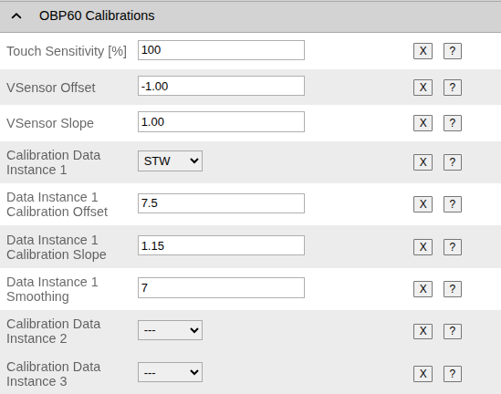

Auf der Seite **Calibrations** können Einstellungen zur Kalibrierung vorgenommen werden. Damit lassen sich Ungenauigkeiten von bestimmten Messwerten korrigieren. Die Korrektur kann je nach Sensor mit einer linearen oder quadratischen Korrektur durchgeführt werden.  

**Touch Sensitivity**
    * Einstellung der Tastenempfindlichkeit 0...100%. 0% bedeutet minimale Empfindlichkeit. 100% bedeutet maximale Empfindlichkeit.

**VSensor Offset**
    * Offset der Korrekturfunktion des internen Spannungssensors des OBP60
    
**VSensor Slope**
    * Steigung der Korrekturfunktion des internen Spannungssensors des OBP60

Config - OBP Display
--------------------

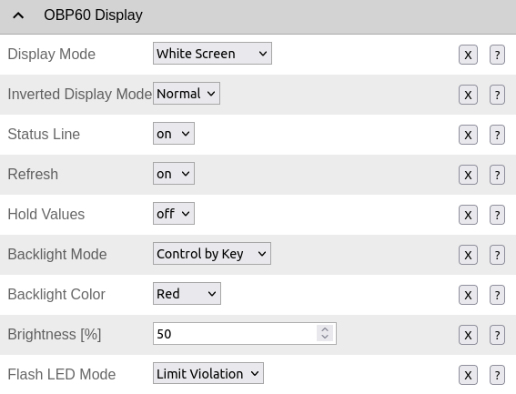

Der Bereich **Display** enthält alle Einstellungen, die das Display betreffen.

**Display Mode**
    * Über den **Display Mode** wird eingestellt, wie sich das Display unmittelbar nach dem Einschalten verhält.
    * ``Logo + QR Code`` - Das Logo und der QR-Code für den WiFi-Zugang werden angezeigt.
    * ``Logo`` - Nur das Logo wird angezeigt.
    * ``White Screen`` - Es wird eine weiße Seite angezeigt.
    * ``off`` - Das Display wird deaktiviert, es wird zur Anzeige nicht verwendet.
    
**Inverted Display Mode**
    * ``Normal`` - Der Bildschirminhalt wird schwarz auf weißem Untergrund angezeigt.
    * ``Inverse`` - Der Bildschirminhalt wird weiß auf schwarzem Untergrund angezeigt.
    
**Status Line**
    * ``on`` - Die Statuszeile wird im oberen Bereich des Bildschirms angezeigt.
    * ``off`` - Die Statuszeile ist deaktiviert.
    
**Refresh**
    * ``on`` - Der Auto-Refresh des Bildschirminhaltes ist aktiviert. Damit werden Geisterbilder beim Seitenwechsel unterbunden. Es wird ein Voll-Refresh des E-Paper-Displays durchgeführt. Alle 10 min erfolgt zusätzlich automatisch ein Voll-Refresh.
    * ``off`` - Auto-Refresh ist deaktiviert
    
.. note::
    Die Entstehung von Geisterbildern ist von der Display-Temperatur des OBP60 abhängig. Bei tiefen Temperaturen sind Geisterbilder deutlicher zu sehen und die Anzeige reagiert träger als bei höheren Temperaturen. Kurz nach dem Einschalten wird für die ersten 5 Minuten jede Minute ein Voll-Refresh durchgeführt, damit sich das Display akklimatisieren kann. Bei extrem großer Sonneneinstrahlung kann es vorkommen, dass der Kontrast des Display-Inhaltes verloren geht. Schwarze Anzeigebereiche werden dann nur noch grau dargestellt. Das Display ist in diesem Fall nicht defekt. Nach einem Voll-Refresh regeneriert sich das Display und der Kontrast wird wieder vollständig hergestellt.
    
**Hold Values**
    * ``on`` - Anzeigewerte werden gehalten, wenn die Datenverbindung kurzzeitig fehlen sollte und die Daten nicht aktualisiert werden können. Diese Einstellung kann bei TCP-Verbindungen über WiFi nützlich sein. 
    * ``off`` - Anzeigewerte werden nicht gehalten. Bei unterbrochener Datenverbindung länger als 5 s werden fehlende Daten mit ``---`` gekennzeichnet.
    
**Backlight Mode**
    * ``Off`` - Die Hintergrundbeleuchtung ist dauerhaft ausgeschaltet.
    * ``Control by Sun`` - Automatisches Schalten der Beleuchtung durch den Sonnenstand
    * ``Control by Bus`` - Automatisches Schalten der Beleuchtung über den Bus durch NMEA2000
    * ``Control by Time`` - Schalten der Beleuchtung durch ein vorgegebenes Zeitintervall
    * ``Control by Key`` - Manuelles Schalten der Beleuchtung durch eine Sensortaste
    * ``On`` - Die Hintergrundbeleuchtung ist dauerhaft eingeschaltet.
    
**Backlight Color**
    * Die Farbe der Hintergrundbeleuchtung kann durch 6 RGB-LEDs individuell eingestellt werden.
    * ``Red`` - rot
    * ``Orange`` - orange
    * ``Yellow`` - gelb
    * ``Green`` - grün
    * ``Blue`` - blau
    * ``Aqua`` - wasser
    * ``Violet``- violett
    * ``White`` - weiß (höchster Stromverbrauch)
    
**Brightness**
    Über **Brightness** kann die Helligkeit der Hintergrundbeleuchtung der RGB-LEDs zwischen 20... 100% eingestellt werden. Der Default-Wert liegt bei 50%. Damit wird sehr wenig Strom für die Hintergrundbeleuchtung benötigt. Die Helligkeit ist damit so für den Nachtbetrieb eingestellt, dass die Beleuchtung nicht blenden kann.
    
.. hint::
    Für längere Nachtfahrten ist eine rote Hintergrundbeleuchtung empfehlenswert, die moderat in der Helligkeit auf z.B. 50% eingestellt ist. Bei rotem Licht muss sich das Auge nicht ständig an wechselnde Lichtverhältnisse anpassen. So können Sie nachts das Display ohne Sichteinschränkungen ablesen. 
    
.. note::
   Je höher die Helligkeit der Hintergrundbeleuchtung eingestellt wird, um so mehr Strom wird verbraucht. Bei weißer Hintergrundbeleuchtung tritt der größte Stromverbrauch auf, da alle 3 Farben der RGB-LED zur Erzeugung von weißem Licht benutzt werden. Bei reinen Grundfarben wie rot, grün und blau wird am wenigsten Strom verbraucht. Bei Mischfarben weden die RGB-LEDs unterschiedlich stark angesteuert und der Stromverbrauch ist höher als bei den Grundfarben. Nachfolgend zwei Beispiele:
        * 100%, weiß - 2 W
        * 50%, rot - 0.2W
        
**Flash LED Mode**

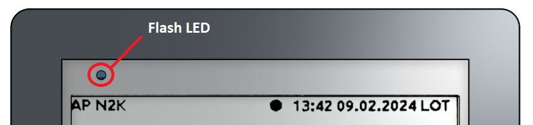
             
Die Flash-LED befindet sich in der linken oberen Ecke über dem E-Paper-Display und zeigt verschiedene Zustände des OBP60 an. Die LED kann dabei verschiedene Farben annehmen, die je nach Verwendung unterschiedliche Bedeutung haben.

    * ``Off`` - Die Flash-LED ist dauerhaft ausgeschaltet.
    * ``Bus Data`` - Bei eintreffenden Busdaten leuchtet die LED kurz blau auf.
    * ``GPS Fix Lost`` - Bei dauerhaft roter Flash-LED wurde der GPS-Fix verloren. Die GPS-Daten sind ungültig.
    * ``Limit Violation`` - Bei blinkend roter Flash-LED ist ein Grenzwert über- oder unterschritten worden.
    
Die Flash-LED leuchtet mit maximaler Helligkeit, sodass sie optisch auch bei hellen Sonnenlicht gut wahrgenommen werden kann. Die Bedeutung der Farben ist folgende:

    * Rot - Alarmierung bei Grenzwertüberschreitung
    * Grün - Bestätigung von Zustandsänderungen (z.B. Autopilot ein/aus)
    * Blau - Signalisierung von Zuständen (z.B. GPS-Empfang, Datentransfer usw.)    

Config - OBP Buzzer
-------------------

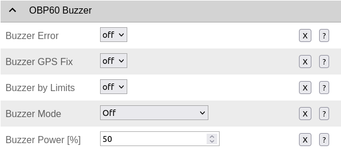
             
In diesem Bereich lassen sich die Funktionen des Buzzer einstellen. Der Buzzer dient zur akustischen Signalisierung von Systemzuständen und Störungen des OBP60. 
             
**Buzzer Error**
    * ``on`` - Der Buzzer ertönt bei Störungen und Fehlern.
    * ``off`` - Die Funktion ist deaktiviert.

**Buzzer GPS Fix**
    * ``on`` - Der Buzzer ertönt, wenn das GPS-Signal verloren wurde.
    * ``off`` - Die Funktion ist deaktiviert.

**Buzzer by Limits**
    * ``on`` - Der Buzzer ertönt bei Grenzwertüberschreitungen.
    * ``off`` - Die Funktion ist deaktiviert.

**Buzzer Mode**
    * ``Off`` - Die Buzzer ist dauerhaft ausgeschaltet.
    * ``Short Single Beep`` - Bei Aktivierung ertönt ein kurzer Einzelton.
    * ``Longer Single Beep`` - Bei Aktivierung ertönt ein längerer Einzelton. 
    * ``Beep until Confirmation`` - Bei Aktivierung ertönt der Buzzer so lange, bis er durch Betätigen einer beliebigen Taste deaktiviert wird.

**Buzzer Power**
    Über **Buzzer Power** kann die Lautstärke des Warntons zwischen 0...100% eingestellt werden. Die Lautstärke gilt grundsätzlich für alle Audioausgaben.

Config - OBP Pages
------------------

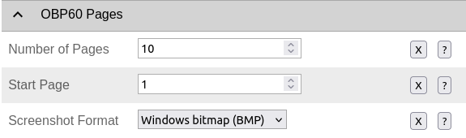
             
Die Konfiguration der möglichen Anzeigeseiten des OPB60 erfolgt auf der Seite **Pages**. Hier wird festgelegt, wie viele Anzeigeseiten das OPB60 darstellen soll. Außerdem lässt sich festlegen, welche Anzeigeseite beim Einschalten gezeigt werden soll.

**Number of Pages**
    * Hier wird die maximale Anzahl der Anzeigeseiten festgelegt. Es muss mindestens eine Anzeigeseite definiert sein, es können maximal 10 Anzeigeseiten aktiviert werden.
    
**Start Page**
    * Dieser Wert legt fest, welche Seite beim Start angezeigt werden soll. Es können nur die Seiten angezeigt werden, die innerhalb der Seitenanzahl (**Number of Pages**) liegen.

Config - OBP Page X
-------------------

.. image:: /pics/Screen_Overview.png
             :scale: 50%

Im OBP60 gibt es insgesamt bis zu 10 Seiten, die man frei auswählen und gestalten kann. Je nach Seite können unterschiedlich viele Daten angezeigt werden. Es gibt frei definierbare Seiten, in denen die Inhalte zum Anzeigen ausgewählt werden können. Dann gibt es Seiten mit vorgegebenem, nicht veränderbaren Inhalt. Die meisten numerischen Seiten sind änderbar, während die grafischen Seiten oft vordefinierte Inhalte anzeigen.

* Seiten mit veränderbarem Inhalt
    * **OneValue** - Ein Anzeigewert
    * **TwoValue** - Zwei Anzeigewerte
    * **ThreeValue** - Drei Anzeigewerte
    * **FourValue** - Vier Anzeigewerte
    * **FourValue2** - Vier Anzeigewerte (andere Anordnung vertikal/horizontal)

* Seiten mit festem Inhalt
    * **Voltage** - Anzeige der Bordspannung (**xdrVBat**)
    * **DST810** - Anzeige für Tiefe, Speed, Log und Wassertemperatur (**DBT, STW, Log, WTemp**)
    * **Clock** - Grafische Zeitanzeige mit Sonnenauf- und Sonnenuntergang (**GPST, GPSD**)
    * **White Page** - Leere weiße Seite, um Display in StandBy zu schalten
    * **BME280** - Anzeige von Umweltdaten wie Temperatur, Luftdruck und Feuchtigkeit (**BME280** I2C)
    * **Rudder Position** - Grafische Anzeige der Ruderposition (**RPOS**)
    * **Keel Position** - Grafische Anzeige der Kielposition (**AS5600** I2C)
    * **Battery** - Anzeige von Spannung, Strom und Leistung (**INA219, INA226** I2C)
    * **Battery2** - Grafische Anzeige des Batterie-Ladezustandes (**INA219, INA226** I2C)
    * **RollPitch** - Grafische Anzeige von Roll und Pitch (**xdrRoll, xdrPitch**)
    * **Solar** - Grafische Anzeige des Solar-Ladezustandes (**INA219, INA226** I2C)
    * **Generator** - Grafische Anzeige des Generator-Ladezustandes (**INA219, INA226** I2C)
    
.. note::
    Bitte beachten Sie, dass alle Seiten mit festen Inhalten bestimmte Sensorwerte vorausetzen, um Messwerte angezeigen zu können. Unter dem Register **Data** kann die Verfügbarkeit der notwendigen Daten geprüft werden. 
    
Bei Seiten mit veränderlichem Inhalt stehen je nach Anzahl der Anzeigewerte unterschiedlich viele Eingabefelder zur Verfügung. Darüber können die anzuzeigenden Daten ausgewählt werden.

.. image:: /pics/Config_OBP60_Page_4Value.png
             :scale: 60%

Abb.: Seite mit 4 Anzeigewerten

* Datenpool auswählbarer Daten
    * **ALT** - Altitude, Höhe über Grund
    * **AWA** - Apparant Wind Angle, scheinbare Windrichtung
    * **AWS** - Apparant Wind Speed, scheinbare Windgeschwindigkeit
    * **BTW** - Bearing To Waipoint, Winkel zum aktuellen Wegpunkt
    * **COG** - Course over Ground, Kurs über Grund
    * **DBS** - Depth Below Surface, Tiefe unter Wasseroberfläche
    * **DBT** - Depth Below Transducer, Tiefe unter Sensor
    * **DEV** - Deviation, Kursabweichung
    * **DTW** - Distance To Waypoint, Entfernung zum aktuellen Wegpunkt
    * **GPSD** - GPS Date, GPS-Datum
    * **GPDT** - GPS Time, GPS-Zeit als UTC (Weltzeit)
    * **HDG** - Heading, rechtweisender Kurs
    * **HDOP** - GPS-Genauigkeit in der Horizontalen
    * **LAT** - Latitude, geografische Breite
    * **LON** - Longitude, geografische Höhe
    * **Log** - Log, Entfernung
    * **MHDG** - Magnetic Heading, magnetischer rechtweisender Kurs
    * **MaxAws** - Maximum Apperant Wind Speed, Maximum der relativen Windgeschwindigkeit seit Gerätestart
    * **MaxTws** - Maximum True Wind Speed, Maximum der wahren Windgeschwindigkeit seit Gerätestart
    * **PDOP** - GPS-Genauigkeit über alle 3 Raumachsen
    * **PRPOS** - Auslenkung Sekundärruder
    * **ROT** - Rotation, Drehrate
    * **RPOS** - Rudder Position, Auslenkung Hauptruder
    * **SOG** - Speed Over Ground, Geschwindigkeit über Grund
    * **STW** - Speed Through Water, Geschwindigkeit durch das Wasser
    * **SatInfo** - Satellit Info, Anzahl der sichtbaren Satelliten
    * **TWD** - True Wind Direction, wahre Windrichtung
    * **TWS** - True Wind Speed, wahre Windgeschwindigkeit
    * **TZ** - Time Zone, Zeitzone
    * **TripLog** - Trip Log, Tages-Entfernungszähler
    * **VAR** - Variation, Abweichung vom Sollkurs
    * **VDOP** - GPS-Genauigkeit in der Vertikalen
    * **WPLat** - Waypoint Latitude, geogr. Breite des Wegpunktes
    * **WPLon** - Waypoint Longitude, geogr. Länge des Wegpunktes
    * **WTemp** - Water Temperature, Wassertemperatur
    * **XTE** - Cross Track Error, Kursfehler 
    * **xdrVBat** - Bordspannung
    

XDR
---

Über die Konfigurationsseite XDR können XDR-Sentences für NMEA0183 erstellt werden. XDR-Sentences sind Telegramme für generische Sensorwerte, die verwendet werden, wenn sich kein geeignetes NMEA0183 Telegramme findet, mit dem man die gewünschten Sensorwerte übertragen kann. Es ist ein universelles Telegramm zur Übertragung von Sensordaten. Sofern nicht zugewiesene Sensordaten im OBP60 vorhanden sind, können diese über ein XDR-Mapping zugewiesen werden. Damit sind diese Daten als NMEA0183 Telegramme allgemein nutzbar und werden im OBP60 dargestellt. Die Daten lassen sich dann auch über NMEA0183 in andere Systeme übertragen und dort nutzen. XDR-Sentences werden immer dann benutzt, wenn Daten aus dem I2C-Bus, dem 1Wire-Bus oder interne Sensordaten vom ESP32 übertragen werden sollen.

Ein XDR-Sentence ist folgendermaßen aufgebaut:

**Sensor Werte**

    $--XDR,a,x.x,b,c--c,x--x*hh<CR><LF>

    Feldnummer:
	    * a - Sensor-Typ
	    * x.x - Messwerrt
	    * b - Einheit des Messwertes
	    * c - Name des Sensors
	    * x - Weitere Sensordaten
	    * hh - Checksumme

    Beispiele:	
	    * $IIXDR,C,19.52,C,TempAir*19
	    * $IIXDR,P,1.02481,B,Barometer*29
	
+------------------+-----------------+---------------------------------+-----------------+-----------------------------------+
|Messwert          | Sensor-Typ      | Beispiele für Messdaten         | Einheit         | Name des Sensors                  |
+==================+=================+=================================+=================+===================================+
| Luftdruck        | **P** Druck     | 0.8..1.1 oder 800..1100         | **B** Bar       | **Barometer**                     |
+------------------+-----------------+---------------------------------+-----------------+-----------------------------------+
| Lufttemperatur   | **C** Temperatur| 2 Dezimalstellen                | **C** Celsius   | **TempAir** oder **ENV_OUTAIR_T** |
+------------------+-----------------+---------------------------------+-----------------+-----------------------------------+
| Pitch            | **A** Winkel    |-180..0 abwärts  0..180 aufwärts | **D** Degrees   | **PTCH** oder **PITCH**           |
+------------------+-----------------+---------------------------------+-----------------+-----------------------------------+
| Rolling          | **A** Winkel    |-180..0 links    0..180 rechts   | **D** Degrees   | **ROLL**                          |
+------------------+-----------------+---------------------------------+-----------------+-----------------------------------+
| Wassertemperatur | **C** Temperatur| 2 Dezimalstellen                | **C** Celsius   | **ENV_WATER_T**                   |
+------------------+-----------------+---------------------------------+-----------------+-----------------------------------+

Über die XDR-Konfigurationsseite lassen sich 30 XDR-Telegramme individuell erstellen.

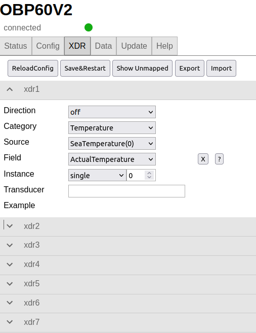

Dazu öffnet man als erstes über **Show Unmapped** eine Liste der nicht verknüpften Sensordaten.

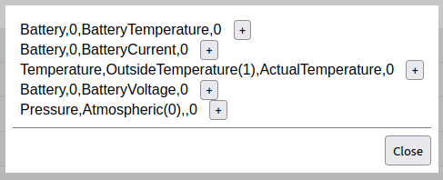
             
In der Liste sehen Sie dann, welche Daten zur Verfügung stehen. Über ``+`` werden die Daten in die letzte, frei verfügbare XDR-Konfiguration automatisch eingefügt und der richtigen Kategorie zugeordnet. Der Sensorname muss noch im Feld **Transducer** hinzugefügt werden. 

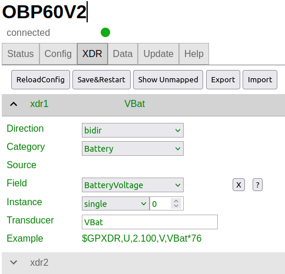

Nach der Zuordnung des Sensornamens wird unter **Example** ein Beispiel für das XDR-Telegramm angezeigt. Danach können alle Einstellungen noch individuell geändert werden. Die Erklärung zu den Einstellungen ist nachfolgend aufgeführt.

**Direction**
    Über **Direction** lässt sich einstellen, wie Sensordaten eingelesen werden sollen und wohin sie übertragen werden:
     
    * ``off`` - Die Sensordaten werden nicht benutzt. Damit können Sie ein bereits konfiguriertes XDR-Telegramm deaktivieren.
    * ``bidir`` - Die Sensordaten werden zwischen NMEA0183 und NMEA2000 ausgetauscht.
    * ``to2K`` - Das Sensordaten werden nur nach NMEA2000 gesendet.
    * ``from2k`` - Sensordaten werden von NMEA2000 eingelesen.
     
**Category**
    Über **Category** kann ein Sensor-Typ zugeordnet werden:
     
    * ``Temperature`` - Temperatursensoren z.B. für Luft, Wasser, Kühlschrank
    * ``Humidity`` - Luftfeuchtigkeitssensoren
    * ``Pressure`` - Drucksensoren für Luftdruck und andere Drücke wie z.B. Öldruck
    * ``Fluid`` - Sensoren für Flüssigkeiten wie Durchfluss und Füllstand
    * ``Battery`` - Batteriesensoren für Spannung, Strom, Leistung, Batterietemperatur
    * ``Engine`` - Motorsensoren für Drehzahl, Anstellung, Trimmklappen, Öl, Kühlwasser
    * ``Attitude`` - Höhendaten, aus GPS-Sensordaten ermittelt
    
**Source**
    Über **Source** lässt sich die Quelle der Sensordaten genauer einstellen. Je nach verwendetem Sensortyp stehen verschiedene Sensor-Quellen zur Verfügung.
    
**Field**
    Mit **Field** kann genauer beschrieben werden, wie die Sensordaten zu verstehen sind. Es sind Zusatzdaten, die kontextabhängig je nach verwendeten Sensor-Typ einstellbar sind. So kann z.B. festgelegt werden, ob es sich um einen Anzeigewert oder um einen Einstellwert handelt.
    
**Instance**
    Mit **Instance** kann festgelegt werden, ob es mehrere Sensoren des selben Typs gibt. Das kann z.B. auftreten, wenn zwei Motoren in einem Boot verbaut sind und zwei Tankwerte angezeigt werden sollen. Mit Hilfe einer Instanz-Nummer werden die Sensoren unterschieden. An den Sensornamen wird dann z.B. \#1 angefügt. Die Arte der Instanziierung kann folgendermaßen festgelegt werden:
    
    * ``single`` - Es wird ein Sensor instanziiert, dem einen freie Instanz-Nummer zugeordnet werden kann. So können z.B. zwei Sensoren die selben Daten in ein XDR-Telegramm übertragen, wenn die Sensoren redundant sind.
    * ``ignore`` - Es existiert nur genau ein einziger Sensor dieses Typs.
    * ``auto`` - Die Instanziierung wird automatisch übernommen. Sobald ein neuer Sensor des gleichen Typs und der selben Source verwendet wird, wird eine neue Instanz des Sensors angelegt.
        
**Transducer**
    Über **Transducer** wird der Sensorname festgelegt. Es handelt sich dabei um eine Klartextbeschreibung des Sensors mit ASCII Zeichen. Verwenden Sie nur Buchstaben und Zahlen ohne Freizeichen und Sonderzeichen.
    
**Example**
    Beispiel, wie der Inhalt des XDR-Telegramms aussehen wird.
    
Data
----

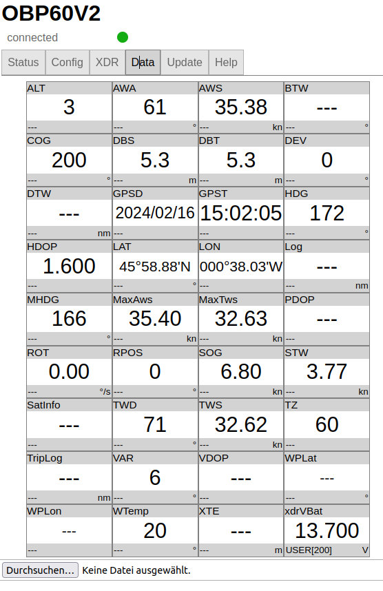
             
Unter Data werden alle Sensordaten aller Bussysteme angezeigt, die derzeit verarbeitet werden können. Sensordaten, die nicht verfügbar sind, werden mit ``---`` gekennzeichnet. Man kann die Datenanzeige auch so konfigurieren, dass nur aktuelle Daten angezeigt werden. Die nicht verfügbaren Daten sind dann ausgeblendet.

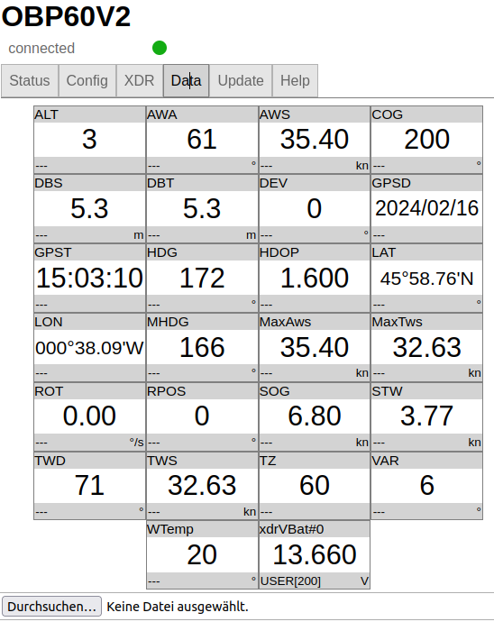

.. note::
    Die Beschränkung der Datenanzeige auf aktuelle Daten führt dazu, dass sich die Anordnung der Daten ändert, wenn einige Sensordaten nicht mehr verfügbar sind. Diese Datenfelder werden dann ausgeblendet. Wenn Sie ein festes Anzeigeformat bevorzugen, lassen Sie sich am besten alle Daten anzeigen.  

Update
------

Um die Firmware eines Gerätes zu aktualisieren, können Sie die Registerkarte ``Update`` verwenden. Es gibt zwei Arten von Firmware-Updates.

**Initial Firmware-Update**
	Beim Initial Firmware-Update wird der komplette Flash-Speicher des OBP60 gelöscht. Anschließend werden alle Firmware-Bestandteile im Flash gespeichert. Dabei wird eine initiale Konfiguration erstellt. Eine vorherige alte Konfiguration wird überschrieben. Die Initial Firmware-Updates verwendet den Dateinamen **xxx-all.bin**.
	
**Normales Firmware-Update**
	Beim normalen Firmware-Update wird nur der Programmteil der Firmware aktualisiert. Eine vorhandene Konfiguration bleibt dabei erhalten und ist nach dem Firmware-Update wieder nutzbar. Normale Firmware-Updates verwenden den Dateinamen **xxx-update.bin**.

Die letzte aktuelle Firmware können Sie von folgender Webseite herunterladen:

https://github.com/norbert-walter/esp32-nmea2000-obp60/releases

Unter **Releases** ist eine Reihe verfügbarer Firmware-Updates für das OBP60 zu finden. Beachten Sie dabei die jeweilige Hardware-Version, für die Sie eine Firmware benutzen wollen.

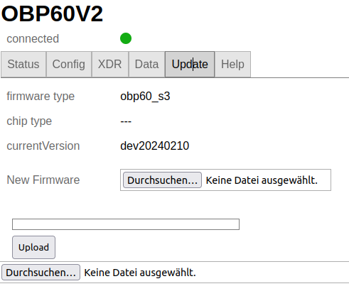

Für ein Firmware-Update laden Sie sich die gewünschte Firmware als Datei herunter und speichern Sie die Datei auf ihrem Gerät. Über die Taste ``Choose File`` wählen Sie dann die heruntergeladene Datei aus. Danach wird der Firmware-Type, der Chip-Type und die Firmware-Version angezeigt. Sollte die Firmware nicht zur verwendeten Hardware passen, so erhalten Sie eine Meldung. Die Firmware kann in diesem Fall nicht geflasht werden. Über die Taste ``Upload`` starten Sie den Flash-Vorgang. Im Fortschrittsbalken sehen Sie den Verlauf des Vorgangs. Nach einem erfolgreichen Firmware-Update wird ein Neustart des Systems durchgeführt. In dieser Zeit ist die Web-Konfigurationsseite offline (roter Punkt). Nach beendetem Neustart ist die Seite wieder online (grüner Punkt). Dann ist das System erneut betriebsbereit.

.. warning::
	Beachten Sie, dass Sie bei einem Firmware-Update auf eine ältere Version ein **Initial Firmware Update** durchführen müssen. So vermeiden Sie Komplikationen mit den gespeicherten Konfigurationsdaten. Bei Nichtbeachtung ist das System  ansonsten unter Umständen nicht nutzbar und kann komplett einfrieren. Ein Firmware-Update über die Konfigurationsseiten ist dann nicht mehr möglich, die Firmware muss dann über USB geflasht werden.

Wie man die Firmware eines OBP60 über USB flasht, ist unter xxx beschrieben.

Help
----

Unter **Help** erfolgt ein Wechsel ins Internet zur Github-Seite, auf der das Projekt gehostet wird. Dort sind einige weitergehende Informationen zum NMEA2000-Gateway zu finden, das die Basis für diese Firmware ist. 

.. note::
    Die Github-Seite lässt sich nur aufrufen, wenn das OBP60 auf das Internet zugreifen kann. Das lässt sich realisieren, wenn das OPB60 zum Beispiel als Client in Ihrem Boots-WLAN arbeitet und Ihr Boots-WLAN Internetzugang hat. Alternativ starten Sie zum Beispiel einen Hotspot auf Ihrem Handy und verbinden das OPB60 als WLAN-Client mit Ihrem Handy.

Sicherheit im WiFi-Netzwerk
---------------------------

Sie sollten das OBP60 nur mit vertrauenswürdigen WiFi-Netzwerken verbinden. Es gibt im Gerät nur einen sehr begrenzten Schutz gegen Netzwerk-Sniffing oder Denial-of-Service-Angriffe. Solange Sie das eigene autarke WiFi-Netz des OBP60 nutzen, können fremde Personen nicht ohne weiteres auf das WiFi-Netz des OPB60 zugreifen. Auf diese Weise läuft die Datenübertragung in Ihrem eigenen WiFi-Netzwerk geschützt. Verbinden Sie das Gerät niemals ohne eine Firewall direkt mit dem Internet und vermeiden Sie direkte Verbindungen zu offenen Hafen-WLANs. Dadurch können auch fremde Personen auf Ihre Geräte im Netzwerk zugreifen.

.. note::
	Sie können die Sicherheit erhöhen, indem Sie einen separaten WiFi- oder LTE-Router in Ihrem Boot verwenden. Die Router können so eingerichtet werden, dass Sie ein eigenes WiFi-Netz aufspannen können, mit dem alle Geräte an Bord verbunden sind. Gängige mobile Router verfügen in der Regel über eine bereits eingeschaltete Firewall, über die Sie Ihr eigenes WiFi-Netz mit dem Internet verbinden können. Die Firewall verhindert fremden Zugriff von außen auf Ihre Geräte. So haben alle Geräte in Ihrem Netz einen gemeinsamen Internet-Zugriff und sind zugleich ausreichend geschützt.

.. image:: ../pics/WiFi_Channels.png
             :scale: 35%

Die Verbindungsqualität von WiFi-Netzwerken hängt maßgeblich von der Auslastung der Funkkanäle ab, die in Ihrer Umgebung aktuell benutzt werden, denn Ihr Gerät teilt sich die selben Funkkanälen mit anderen Teilnehmern anderer WiFi-Netze. Das OBP60 nutzt die Funkkanäle des 2.4 GHz-Frequenzbandes.

.. warning::
	Bei hoher Auslastung wie z.B. in Häfen kann die Verbindungsqualität des eigenen WiFi-Netzwerks dadurch beeinträchtigt sein. Sie müssen dann mit Verzögerungen bei der Datenübertragung rechnen, insbesondere, wenn Sie TCP-Datenverbindungen zum oder vom OBP60 nutzen. Stellen Sie aber auf alle Fälle sicher, dass in solchen Situationen die Bootsführung nicht beeinträchtigt wird.

.. hint::
	Verwenden Sie bei hoher Kanalauslastung Kanäle mit geringer Auslastung. Die Kanäle 1, 13 und 14 haben keine Nachbarkanäle und sind deutlich robuster gegen hohe Auslastung als die anderen Kanäle. Am besten eignet sich der Kanal 13, da er seltener benutzt wird. In den USA kann auch der Kanal 14 verwendet werden. Moderne mobile Router bieten häufig eine Automatik in ihrer Konfiguration an, die die Kanalauswahl optimieren hilft.

Bei Änderungen der Konfiguration des OPB60 werden Sie grundsätzlich nach dem Admin-Passwort gefragt. Die Übertragung des Passwortes erfolgt dabei immer verschlüsselt. Wenn Sie jedoch das Passwort für den WLAN-Zugangspunkt oder das WiFi-Client-Passwort ändern, wird es im Klartext gesendet. Wenn Sie das ``Remember me`` für das Admin-Passwort aktivieren, wird es im Klartext in Ihrem Browser gespeichert. Um es von dort zu entfernen, verwenden Sie ``Forget Password``.
