Datenaustausch
==============

Interne Datenverarbeitung
-------------------------

Die Firmware des OBP60 besteht aus zwei Teilen. Der erste Teil ist das **NMEA2000-Gateway** und der zweite Teil die **Hardwareansteuerung** des OBP60. Das `NMEA2000-Gateway`_ ist ein Open Source Projekt von Andreas Wellenvogel. Es ist eine Software mit der man bidirektionale Datenkonvertierungen zwischen NMEA2000 und NMEA0183 durchführen kann. Die Software ist so gestaltet, dass sie unterschiedliche kommerzielle Hardware unterstützen kann. So läuft das NMEA2000-Gateway z.B. auf einer Reihe von Produkten der Firma `M5Stack`_ wie dem **M5Stack Atom** aber auch auf ESP32-Entwicklerboards wie dem **ESP32 Node MCU**. Es werden ESP32-CPUs in unterschiedlicher Ausprägung unterstützt, wie der ESP32-Wroom und ESP32-S3. Die Hardwareansteuerung des OBP60 ist über eigenständige Tasks implementiert und nutzt die Grundfunktionalität des NMEA2000-Gateways.

.. _NMEA2000-Gateway: https://open-boat-projects.org/de/nmea2000-gateway-mit-m5stack-atom/
.. _M5Stack: https://shop.m5stack.com/collections/all-products/m5stack-atom

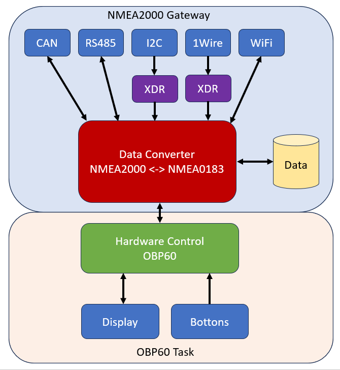
Abb.: Datenflussschema

Die gesamte Datenverarbeitung sämtlicher Bussysteme und Konvertierungen ist Bestandteil des NMEA2000-Gateways. Neben NMEA2000 (**CAN**) und NMEA0183 (**RS485**) werden weitere Bussysteme wie **I2C** und **1Wire** unterstützt. Die Hauptaufgabe des NMEA2000-Gateways besteht darin, alle ankommenden Daten der Busssysteme zu empfangen und in einem gemeinsamen Daten-Pool abzubilden. Diese Daten können über die Webseite **Data** eingesehen werden. Erweiterte Sensorik, die nicht Bestandteil von NMEA2000 und NMEA0183 sind, können über I2C und 1Wire eingefügt werden. So lassen sich preisgünstige Sensoren nutzen. Damit die Daten der erweiterten Sensorik im NMEA2000- und NMEA0183-Netzwerk genutz werden können, werden sie über NMEA0183 als universelle `XDR-Datensätze`_ in den Daten-Pool eingefügt. Als XDR-Datensätze können die Daten dann auch nach NMEA2000 konvertiert werden, sofern im Konverter entsprechende Übersetzungen implementiert sind. Als Ausgabeschnittstellen stehen CAN, RS485 und WiFi zur Verfügung. Über die CAN-Schnittstelle lassen sich nur NMEA2000-Daten austauschen. Über RS485 und WiFi (TCP) lassen sich sowohl NMEA0183-Daten als auch NMEA2000-Daten austauschen, sofern die NMEA2000-Daten in SeaSmart-Telegrammen durch NMEA0183 getunnelt werden.

.. _XDR-Datensätze: https://obp60-v2-docu.readthedocs.io/de/latest/usermanual/configuration.html#xdr

Der Datenaustausch im OBP60 kann auf verschiedene Weise erfolgen. Grundsätzlich stehen mehrere Übertragungsarten über verschiedene Übertragungswege zur Verfügung:

Übertragungsarten
-----------------

* Simplex
	* Daten können in nur eine Richtung übertragen werden
* Halbduplex
	* Daten können abwechselnd, aber nicht gleichzeitig, in beide Richtungen fließen
* Vollduplex
	* Daten können in beide Richtungengleichzeitig gleichzeitig übertragen werden. 
	
Übertragungswege
----------------

* NMEA2000
	* Kabelgebunden NMEA2000-Bus (halbduplex)
	* Über WiFi via SeaSmart (vollduplex)
* NMEA0183
	* Kabelgebunden NMEA0183-Bus (simplex)
	* USB (vollduplex)
	* Über WiFi via TCP (vollduplex)
* **I2C** (halbduplex)
* **1Wire** (halbduplex)

Datenquellen
------------

Als Datenquellen werden Geräte bezeichnet, die überwiegend Daten zur anderen Geräten senden und selber nur Daten zur Parametrierung empfangen. Dazu zählen folgende Geräte:

* GPS-Empfänger (Position, Geschwindigkeit, Richtung)
* Windsensor (Geschwindigkeit, Richtung, Temperatur)
* Tiefen-Sensor (Tiefe, Geschwindigkeit, Wassertemperatur, zurückgelegte Strecke)
* Winkelsensoren (Ruderlage, Mast, Großbaum, Foil, Trimmklappen)
* Elektro-Sensor (Spannung, Strom, Leistung, Energie)
* Umgebungssensoren (Lufttemperatur, Fuftdruck, Luftfeuchtigkeit, Helligkeit, Niederschlag, Zustand, Bewegung)
* Durchflusssensoren (Kühlwasserfluss, Kühlwassertemperatur)
* Druck- und Zugsensoren (Öldruck, Achterstag, Vorstag)
* Füllstandsensoren (Level für Wasser, Abwasser, Krafstoff)
* Lagesensoren (Roll-, Pitch-, Nick-Winkel, Beschleunigung, Rotation, Magnetfeld)
* Temperatursensoren (Luft, Kühlwasser, Raum, Kühlschrank, Wasser, Maschinenraum)
* Elektrogeneratoren (Solar, Wind-, Schlepp- Dieselgenerator,
* Radargeräte (Umgebungskarte
* Funkgeräte (Position, AIS-Schiffsverkehr, Anrufer, Meldungen, Notrufe)
* Anzeigegeräte (Multifunktionsdisplays, Plotter)
* Videokameras (Bild, Ton, Bewegung)

Datensenken
-----------

Datensenken empfangen Informationen und führen bestimmte Aktionen aus.

* Ruder-Aktuator (linear, rotatorisch, hydraulisch, elektrisch)
* Relais und Schalter (elektrische Verbraucher wie Ankerwinde, Licht, Positionsleuchten, Lüftung, Heizung, Ladegeräte)
* Winkelaktuator (Trimmklappen, Foil-Einstellung)
* Anzeigegeräte (Multifunktionsdisplays, Plotter)
* Multimediageräte (Radio, Lautsprecher)

Einige komplexere Geräte können sowohl Datenquelle als auch Datensenke sein, wie z.B. Multifunktionsdisplays oder Plotter.

Nachfolgend werden die Übertragungswege näher beschrieben.

NMEA2000 - Kabelgebunden
------------------------

Der kabelgebundene NMEA2000-Bus ist der aktuelle Standard in der Bootsvernetzung. Über ein NMEA2000-Backbone auf CAN-Basis werden verschiedene Geräte an das Bussystem angeschlossen. Alle Bus-Teilnehmer können Daten lesen und schreiben. Dabei sind Sensoren Datenlieferanten, die ihre Daten an Displays und Plotter übertragen. Das NMEA2000-Backbone kann Sensoren auch mit Strom versorgen. Die Einspeisung der Versorgunsgspannung erfolgt über einen Plotter oder über ein Einspeisekabel.

.. image:: ../pics/NMEA2000_Sample_Setup_Plotter.png
             :scale: 60%	
Abb.: NMEA2000-Bussystem mit Sensoren und Anzeigegeräten

Für den Betrieb von NMEA2000 muss nichts speziell konfiguriert werden. Die Standardeinstellungen sind so gesetzt, dass ein Betrieb problemlos möglich ist. Bei Bedarf kann das Senden von NMEA2000-Telegrammen unterbunden werden. Dann ist nur ein Empfang von NMEA2000-Telegrammen möglich. Die Einstellungen zu NMEA2000 findet man unter `Config - Converter`_.

.. _Config - Converter: https://obp60-v2-docu.readthedocs.io/de/latest/usermanual/configuration.html#config-converter

NMEA2000 - WiFi via SeaSmart
----------------------------

Über das SeaSmart-Protokoll besteht die Möglichkeit, NMEA2000-Telegramme über Ethernet und WiFi übertragen zu können. Dazu werden die Binärdaten der NMEA2000-Telegramme in propritäre NMEA0183-Telegramme eingebettet. Ein SeaSmart-Telegramm sieht wie folgt aus:

    $PCDIN,a--a,b--b,b,cc,d--d*hh<CR><LF>

    Feldnummer:
	    * a - PGN im Binärform
	    * b - Zeitstempel im Binärform
	    * c - Source-ID
	    * d - PGN-Daten im Binärform
	    * hh - Checksumme

    Beispiel:	
	    * $PCDIN,01F211,0B9CF01B,03,008061480D0000FF*5C
		
Der Vorteil ist, dass sich SeaSmart-Telegramme genauso wie NMEA0183-Telegramme übertragen lassen. Damit ist es möglich, NMEA2000-Telegramme drahtlos über Wifi von einem OBP60 zu einem anderen OBP60 zu übertragen. Diese Funktion kann z.B. genutzt werden, um Bus-Sensordaten von einem OBP60 oder einem `NMEA2000-Gateway`_ auf einem OBP60-Tochtergerät anzeigen zu lassen.

.. _NMEA2000-Gateway: https://open-boat-projects.org/de/nmea2000-gateway-mit-m5stack-atom/

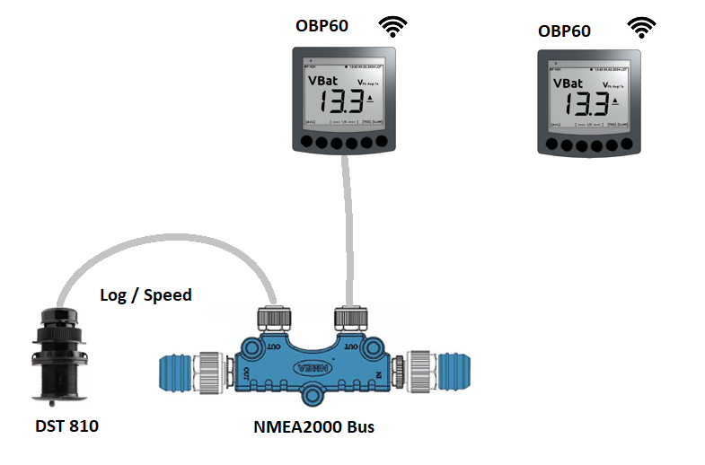
Abb.: Datenübertragung via WiFi OBP60 - OBP60

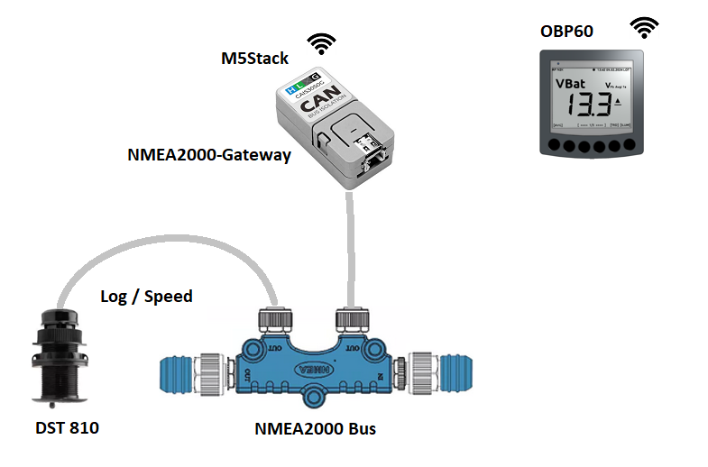
Abb.: Datenübertragung via WiFi M5Stack - OBP60

.. hint::
	Beide Geräte müssen sich im selben WiFi-Netzwerk befinden und unterschiedliche Netzwerknamen und IP-Adressen besitzen. Dabei muss ein Gerät als TCP-Server und das andere Gerät als TCP-Client konfiguriert sein und auf beiden Geräten **SeaSmart out** aktiviert werden.
	
Nachfolgend ist ein Konfigurationsbeispiel für die obere Abbildung gezeigt, in dem ein Datenaustausch über WiFi zwischen zwei OBP60 stattfindet. Das Gerät 1 ist dabei als TCP-Server und Gerät 2 als TCP-Client konfiguriert. Das Gerät 2 bucht sich in das WiFi-Netzwerk vom Gerät 1 ein und tauscht darüber bidirektional Daten aus.

+-------------------------+---------------------+---------------------+
|Einstellung              |Gerät 1              |Gerät 2              |
+=========================+=====================+=====================+
|`Config - System`_       |                     |                     |
+-------------------------+---------------------+---------------------+
|System Name              |OBP60-1              |OBP60-2              |
+-------------------------+---------------------+---------------------+
|ApPassword               |11111111             |22222222             |
+-------------------------+---------------------+---------------------+
|ApIP                     |192.168.15.1         |192.168.16.1         |
+-------------------------+---------------------+---------------------+
|`Config - TCP Server`_   |                     |                     |
+-------------------------+---------------------+---------------------+
|SeaSmart Out             |on                   |off                  |
+-------------------------+---------------------+---------------------+
|`Config - TCP Client`_   |                     |                     |
+-------------------------+---------------------+---------------------+
|Enable                   |off                  |on                   |
+-------------------------+---------------------+---------------------+
|Remote Address           |---                  |192.168.15.1         |
+-------------------------+---------------------+---------------------+
|SeaSamart Out            |off                  |on                   |
+-------------------------+---------------------+---------------------+
|`Config - WiFi Client`_  |                     |                     |
+-------------------------+---------------------+---------------------+
|WiFi Client              |off                  |on                   |
+-------------------------+---------------------+---------------------+
|WiFi Client SSID         |---                  |OBP60-1              |
+-------------------------+---------------------+---------------------+
|WiFi Client Password     |---                  |11111111             |
+-------------------------+---------------------+---------------------+

.. _Config - System: https://obp60-v2-docu.readthedocs.io/de/latest/usermanual/configuration.html#config-system
.. _Config - TCP Server: https://obp60-v2-docu.readthedocs.io/de/latest/usermanual/configuration.html#config-tcp-server
.. _Config - TCP Client: https://obp60-v2-docu.readthedocs.io/de/latest/usermanual/configuration.html#config-tcp-client
.. _Config - WiFi Client: https://obp60-v2-docu.readthedocs.io/de/latest/usermanual/configuration.html#config-wifi-client

NMEA0183 - Kabelgebunden
------------------------

Bei der kabelgebunden Datenübertragung für NMEA0183 handelt es sich um eine Simplex-Übertragung. Das bedeutet, dass man entweder senden oder empfangen kann. Als Default ist das OBP60 auf Empfang eingestellt. Es ist aber auch möglich, NMEA0183-Daten zu senden. Die Einstellung dazu erfolgt unter `Config - Serial Port`_. Über **Serial Direction** kann die Datenrichtung eingestellt werden.

.. _Config - Serial Port: https://obp60-v2-docu.readthedocs.io/de/latest/usermanual/configuration.html#config-serial-port

An dieser Stelle wird ein Beispiel gezeigt wie Daten von einem NMEA0183-Multiplexer in ein OBP60 eingebunden werden können. Dabei sammelt der Multiplexer alle Sensordaten über die Eingänge ein und erzeugt einen zusammengefassten Datenstrom an seinem Ausgang. Die Daten werden lesend vom OBP60 empfangen und können dann entsprechend verwendet werden.

.. note::
	Die Konfiguration des Multiplexers ist vom Modell abhängig. Konsultieren Sie dazu das Handbuch und achten Sie auf die korrekte Einstellung der Baudraten für die Eingänge und Ausgänge des Multiplexers.
	
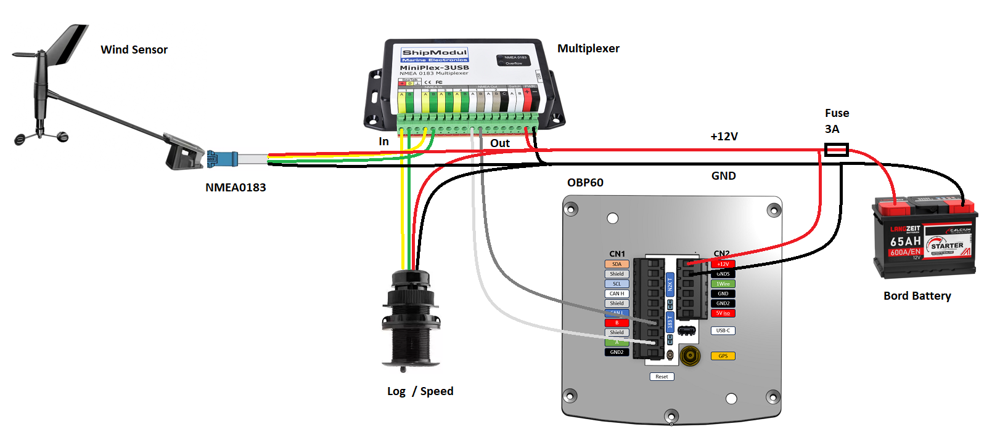
Abb.: NMEA0183-Verbindung zu einem Multiplexer (empfangen)

+-------------------------+---------------------+
|Einstellung              |OBP60                |
+=========================+=====================+
|`Config - Serial Port`_  |                     |
+-------------------------+---------------------+
|Serial Direction         |receive              |
+-------------------------+---------------------+
|Serial Baud Rate         |115200               |
+-------------------------+---------------------+
|Serial to NMEA2000       |on                   |
+-------------------------+---------------------+

.. _Config - Serial Port: https://obp60-v2-docu.readthedocs.io/de/latest/usermanual/configuration.html#config-serial-port

Zum Senden von NMEA0183-Daten hier ein Beispiel für einen Autopiloten. Dabei werden Daten aus den verwendeten Kommunikationsmöglichkeiten genutzt und diese an einen Autopiloten gesendet. Die Ausgabe der Daten erfolgt über einen Filter, so dass nur relevante Informationen den Autopiloten erreichen. In dem gezeigten Beispiel verwendet der Autopilot eine NMEA0183-Eingang nach RS422 oder RS485 mit einer Schnittstellengeschwindigkeit von 4800 Bd. Unter Umständen müssen Sie die Geschwindigkeit an ihren Autopiloten anpassen.

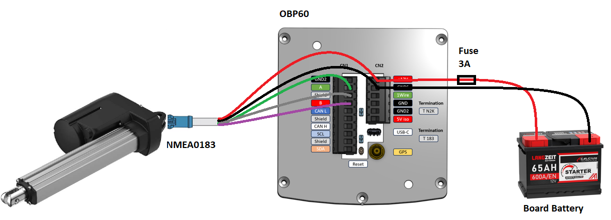
Abb.: NMEA0183-Verbindung zu einem Autopiloten (senden)

+-------------------------+---------------------+
|Einstellung              |OBP60                |
+=========================+=====================+
|`Config - Serial Port`_  |                     |
+-------------------------+---------------------+
|Serial Direction         |send                 |
+-------------------------+---------------------+
|Serial Baud Rate         |4800                 |
+-------------------------+---------------------+
|Serial to NMEA2000       |on                   |
+-------------------------+---------------------+
|Serial Read Filter       |---                  |
+-------------------------+---------------------+
|Serial Write Filter      |XTE,XDR,RMB,RMC,ROT  |
+-------------------------+---------------------+

.. _Config - Serial Port: https://obp60-v2-docu.readthedocs.io/de/latest/usermanual/configuration.html#config-serial-port

Dem Autopiloten werden nur die NMEA0183-Telegramme **XTE**, **XDR**, **RMB**, **RMC** und **ROT** gesendet.

.. note::
	Prüfen Sie in der Dokumentation des Autopiloten, ob die übermittelten NMEA0183-Telegramme zur Navigation verwendet werden können und ausreichend sind. In einigen Fällen kann es sein, dass der Autopilot andere Telegramme zur Kursregelung benutzt. In dem Fall kann der Autopilot nicht angesteuert werden.

NMEA0183 - USB
--------------

NMEA0183-Telegramme lassen sich auch über USB vollduplex übertragen. Das bedeutet, dass Daten gleichzeitig gesendet und empfangen werden können. Den USB-Port für die Datenübertragung findet man auf der Rückseite des OBP60 unterhalb des Steckverbinders **CN2**. Er ist als USB-C ausgeführt. Die USB-Schnittstelle im OBP60 ist als serielles RS232 Device implementiert und unterstützt die Übertragungsgeschwindigkeiten 1.200...460.800 Bd. Die Defaulteinstellung für die Datenübertragung ist auf 115.200 Bd eingestellt und sollte für die meisten Anwendungen ausreichend schnell sein. Die Daten werden ausschließlich als NMEA0183-Daten über USB übertragen.

Als mögliche Endpunkte könnte folgende Hardware verwendet werden:

* Raspberry Pi 3, 3B, 4B, 5
* Android Autoradio
* Laptop
* PC

Die NMEA0183-Daten lassen sich in unterschiedliche Software einbinden wie:

* AVnav
* OpenPlotter
* OpenCPN
* BBN
* SignalK
* qtVlm
* Navionics
* WinGPS
* NMEA Simulator

Für alle oben aufgeführten Endpunkte sind folgende Einstellungen im OBP60 vorzunehmen. Dabei werden NMEA0183-Daten auf der USB-Schnittstelle empfangen und gesendet und gleichzeitig nach NMEA2000 bidirektional konvertiert. 
 
+-------------------------+---------------------+
|Einstellung              |OBP60                |
+=========================+=====================+
|`Config - System`_       |                     |
+-------------------------+---------------------+
|Log Level                |off                  |
+-------------------------+---------------------+
|`Config - USB Port`_     |                     |
+-------------------------+---------------------+
|USB Mode                 |nmea0183             |
+-------------------------+---------------------+
|USB Baud Rate            |115200               |
+-------------------------+---------------------+
|NMEA to USB              |on                   |
+-------------------------+---------------------+
|NMEA from USB            |on                   |
+-------------------------+---------------------+
|USB to NMEA2000          |on                   |
+-------------------------+---------------------+

.. _Config - System: https://obp60-v2-docu.readthedocs.io/de/latest/usermanual/configuration.html#config-system
.. _Config - USB Port: https://obp60-v2-docu.readthedocs.io/de/latest/usermanual/configuration.html#config-usb-port

.. hint::
	Achten Sie darauf, dass der **Log Level** auf ``off`` gestellt ist. Anderenfalls kann es sonst zu Störungen in der Kommunikation kommen, da Logging-Ausgaben in den Datenstrom eingespeist werden, die ebenfalls über USB-C ausgegeben werden.
	
Nachfolgend sind einige Konfigurationsbeispiele aufgeführt und es wird gezeigt wie die Konfiguration auf dem System erfolgt.
	
Beispiel AVnav auf Raspberry Pi
^^^^^^^^^^^^^^^^^^^^^^^^^^^^^^^

Dieses Beispiel zeigt die Einbindung eines OBP60 über USB in AVnav, das auf einem Rasberry Pi läuft. Dabei werden NMEA2000 Busdaten ausgelesen und nach NMEA0183 übertragen. Die Anbindung erfolgt direkt in AVnav als Device und die Daten stehen dann der Anwendung zu Verfügung. In diesem Fall wird das AVnav-Image benutzt. Wer AVnav unter OpenPlotter als Plugin benutzt sollte dem **Konfigurationsbeispiel OpenPlotter auf Raspberry Pi** folgten.

Verbinden Sie das OBP60 und den Raspberry Pi über USB. Sie benötigen dazu ein **USB-C zu USB-A Kabel**. Am Raspberry Pi können Sie jeden beliebigen USB-A-Port verwenden.

.. hint::
	Es ist ratsam die schwarzen USB-A-Ports zu benutzen, da das OBP60 nur USB 1.1 unterstützt und dadurch die leistungsfähigeren USB 3.0-Ports frei bleiben und anderweitig genutzt werden können. Versorgen Sie auf jeden Fall das OBP60 zusätzlich mit 12V, da der Raspberry Pi zu wenig Strom an seinen USB-Ports liefert.

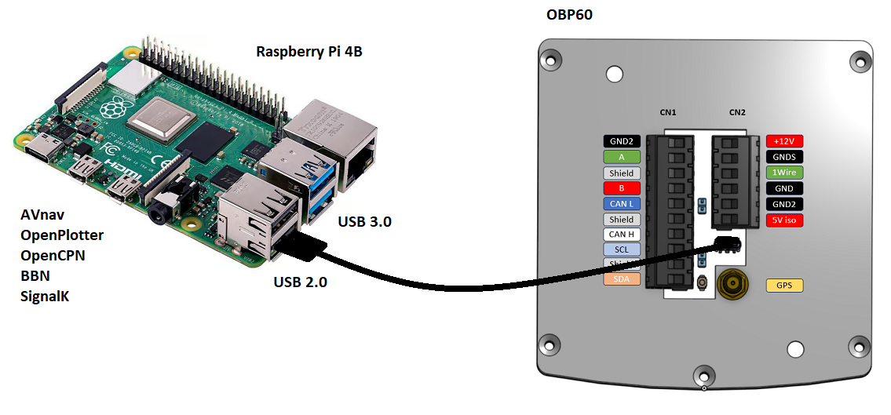
Abb.: Verbindung OBP60 - Raspberry Pi

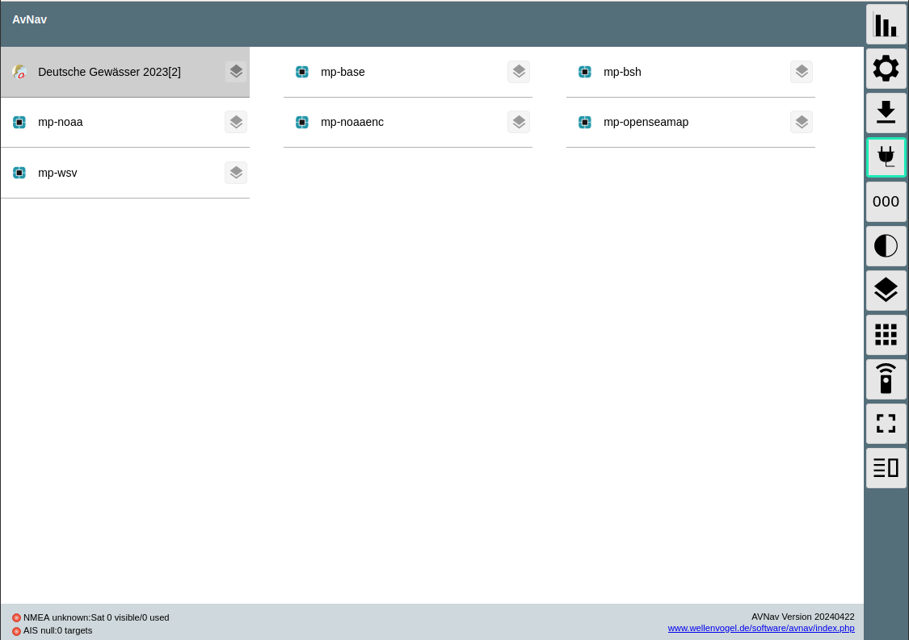
Abb.: AVnav Startseite

Unter AVnav kicken Sie auf der Startseite oben rechts das Symbol mit den 3 Strichen.

Sie gelangen dann auf die Seite zum Serverstatus. Dort können sie über das Plus-Symbol weitere Verbindungen zum AVnavServer einrichten.

Für die bidirektionale Kommunikation über USB legen Sie eine neue **AVNSerialWriter**-Verbindung an.

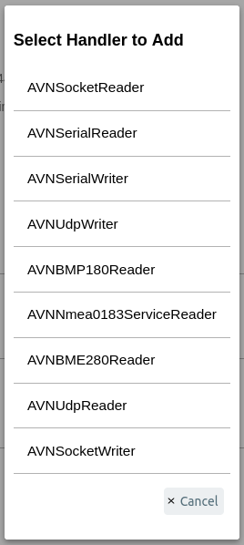
Abb.: Verbindungstypen

Unter **Port** wählen Sie die serielle Verbindung aus unter der das OBP60 mit dem Raspberry Pi verbunden ist. Als Schnittstellengeschwindigkeit wird **115200 Bd** eingestellt. Um nicht nur Daten zu senden, sondern auch empfangen zu können, aktivieren Sie **combined**.

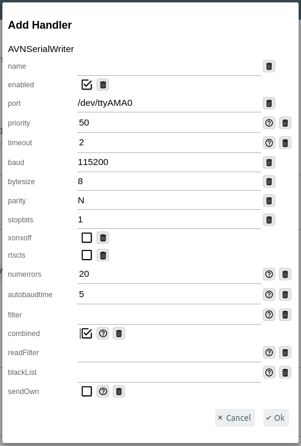
Abb.: Einstellungen zum AVNSerailWriter

Nach der Übernahme aller Daten ist die neue Verbindung im Server-Status zu sehen.

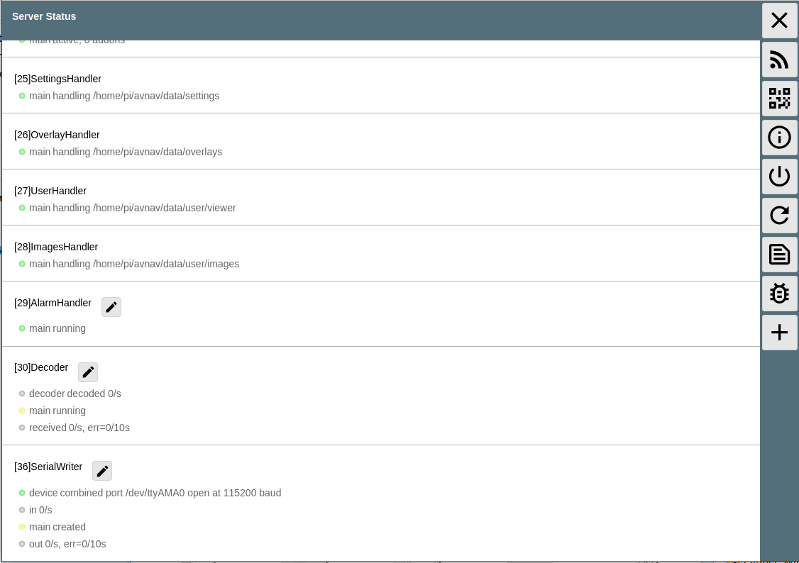
Abb.: Server-Status

Beispiel AVnav auf Android-Autoradio
^^^^^^^^^^^^^^^^^^^^^^^^^^^^^^^^^^^^

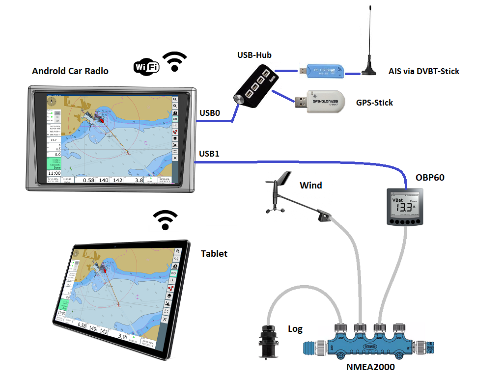
Abb.: Verbindung OBP60 - Android Autoradio AVnav

In dem Beispiel wird gezeigt, wie man Busdaten in ein Android-Radio einspeisen kann, um die Daten in AVnav nutzen zu können. Für die Datenübertragung zum Andriod-Autoradio benötigen Sie ein **USB-C zu USB-A Kabel**, sofern ein passende Adapterbuchse zur Verfügung steht. In einigen Situation müssen Sie die USB-Kabel direkt über spezielle Stecker am Autoradio auflegen. Konsultieren Sie dazu das Handbuch zum Android-Autoradio und stellen Sie die USB-Verbindung wie gefordert her.

Abb.: Android Startseite

Unter AVnav kicken Sie auf der Startseite oben rechts das Symbol mit den 3 Strichen.

Sie gelangen dann auf die Seite zum Serverstatus. Dort können sie über das Plus-Symbol weitere Verbindungen zum AVnavServer einrichten.

Für die bidirektionale Kommunikation über USB wählen Sie **UsbConnection**.

.. image:: ../pics/Android_Select_Handler.png
             :scale: 50%	
Abb.: Verbindungstypen

Unter *Device** wählen Sie die serielle Verbindung aus unter der das OBP60 mit dem Raspberry Pi verbunden ist. Als Schnittstellengeschwindigkeit wird **115200 Bd** eingestellt. Um nicht nur Daten zu senden, sondern auch empfangen zu können, aktivieren Sie **SendOut**.

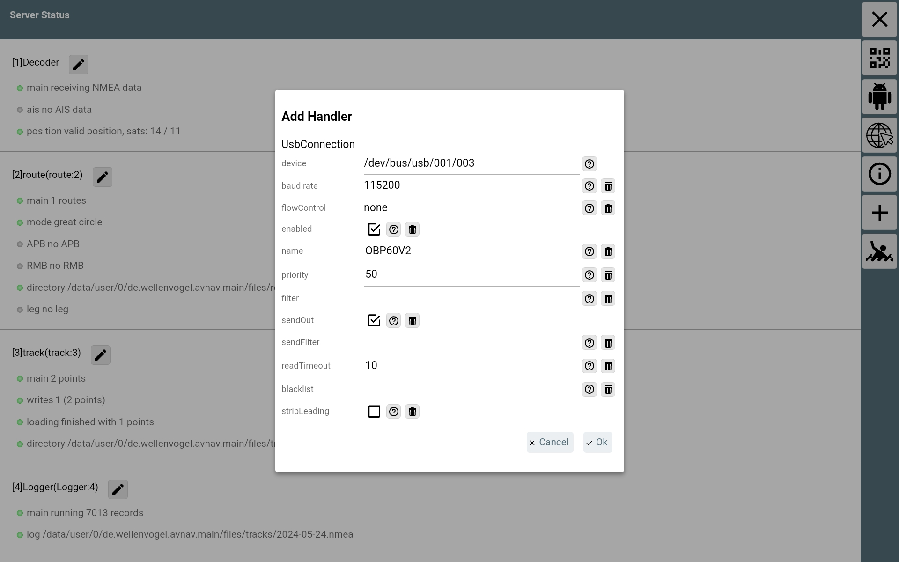
Abb.: Einstellungen zur USB-Verbindung

Nach der Übernahme aller Daten ist die neue Verbindung im Server-Status zu sehen.

.. image:: ../pics/Android_Server_Status.jpg
             :scale: 50%	
Abb.: Server-Status

Beispiel SignalK auf Raspberry Pi
^^^^^^^^^^^^^^^^^^^^^^^^^^^^^^^^^

Beispiel OpenPlotter auf Raspberry Pi
^^^^^^^^^^^^^^^^^^^^^^^^^^^^^^^^^^^^^

Beispiel Navionics auf Android-Autoradio
^^^^^^^^^^^^^^^^^^^^^^^^^^^^^^^^^^^^^^^^

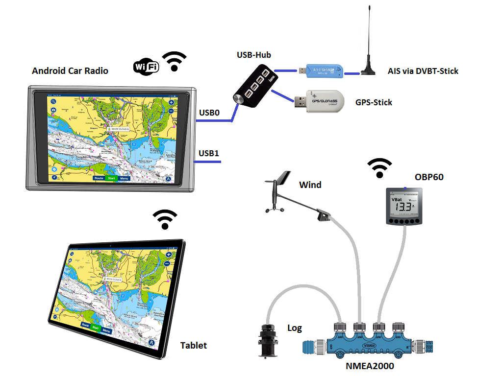
Abb.: Verbindung OBP60 - Android Autoradio Navionics

In dem Beispiel wird gezeigt, wie man Busdaten in ein Android-Radio einspeisen kann, um die Daten in Navionics nutzen zu können. Für die Datenübertragung zum Andriod-Autoradio benötigen Sie ein **USB-C zu USB-A Kabel**, sofern ein passende Adapterbuchse zur Verfügung steht. In einigen Situation müssen Sie die USB-Kabel direkt über spezielle Stecker am Autoradio auflegen. Konsultieren Sie dazu das Handbuch zum Android-Autoradio und stellen Sie die USB-Verbindung wie gefordert her.

.. note::
	Bedingt durch die Navigationssoftware können nicht alle Busdaten in Navionics verwendet werden. Aktuell lassen sich nur einige Daten nutzen. Die nachfolgende Liste zeigt die derzeitig verarbeitbaren NMEA0183 Sentences.
	
* **AIVDM** (AIS-Daten)
* **AIVDO** (AIS-Daten)
* **DBT**  (Tiefe unter Sensor)
* **DPT**  (Korrigierte Tiefe)
* **GGA**  (Position)
* **GLL**  (Position)
* **RMC**  (Notwenige minimale Navigationsdaten - Zeit, Position, Kurs, Speed)
* **VTG**  (Kurs und Speed über Grund)
* **ZDA**  (Uhrzeit und Datum)

I2C-Bus
-------

Beispiel I2C Ruderlagensensor
^^^^^^^^^^^^^^^^^^^^^^^^^^^^^

Es wird an dieser Stelle gezeigt wie man einen I2C-Winkelsensor als Ruderlagensensor am I2C-Bus benutzt. Grundsätzlich kann der Winkelsensor für folgende Winkelmessungen benutzt werden:

* Ruderlage
* Windrichtung
* Mastausrichtung bei drehbaren Masten
* Kielneigung
* Winkelsensor für Trimmklappen oder Foils
* Großbaum

Als I2C-Winkelsensor wird eine kleine Platine mit einem AS5600 verwendet, die auf Adresse 0x36 angesprochen werden kann. Der AS5600 ist ein magnetischer Winkelsensor, der die Ausrichtung eines Magnetfeldes erkennt. Über einen diametralen Magneten, dessen Magnetfeld in der Scheibenebene geteilt ist und mit der Ruderachse verbunden ist, kann der Ruderausschlag gemessen werden. Der Magnet entspricht dabei der Drehachse des Ruders.

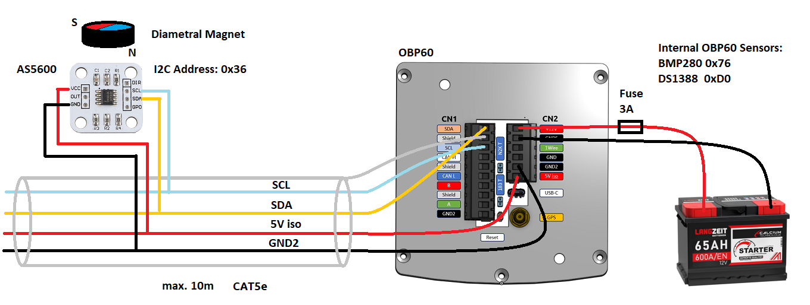
Abb.: I2C-Anbindung magnetischer Winkelmesser AS5600

.. note::
	Bedenken Sie, dass nur ein AS5600 als Winkelmesser verwendet werden kann, da die I2C-Adresse nicht änderbar ist. Das Verbindungskabel sollte ein geschirmetes Kabel sein und eine Länge von 10 m nicht überschreiten.
	
Folgende Einstellungen sind im OBP60 vorzunehmen.

+-------------------------+---------------------+
|Einstellung              |OBP60                |
+=========================+=====================+
|`Config - OBP Hardware`_ |                     |
+-------------------------+---------------------+
|Rot. Sensor              |AS5600               |
+-------------------------+---------------------+
|Rot. Function            |Rudder               |
+-------------------------+---------------------+
|Rot. Offset              |0                    |
+-------------------------+---------------------+

.. _Config - OBP Hardware: https://obp60-v2-docu.readthedocs.io/de/latest/usermanual/configuration.html#config-obp-hardware

Je nach Erfordernissen muss noch der Offset über **Rot. Offset** eingestellt werden.

1Wire-Bus
---------

Über den 1Wire-Buss lassen sich bis zu 8 Temperatursensoren des Typs DS18B20 anschließen. Damit können Temperaturen im Bereich von -55°C bis 125°C an verschiedenen Stellen im Boot gemessen werden. Die Sensoren gibt es als elektronisches Bauteil in Transistorform (TO-92) oder in einer wasserdichten Metallhülse mit Kabel. Die letzte Varriante eignet sich am besten im Marinebereich.

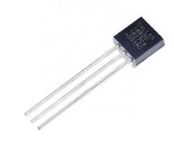
Abb.: DS18B20 TO-92

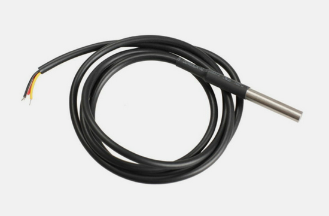
Abb.: DS18B20 Wasserdicht

Wenn Sie im Boot an verschiedenen Stellen Temperaturen messen möchten, erstellen Sie sich ein Backbone mit Abzweigdosen und schließen die Sensoren an den Abzweigdosen an. So entstehen im 1Wire-Bussystem nicht ungewollt lange Stichleitungen.

Konfigurationsbeispiel 1Wire
^^^^^^^^^^^^^^^^^^^^^^^^^^^^

Im unteren Bild ist eine Schaltung zu sehen in der 4 DS18B20 verwendet werden. Die Sensoren sind dabei über einen Spannungswandler LM7805 direkt versorgt. Diese Schaltung funktioniert für alle Sensorn die am Markt erhältlich sind.

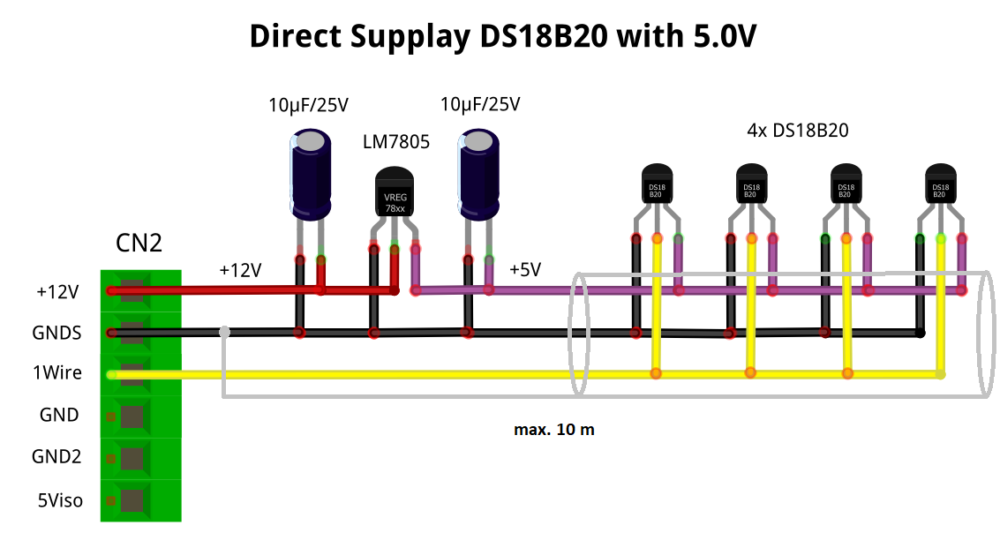
Abb.: 1Wire-Anbindung von externen Temperatur-Sensoren (direkt versorgt)

+-------------------------+---------------------+
|Einstellung              |OBP60                |
+=========================+=====================+
|`Config - OBP Hardware`_ |                     |
+-------------------------+---------------------+
|Temp. Sensor             |DS18B20              |
+-------------------------+---------------------+

.. _Config - OBP Hardware: https://obp60-v2-docu.readthedocs.io/de/latest/usermanual/configuration.html#config-obp-hardware

