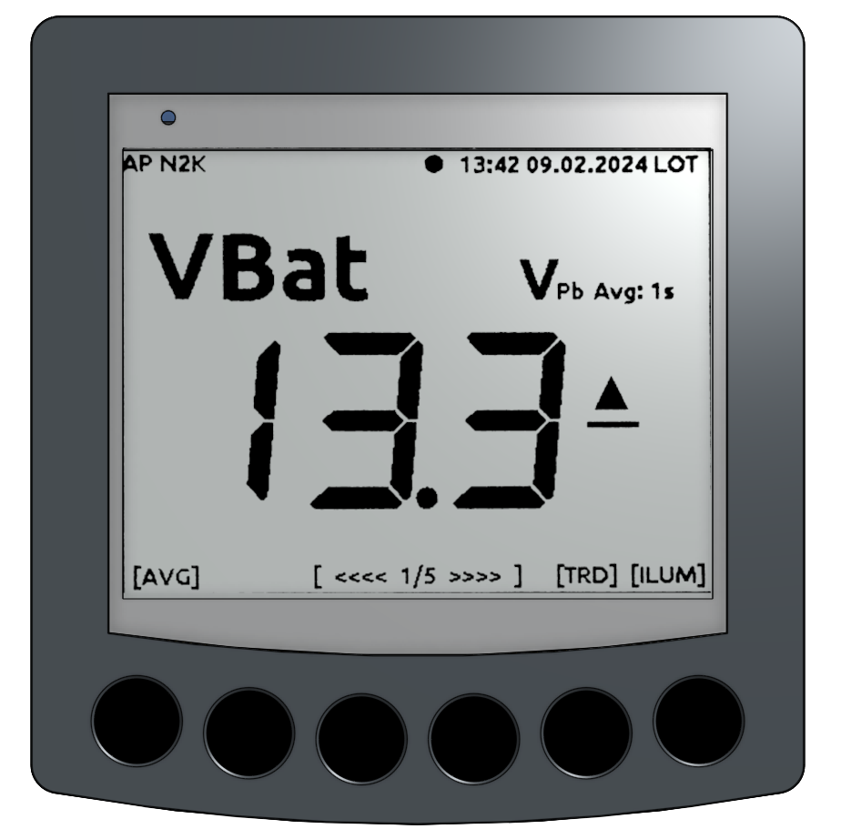

Bedienelemente
==============

             
Statuszeile
-----------

Die Statuszeile dient zur Anzeige von Statusinformationen. Dazu zählen:

* Zustandsanzeige des Access Points
   * **AP** - Access Point
* Zustandsanzeige aktiver Bussysteme
   * **N2K** - NMEA2000
   * **183** - NMEA0183
   * **USB** - NMEA0183
   * **TCP** - NMEA0183 via TCP (WiFi)
* Lebenszeichen (pulierender Punkt)
* Datum und Uhrzeit (landesspezifisch)
* Anzeige der Zeitzone
   * **UTC** - Weltzeit
   * **LOT** - Lokalzeit

Die Statuszeile ist in allen Anzeigeseiten zu sehen und zeigt den aktuellen Status des Gerätes an.

.. note::
   Der Anzeigeinhalt eines E-Ink Displays bleibt beim Ausschalten des Gerätes erhalten. Um ein aktives Gerät zu erkennen, gibt es ein Lebenszeichen in Form eines pulisierenden Punktes in der Statuszeile. Sollte der Punkt nicht blinken, so ist die Software inaktiv oder das Gerät wurde ausgeschaltet.
   
Anzeigebereich
--------------

Im mittleren Bereich befindet sich der Anzeigebereich. In ihm werden alle relevanten Informationen angezeigt. Bei einem Wechsel auf eine neue Seite wird der Inhalt des Anzeigebereichs verändert. Die Aktualisierung des Anzeigebereichs erfolgt jede Sekunde als partieller Bild-Refresh.

Bedingt durch die E-Ink Technologie, sind im Display nach einiger Zeit Geisterbilder von alten Anzeigezuständen zu sehen. Um die Geiterbilder zu entfernen, wird in regelmäßigen Abständen von 10 min ein Voll-Refresh der Anzeige durchgeführt. Dabei wird der komplette Bildinhalt mehrmals invertiert, dann gelöscht und anschließend neu geschrieben. Man erkennt einen Voll-Refresh am kurzen flackern der Anzeige. Genau das selbe passiert 4 Sekunden nach einem Seitenwechsel. Darurch kann man schnell mehrere Anzeigeseiten nacheinander aufrufen. Erst bei der zu letzt aufgerufenen Seite wird nach 4 Sekunden ein Voll-Refresh durchgeführt und damit Geisterbilder alter Anzeigeseiten entfernt. Der regelmäßige Voll-Refresh ist per Default eingestellt und kann bei Bedarf über die Konfiguration deaktiviert werden.

Die Entstehung von Geisterbildern ist von der Display-Temperatur des OBP60 abhängig. Bei tiefen Temperaturen sind Geisterbilder deutlicher zu sehen und die Anzeige reagiert träger als bei warmen Temperaturen. Kurz nach dem Einschalten wird für die ersten 5 Minuten jede Minute ein Voll-Refresh durchgeführt, damit sich das Display aklimatisieren kann. Vor zu großer Sonneneinstrahlung schützen die Plexi-Glasscheibe vor UV-Strahlung und ein IR-Filter vor übermäßiger Erwärmung.

.. note::
   Trotz Filter kann es bei extrem großer Sonneneinstrahlung vorkommen, dass der Kontrast des Display-Inhaltes verloren geht. Die schwarzen Anzeigebereiche werden dann nur noch grau dargestellt. Das Display ist in dem Fall nicht defekt. Nach einem Voll-Refresh regeneriert sich das Display und der Kontrast wird wieder vollständig hergestellt.
   
.. important::  
   Wird das OBP60 nicht benutzt, so löschen sie bitte den Bildschirminhalt und decken das Gerät mit der Schutzkappe ab. So schützen sie es vor zu großer Sonneneinstrahlung und vor Witterungseinflüssen.
   
Fußzeile
---------

Die Fußzeile dient zur Darstellung der Tastenfunktionen. Die Belegung der Tasten ändert sich abhängig vom Inhalt der Anzeigeseiten. Aktive Tatsen sind mit Kurzbezeichnungen in eckigen Klammern versehen, wie z.B. ``[AVG]``. Es kann auch Anzeigeseiten geben, die keine Tastenfunktionen enthalten. In der Mitte der Fußzeile werden weiter Informationen eingeblendet:

* [ <<<< 1/5 >>>> ] - Wischgeste aktiv
* [ Keylock active ] - Tasten gesperrt

Sofern die Wischgeste aktiv ist, wird im Infobereich die aktuelle Seite und die Seitenanzahl angezeigt. 

Sensor-Tasten
-------------

Das OBP60 hat 6 kapazitive Sensor-Tasten am unteren Display-Rand. Die Tasten reagieren auf Berührung durch Veränderung des Bezugspotenzials. Wassertropfen oder Regen haben so gut wie keinen Einfluss auf die Auslösefunktion der Tasten. Aktuell sind folgende Tastenfunktioenen realisiert:

* Konfiguration der Tasten-Sensitivität
* Wischen links / rechts
* kurzes tippen
* normales drücken
* drücken mehrerer Tasten gleichzeitig
* Tasten sperren

Die Tasten-Sensitivität kann über die Konfigurationsseite eingestellt werden. Damit lässt sich die Schwelle einstellen ab der ein Tastendruck erkannt wird. Die Tasten haben in der Mitte alle eine Vertiefung. So kann die Mitte der Taste besser erfühlt werden. Erkannte Tastenberührungen werden akustisch mit einem Piepton signalisiert.

Die Tasten sind bündig in das Display eingelassen. So ist es möglich, mit Wischgesten die Seiteninhalte umzuschalten. Dazu wischt man zügig rechts oder links entlang über mindstens zwei Tasten. Die Software erkennt automatisch wenn mehrere Tasten hintereinander ausgelöst werden und bestimmt daraus die Wischrichtung. Für die Wischgeste wird ein akustisches Feadback gegeben. Rechts wischen wird mit der Tonfolge tief-hoch signalisiert, links wischen mit hoch-tief. Die Seitenweiterschaltung ist ann den Enden rollierend.

Beim kurzen Tippen wird kein Piepton ausgegeben. Kurzes tippen der zwei äußeren Tasten nacheinander aktiviert die Tastensperre, gefolgt von einem langen Piepton. Danach kann keine Taste mehr normal gedrückt werden und es wird keine Wischgeste mehr erkannt. Im Display ist die Meldung ``[Keylock active]`` zu sehen. Welche Taste beim Aktivieren der Tastensperre zu erst gedrückt wird ist unerheblich, ebenso die Reihenfolge. Die Deaktivierung der Tastensperre erfolgt auf die selbe Weise.

.. important::
   Sollte ihr OBP60 so platziert sein, dass sich eine Person versehentlich dagegen lehnen kann, so stellen sie die Tasten-Sensitivität entsprechend niedriger ein. So vermeiden sie versehentliches Auslösen der Tasten. Sie können auch die Tasten-Sperrfunktion activieren. 

Flash LED
---------

Links oberhalb des Displays befindet sich eine kleine Flash-LED. Diese LED dient zur Signalisierung von Zuständen. Die LED kann dabei verschiedene Farben annehmen. Die LED leuchet mit maximaler Helligkeit, so dass sie optisch wahr genommen werden kann.

* Rot - Alarmierung bei Grenzwertüberschreitung
* Grün - Bestätigung von Zustandsänderungen (z.B. Autopilot ein/aus)
* Blau - Signalisierung von Zuständen (z.B. GPS-Empfang, Datentransfer usw.)

Hintergrundbeleuchtung
----------------------

Um das Display bei Nacht ablesen zu können, kann eine Hintergrundbeleuchtung über die rechte Sensortatste zugeschaltet werden. Die Farbe und die Helligkeit können über die Konfiguration eingestellt werden. Grundsätzlich lässt sich die Hintergrundbeleuchtung folgendermaßen verwenden:

* Dauerhaft an
* Dauerhaft aus
* Manuell einschaltbar über Sensor-Taste
* Über Sonnenstand automatisch schaltbar

.. important::
   Wenn Sie den Sonnenstand zum Schalten der Hintergrundbeleuchtung verwenden wollen, benötigen sie ein gültiges GPS-Signal, damit die Schaltzustände ausgelöst werden können. Die Hintergrundbeleuchtung wird automatisch beim Sonnenuntergang eingeschaltet und beim Sonnenaufgang abgeschaltet. Ist kein gültiges GPS-Signal vorhanden, so erfolgt keine Änderung der Schaltzustände.
   
Buzzer
------

Der Buzzer dient zur akustischen Signalisirung bei Störungen und als Feadback bei Zustandsänderungen. Die Funktion und Lautstärke des Buzzers kann in der Konfiguration eingestellt werden. Beim Einschalten und beim manuellen oder automatischen Reset des OBP60 erfolgt eine kurzer Signalton, um das Hochfahren des Gerätes zu signalisieren.

Reset-Taster
------------

.. image:: ../pics/OBP60_Back_Side_3.png
             :scale: 45%

Der Reset-Taster befindet sich auf der Rückseite des Displays an der Unterseite des gorßen linken Steckverbinders CN1. Der Reset-Taster wird beim normalen Betrieb nicht genutzt. Bei Programmiervorgängen kann es nützlich sein, einen manuellen Reset auszulösen. Benutzen sie zum Auslösen des Reset einen nicht leitenden schmalen Gegenstand und drücken sie die Taste vorsichtig, bis ein überwundener Druckpunkt spürbar ist.

.. warning::
   Verwenden sie keine leitenden Gegenstände. Damit können Kurzschlüsse auf der Platine ausgelöst werden und das Gerät kann beschädigt werden.
