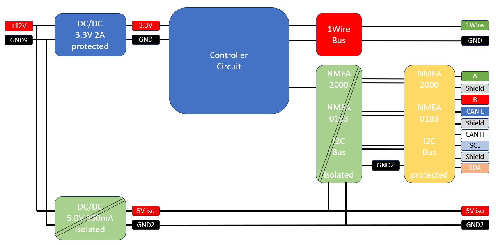
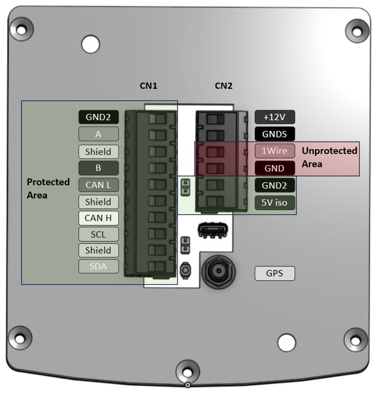
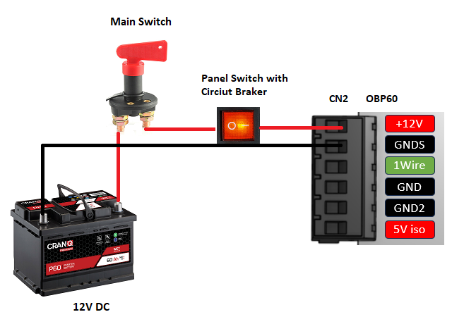

Inbetriebnahme
==============

In diesem Abschnitt wird erklärt, wie die Erstinbetriebnahme eines OBP60 erfolgt. Das geht am einfachsten, wenn das Gerät noch nicht im Boot eingebaut ist. Dazu wird das Gerät mit Strom versorgt, um die ersten Einstellungen vorzunehmen. So können Sie die Funktionalität testen, bevor Sie das Gerät im Boot einbauen.

Schutzkonzept
-------------

Das OBP60 verfügt über ein mehrstufiges Schutzkonzept. Das soll verhindern, dass sich Störungen im Versorgungsnetz und auf den Datenleitungen im System ausbreiten. Damit wird sichergestellt, dass das OBP60 trotz Störungen nicht komplett ausfällt und in wichtigen Teilen weitestgehend funktionsfähig bleibt. Um dies zu erreichen, sind die Busssysteme:

* NMEA2000
* NMEA0182
* I2C

vom Bordnetz isoliert aufgebaut.

Abb.: Sicherheitskonzept

Im OBP60 ist dazu eine zusätzliche 5V-Stromversorgung enthalten, die die isolierten Schaltungsteile versorgt. Die zusätzliche Stromversorgung hat die Ausgänge ``+5Viso`` und ``GND2``, die am Steckverbinder CN1 und CN2 anliegen. Über diese können auch externe Schaltungen bis 200 mA versorgt werden.

.. warning::
	Verbinden Sie die unterschiedlichen Massepotenziale ``GNDS``, ``GND``, ``GND2`` und ``Shield`` niemals miteinander! Dadurch geht die Isolations- und Schutzwirkung verloren. Die Massepotenziale dürfen nicht gleichberechtigt verwendet werden.
	
Die unterschiedlichen Massepotenziale haben folgende Bedeutung:

* ``GNDS`` - Masse der Versorgungsspannung
* ``GND`` - Interne Masse der Elektronik
* ``GND2`` - Masse der isolierten Bus-Elektronik
* ``Shield`` - Schutzleiter für die Kabelschirmung
	
Im folgenden Bild sind die geschützten und ungeschützten Anschlüsse zu sehen. 
	

Abb.: Sichere Bereiche

.. warning::
	Bitte beachten Sie, dass der 1Wire-Bus (gegen Störungen?) ungeschützt ist (und entsprechend durch Schirmung geschützt werden muss). Vorschlag: Daher sollte für die Leitungen des 1Wire-Bus nur abgeschirmte Kabel verwendet werden. ``GND`` darf mit keinen weiteren externen Schaltungsteilen verbunden werden, denn ``GND`` dient ausschließlich als Masseleitung für den 1Wire-Bus.

Stromversorgung
---------------

Die Stromversorgung des OBP60 erfolgt über den Steckverbinder CN2. Beim Zuschalten der Versorgungsspannung schaltet sich das OBP60 automatisch ein. Es gibt keinen gesonderten Ein- oder Ausschalter am Gerät. Benutzen Sie für die Stromversorgung die Anschlüsse ``+12V`` und ``GNDS``. Dabei wird ``+12V`` mit dem positiven Pol der Batterie verbunden und ``GNDS`` mit dem negativen Pol. Diese Anschlüsse für die Stromversorgung sind:

* verpolungssicher
* kurzschlussfest
* überspannungssicher
* ESD-geschützt

Der zulässige Spannungsbereich liegt zwischen 10V...28V.

Das OBP60 kann in 12V- und in 24V-Bord-Versorgungsnetzen verwendet werden. Bei Spannungen höher als 28V wird die interne Sicherung im Gerät ausgelöst.

.. note::
	Im Gerät ist eine selbst rückstellende Sicherung verbaut, die bei zu hohem Stromverbrauch die Versorgungsspannung selbständig trennt. Sie können die Sicherung zurücksetzen, indem Sie die Stromversorgung zum OBP60 trennen und den Grund des übermäßigen Stromverbrauchs beseitigen. Danach warten Sie einige Minuten, schalten Sie dann die Versorgungsspannung wieder ein.

.. important::
	Die interne Sicherung im OBP60 schützt nur das Gerät und nicht die Versorgungsleitungen! 

	Daher sollte die bereitgestellte Stromversorgung des OBP60 im Bordnetz mit einer zusätzlichen Sicherung von mindestens 5A abgesichert werden. Das erfolgt typischerweise durch das Board-Panel (die Schalttafel?), über das / die die Stromkreise im Boot geschaltet werden können. So vermeiden Sie Brände zum Beispiel durch aufgescheuerte oder überhitzte Versorgungsleitungen. 
